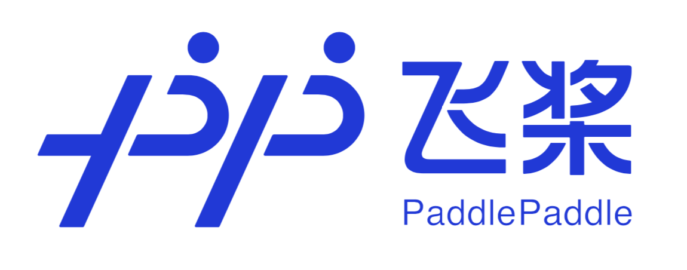

<p align="center">

<p>
    
--------------------------------------------------------------------------------

English | [简体中文](./README_cn.md)

[](https://travis-ci.org/PaddlePaddle/Paddle)
[](https://paddlepaddle.org.cn/documentation/docs/en/guides/index_en.html)
[](https://paddlepaddle.org.cn/documentation/docs/zh/guides/index_cn.html)
[](https://github.com/PaddlePaddle/Paddle/releases)
[](LICENSE)

Welcome to the PaddlePaddle GitHub.

PaddlePaddle, as the first independent R&D deep learning platform in China, has been officially open-sourced to professional communities since 2016. It is an industrial platform with advanced technologies and rich features that cover core deep learning frameworks, basic model libraries, end-to-end development kits, tools & components as well as service platforms.
PaddlePaddle is originated from industrial practices with dedication and commitments to industrialization. It has been widely adopted by a wide range of sectors including manufacturing, agriculture, enterprise service, and so on while serving more than 4 million developers, 157,000 companies and generating 476,000 models. With such advantages, PaddlePaddle has helped an increasing number of partners commercialize AI.


## Installation

### Latest PaddlePaddle Release: [v2.2](https://github.com/PaddlePaddle/Paddle/tree/release/2.2)

Our vision is to enable deep learning for everyone via PaddlePaddle.
Please refer to our [release announcement](https://github.com/PaddlePaddle/Paddle/releases) to track the latest features of PaddlePaddle.
### Install Latest Stable Release:
```
# CPU
pip install paddlepaddle
# GPU
pip install paddlepaddle-gpu

```
For more information about installation, please view [Quick Install](https://www.paddlepaddle.org.cn/install/quick)

Now our developers can acquire Tesla V100 online computing resources for free. If you create a program by AI Studio, you will obtain 8 hours to train models online per day. [Click here to start](https://aistudio.baidu.com/aistudio/index).

## FOUR LEADING TECHNOLOGIES

- **Agile Framework for Industrial Development of Deep Neural Networks**

    The PaddlePaddle deep learning framework facilitates the development while lowering the technical burden, through leveraging a programmable scheme to architect the neural networks. It supports both declarative programming and imperative programming with both development flexibility and high runtime performance preserved.  The neural architectures could be automatically designed by algorithms with better performance than the ones designed by human experts.


-  **Support Ultra-Large-Scale Training of Deep Neural Networks**

    PaddlePaddle has made breakthroughs in ultra-large-scale deep neural networks training. It launched the world's first large-scale open-source training platform that supports the training of deep networks with 100 billion features and trillions of parameters using data sources distributed over hundreds of nodes. PaddlePaddle overcomes the online deep learning challenges for ultra-large-scale deep learning models, and further achieved real-time model updating with more than 1 trillion parameters.
     [Click here to learn more](https://github.com/PaddlePaddle/Fleet)


- **High-Performance Inference Engines for Comprehensive Deployment Enviroments**

   PaddlePaddle is not only compatible with models trained in 3rd party open-source frameworks , but also offers complete inference products for various production scenarios. Our inference product line includes [Paddle Inference](https://paddle-inference.readthedocs.io/en/latest/product_introduction/summary.html): Native inference library for high-performance server and cloud inference; [Paddle Serving](https://github.com/PaddlePaddle/Serving): A service-oriented framework suitable for distributed and pipeline productions; [Paddle Lite](https://github.com/PaddlePaddle/Paddle-Lite): Ultra-Lightweight inference engine for mobile and IoT environments; [Paddle.js](https://www.paddlepaddle.org.cn/paddle/paddlejs): A frontend inference engine for browser and mini-apps. Furthermore, by great amounts of optimization with leading hardware in each scenario, Paddle inference engines outperform most of the other mainstream frameworks.
     
     
- **Industry-Oriented Models and Libraries with Open Source Repositories**

     PaddlePaddle includes and maintains more than 100 mainstream models that have been practiced and polished for a long time in the industry. Some of these models have won major prizes from key international competitions. In the meanwhile, PaddlePaddle has further more than 200 pre-training models (some of them with source codes) to facilitate the rapid development of industrial applications.
     [Click here to learn more](https://github.com/PaddlePaddle/models)
     

## Documentation

We provide [English](https://www.paddlepaddle.org.cn/documentation/docs/en/guides/index_en.html) and
[Chinese](https://www.paddlepaddle.org.cn/documentation/docs/zh/guide/index_cn.html) documentation.

- [Guides](https://www.paddlepaddle.org.cn/documentation/docs/en/guides/index_en.html)

  You might want to start from how to implement deep learning basics with PaddlePaddle.

- [Practice](https://www.paddlepaddle.org.cn/documentation/docs/zh/tutorial/index_cn.html)

  So far you have already been familiar with Fluid. And the next step should be building a more efficient model or inventing your original Operator. 

- [API Reference](https://www.paddlepaddle.org.cn/documentation/docs/en/api/index_en.html)

   Our new API enables much shorter programs.

- [How to Contribute](https://www.paddlepaddle.org.cn/documentation/docs/en/guides/08_contribution/index_en.html)

   We appreciate your contributions!

## Communication

- [Github Issues](https://github.com/PaddlePaddle/Paddle/issues): bug reports, feature requests, install issues, usage issues, etc.
- QQ discussion group: 441226485 (PaddlePaddle).
- [Forums](https://ai.baidu.com/forum/topic/list/168?pageNo=1): discuss implementations, research, etc.
    
## Courses

- [Server Deployments](https://aistudio.baidu.com/aistudio/course/introduce/19084): Courses intorducing high performance server deployments via local and remote services.
- [Edge Deployments](https://aistudio.baidu.com/aistudio/course/introduce/22690): Courses intorducing edge deployments from mobile, IoT to web and applets.   

## Copyright and License
PaddlePaddle is provided under the [Apache-2.0 license](LICENSE).
