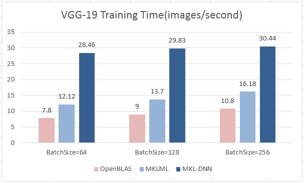
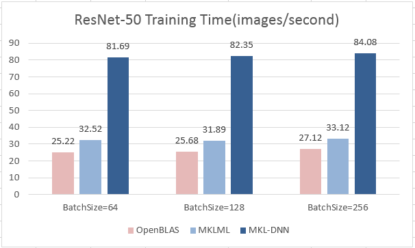
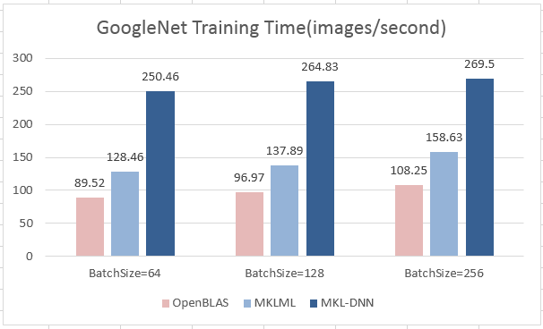
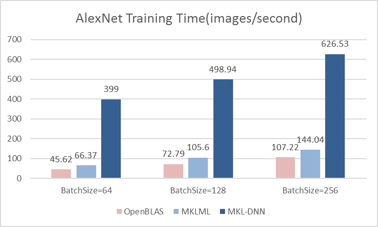
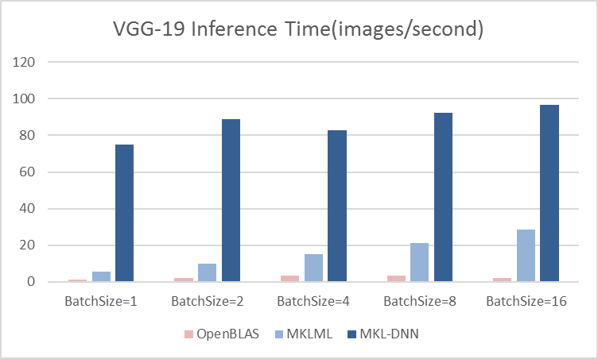
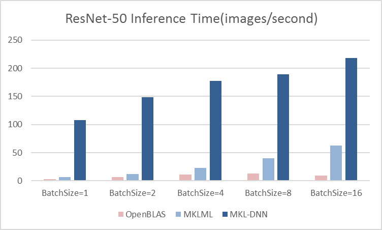
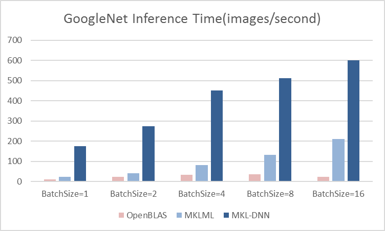
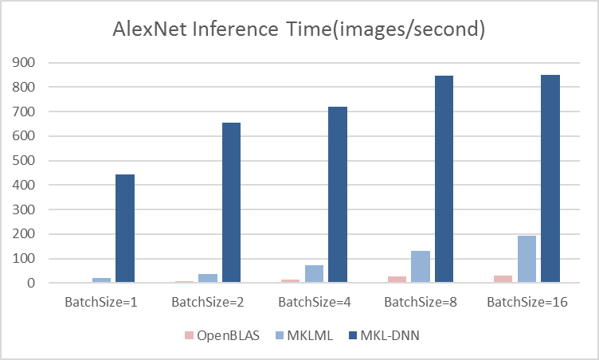

# Benchmark

Machine:

- Server: Intel(R) Xeon(R) Gold 6148 CPU @ 2.40GHz, 2 Sockets, 20 Cores per socket
- Laptop: TBD

System: CentOS release 6.3 (Final), Docker 1.12.1.

PaddlePaddle:
- paddlepaddle/paddle:0.11.0 (for MKLML and MKL-DNN)
  - MKL-DNN tag v0.11
  - MKLML 2018.0.1.20171007
- paddlepaddle/paddle:0.11.0-openblas (for OpenBLAS)
  - OpenBLAS v0.2.20
	 
On each machine, we will test and compare the performance of training on single node using MKL-DNN / MKLML / OpenBLAS respectively.

## Benchmark Model

### Server

#### Training
Test on batch size 64, 128, 256 on Intel(R) Xeon(R) Gold 6148 CPU @ 2.40GHz
Pay attetion that the speed below includes forward, backward and parameter update time. So we can not directly compare the data with the benchmark of caffe `time` [command](https://github.com/PaddlePaddle/Paddle/blob/develop/benchmark/caffe/image/run.sh#L9), which only contain forward and backward. The updating time of parameter would become very heavy when the weight size are large, especially on alexnet.

Input image size - 3 * 224 * 224, Time: images/second

- VGG-19

| BatchSize    | 64    | 128  | 256     |
|--------------|-------| -----| --------|
| OpenBLAS     | 7.80  | 9.00  | 10.80  | 
| MKLML        | 12.12 | 13.70 | 16.18  |
| MKL-DNN      | 28.46 | 29.83 | 30.44  |

 - ResNet-50

| BatchSize    | 64    | 128   | 256    |
|--------------|-------| ------| -------|
| OpenBLAS     | 25.22 | 25.68 | 27.12  | 
| MKLML        | 32.52 | 31.89 | 33.12  |
| MKL-DNN      | 81.69 | 82.35 | 84.08  |

 - GoogLeNet

| BatchSize    | 64    | 128   | 256    |
|--------------|-------| ------| -------|
| OpenBLAS     | 89.52 | 96.97 | 108.25 | 
| MKLML        | 128.46| 137.89| 158.63 |
| MKL-DNN      | 250.46| 264.83| 269.50 |

- AlexNet

| BatchSize    | 64     | 128    | 256    |
|--------------|--------| ------ | -------|
| OpenBLAS     | 45.62  | 72.79  | 107.22 | 
| MKLML        | 66.37  | 105.60 | 144.04 |
| MKL-DNN      | 399.00 | 498.94 | 626.53 | 

#### Inference
Test on batch size 1, 2, 4, 8, 16 on Intel(R) Xeon(R) Gold 6148 CPU @ 2.40GHz
- VGG-19

| BatchSize | 1     | 2     | 4     | 8     | 16    |
|-----------|-------|-------|-------|-------|-------|
| OpenBLAS  | 1.10  | 1.96  | 3.62  | 3.63  | 2.25  |
| MKLML     | 5.58  | 9.80  | 15.15 | 21.21 | 28.67 |
| MKL-DNN   | 75.07 | 88.64 | 82.58 | 92.29 | 96.75 |

- ResNet-50

| BatchSize | 1     | 2      | 4      | 8      | 16     |
|-----------|-------|--------|--------|--------|--------|
| OpenBLAS  | 3.31  | 6.72   | 11.59  | 13.17  | 9.27   |
| MKLML     | 6.33  | 12.02  | 22.88  | 40.53  | 63.09  |
| MKL-DNN   | 107.83| 148.84 | 177.78 | 189.35 | 217.69 |

- GoogLeNet

| BatchSize | 1      | 2      | 4      | 8      | 16     |
|-----------|--------|--------|--------|--------|--------|
| OpenBLAS  | 12.06  | 23.56  | 34.48  | 36.45  | 23.12  |
| MKLML     | 22.74  | 41.56  | 81.22  | 133.47 | 210.53 |
| MKL-DNN   | 175.10 | 272.92 | 450.70 | 512.00 | 600.94 |

- AlexNet

| BatchSize | 1      | 2      | 4      | 8      | 16     |
|-----------|--------|--------|--------|--------|--------|
| OpenBLAS  | 3.53   | 6.23   | 15.04  | 26.06  | 31.62  |
| MKLML     | 21.32  | 36.55  | 73.06  | 131.15 | 192.77 |
| MKL-DNN   | 442.91 | 656.41 | 719.10 | 847.68 | 850.51 |

### Laptop
TBD
