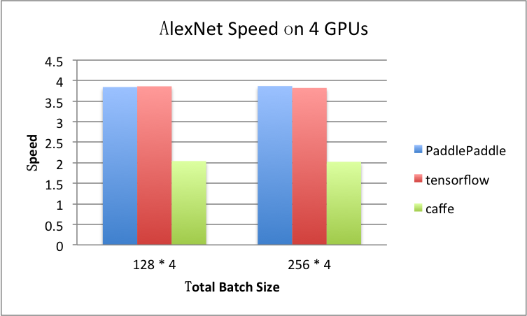
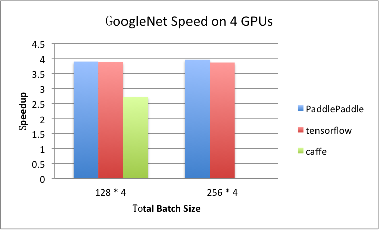
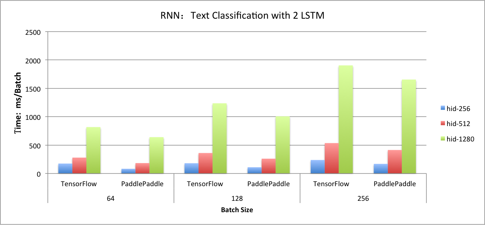
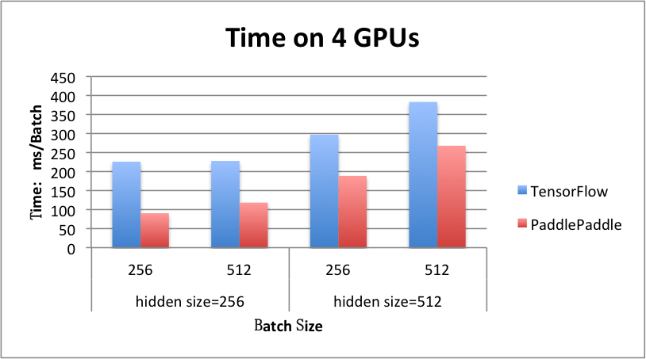

# Benchmark

Machine: 

- CPU: 12-core Intel(R) Xeon(R) CPU E5-2620 v2 @2.10GHz
- GPU: Tesla K40m
- cuDNN: v5.1
- system: Docker 1.12.1, all platform are tested in docker environment.

Platform: 

- PaddlePaddle: 
- Tensorflow: gcr.io/tensorflow/tensorflow:0.11.0rc0-gpu 
- Caffe: 

Several convolutional neural networks and recurrent neural network are used to test.

## Image

### Benchmark Model

AlexNet, GooleNet and a small network which refer the config of cifar10 in Caffe are used.

- [AlexNet](https://github.com/BVLC/caffe/tree/master/models/bvlc_alexnet): but the group size is one.

- [GoogleNet](https://github.com/BVLC/caffe/tree/master/models/bvlc_googlenet): but remove loss1 and loss2 when testing benchmark.

- [SmallNet](https://github.com/BVLC/caffe/blob/master/examples/cifar10/cifar10\_quick\_train\_test.prototxt)


### Singe-GPU

- AlexNet:  input - 3 * 227 * 227,  Time: ms/batch

| BatchSize    | 64  | 128  | 256   | 512  |
|--------------|-----| -----| ------| -----|
| PaddlePaddle | 195 | 334  | 602   | 1629 |
| TensorFlow   | 223 | 364  | 645   | 1235 |
| Caffe        | 324 | 627  | 1232  | 2513 |
 
##### Notation

All platforms use cuDnn-v5.1. You might see that caffe is slower, because the workspace limit size is 8 * 1024 * 1024 in Caffe's cuDnn-conv interface. This size is larger in PaddlePaddle and TensorFlow. Caffe will be faster if increasing the workspace limit size.
 
- GoogletNet:  input - 3 * 224 * 224, Time: ms/batch


| BatchSize    | 64    |   128  | 256     |
|--------------|-------| -------| --------|
| PaddlePaddle | 613   | 1149   | 2348    |
| TensorFlow   | 644   | 1176   | 2219    |
| Caffe        | 694   | 1364   | out of memory   |

- SmallNet: input - 3 * 32 * 32, Time ms/batch

| BatchSize    | 64     |   128    | 256     | 512     |
|--------------|--------| -------- | --------|---------|
| PaddlePaddle | 10.463 | 18.184   | 33.113  |  63.039 |
| TensorFlow   | 9     | 15       | 28      | 59       |
| Caffe        | 9.373  | 16.6606  | 31.4797 | 59.719  |

##### Notation

All the tests in caffe use `caffe time` to execute, which is not including the parameter updating process. But the time in PaddlePaddle and TensorFlow contains it.

In Tensorflow, they implement algorithm searching method instead of using the algorithm searching interface in cuDNN.

### Multi-GPU: 4 GPUs

- AlexNet,  ms / batch

| totoal-BatchSize | 128 * 4  | 256 * 4    |
|------------------|----------| -----------|
| PaddlePaddle     | 347      | 622        |
| TensorFlow       | 377      | 675        |
| Caffe            | 1229     | 2435       |

For example, if `totoal-BatchSize = 128 * 4`, the speed is calculated by 

```
  time_at_1gpu_batch_128 * 4 / time_at_4gpu_total_batch_512 
= (334 * 4)/347 
= 3.85
``` 




- GooleNet, ms / batch

| totoal-BatchSize  | 128 * 4      |  256 * 4    |
|-------------------|--------------| ----------- |
| PaddlePaddle      | 1178         | 2367        |
| TensorFlow        | 1210         | 2292        |
| Caffe             | 2007         | out of memory  |




## RNN
We use lstm network for text classfication to test benchmark.

### Dataset
-  [IMDB](http://www.iro.umontreal.ca/~lisa/deep/data/imdb.pkl)
- Sequence legth=100, in fact, PaddlePaddle support training with variable-length sequence. But TensorFlow need to pad, in order to compare, we also pad sequence length to 100 in PaddlePaddle.
- Dictionary size=30000 
- Peephole connection is used in `lstmemory` by default in PaddlePaddle. It is also configured in TensorFlow.

### Single GPU

#### LSTM in Text Classification

Testing network for different hidden size, batch size with `2 lstm layer + fc` network.
  
- Batch size = 64, ms / batch
 
| hidden_size  | 256   | 512    |  1280   |
|--------------|-------| -------| --------|
| PaddlePaddle | 83    | 184    | 641     |
| TensorFlow   | 175   | 280    | 818     |

- Batch size = 128, ms / batch
 
| hidden_size  | 256    | 512    |  1280   |
|--------------|------- | -------| --------|
| PaddlePaddle | 110    | 261    | 1007    |
| TensorFlow   | 181    | 361    | 1237    |


- Batch size = 256, ms / batch
 
| hidden_size  | 256   | 512    |  1280   |
|--------------|-------| -------| --------|
| PaddlePaddle | 170   | 414    | 1655    |
| TensorFlow   | 238   | 536    | 1905    |



#### Seq2Seq

The benchmark of sequence-to-sequence network will be add later.
 

### Multi GPU: 4 GPUs

#### LSTM in Text Classification

- hidden_size = 256, ms / batch
 
| batch_size   | 256    |  512    |
|--------------| -------| --------|
| PaddlePaddle | 90     | 118     |
| TensorFlow   | 226    | 118     |


- hidden_size = 512, ms / batch
 
| batch_size   | 256    |  512    |
|--------------| -------| --------|
| PaddlePaddle | 189    | 268     |
| TensorFlow   | 297    | 383     |




#### Seq2Seq

The benchmark of sequence-to-sequence network will be add later.
