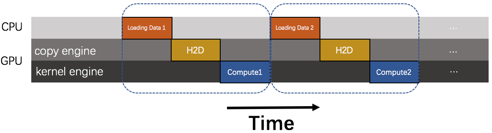

# Double Buffering

## Background

In general, the model training is divided into two steps: data preparation and model calculation. Because training a deep learning model needs a lot of computing resources. If using CPU, it will take a long time to complete an iteration. Training a good model usually takes tens of thousands of iterations. Obviously, this is unacceptable. Therefore, we usually choose the accelerator (e.g. GPU) for model training. But using accelerator for training model brings a new problem. Because our training data is in CPU, before the accelerator training model, it need to wait for the data to be copied from the CPU side to the accelerator. So the time to train the model on the accelerator is the sum of the time of loading the data, the time of data transfer, and the time of the accelerator calculation. Therefore, although the accelerator's computation speed is very fast, sometimes the data transfer time is very long, which may cause the accelerator training model to be slower than the direct CPU training model.  

## Problem
The data transfer between host and device is synchronized, by default. If the accelerator is `GPU`, a time line for the execution of traing model on `GPU` is shown in the following diagram. This is just a schematic. 

<p align="center"><br/></p>

In the schematic we assume that the time required for loadding data,  data transfer, and kernel execution are approximately the same. Obviously, the overlap of loading data, data transfer and kernel execution is zeros.    
In depth analysis, we will find these stages can be overlapped. In general, the GPU provided by NVIDIA generally has two engines: a copy engine and a computing engine, some device has three engines, two copy engines, one for host-to-device transfers and another for device-to-host transfers, as well as a single kernel engine. To overlap them, We need to use the [stream mechanism](https://devblogs.nvidia.com/parallelforall/gpu-pro-tip-cuda-7-streams-simplify-concurrency/) provided by CUDA. If data transfer and kernel execution are in different streams, and the kernel will not use the data being transferred, then data transfer and kernel execution can be done at the same time on GPU.    
Therefore, this design document hopes to make full use of this characteristic to maximize the overlap of data transfers and other operations, and reduce data transfer delay in turn.

## Solution
### Basic Strategy
#### Producer-Consumer
A feasible way is to adopt [producer-consumer](https://en.wikipedia.org/wiki/Producer–consumer_problem) model. The producer and the consumer share a common, fixed-size buffer used as a queue. Sometimes, the buffer's memory has up limit. The producer's job is to generate data, put it into the buffer, and start again. At the same time, the consumer is consuming the data, one piece at a time. The problem is to make sure that the producer won't try to add data into the buffer if it's full or it's memory is beyond the upper limit and that the consumer won't try to remove data from an empty buffer.
Caffe2 uses this way in [`PrefetchOperator`](https://github.com/caffe2/caffe2/blob/01827c153db96349745a544148c1ff0386c5ef9e/caffe2/operators/prefetch_op.h#L42).    
For fluid, data loadding is done in python, so the python side can adopt producer-consumer model to load data. [This is what fuild is currently using](https://github.com/PaddlePaddle/Paddle/blob/ce6dad3b35c85d133e7c35249cced9df4dc0f05e/python/paddle/v2/reader/decorator.py#L165). 

#### Staging area 
Another feasible way is to adopt [staging area](https://en.wikipedia.org/wiki/Staging_(data)). Staging area is an intermediate storage area used for data processing during the [extract, transform and load (ETL)](https://en.wikipedia.org/wiki/Extract,_transform,_load) process. The data staging area sits between the data source(s) and the data target(s), which are often data warehouses, data marts, or other data repositories.   
The staging area has one fixed-size buffer and two methods, `put` and `get`. `put` and `get` access buffer in a thread safe way. The operation of `put` includes copying a data from data set(on CPU side) to GPU and putting data into buffer, and `get` removes a data from the buffer.   
When the program runs, the staging area should be warmed up. First, the `put` is called to put some data in the staging area in advance. After that, the `get` is called every time when the model is calculated, and a data is extracted from the staging area. At the same time, `put` is called, meanwhile a new data is copied from the data set to the stage area. Because the operation of data transfer is asynchronous, so the `put` method will back immediately.   
This strategy can be used to overlap data transfer between host and device and kernel execution.


The following C++ programs shows the structure of buffer:
```
using MetaType = LoDTensor;
using BufferElement = std::vector<MetaType>;

class Buffer {
 private:
  std::size_t capacity_;
  std::size_t bytes_limit_;
  std::size_t current_bytes_;
  std::mutex mu_;
  std::condition_variable empty_cond_var_;
  std::condition_variable full_cond_var_;
  std::deque<BufferElement> buf_;

 public:
  void Put(BufferElement* tuple) {...}
  void Get(BufferElement* tuple) {...}
  size_t Size() {...}
  void Clear() {...}
};

Buffer* GetBuffer(const platform::Place place, const size_t capacity,
               const size_t bytes_limit) {
  static std::map<platform::Place, Buffer*> buffering;

  if (buffering.count(place)) {
    buffering[place] = new Buffer(
        capacity, bytes_limit);
  }
  return buffering[place];
}
```

**Take the [recognize_digits_mlp](https://github.com/PaddlePaddle/Paddle/blob/develop/python/paddle/v2/fluid/tests/book/test_recognize_digits_mlp.py) as an example to show the model definition after using the staging area mechanism.**

```
image = fluid.layers.data(name='x', shape=[784], dtype='float32')
label = fluid.layers.data(name='y', shape=[1], dtype='int64')

stage = fluid.staging(input=[image, label])
stage_program = fluid.default_main_program().clone()

image, label = stage_out = fluid.unstaging(stage)

y_predict = fluid.layers.fc(input=image, size=1, act=None)
cost = fluid.layers.square_error_cost(input=y_predict, label=label)
avg_cost = fluid.layers.mean(x=cost)

...
place = fluid.CUDAPlace(0)
...

buffer_size = 2

# warm up staging area
for i in range(buffer_size):
    data = next(train_reader())
    exe.run(fluid.stage_program, feed=feeder.feed(data))

for pass_id in range(5):
    for data in train_reader():
        exe.run(fluid.default_main_program(),
                           feed=feeder.feed(data))

for i in range(buffer_size):
    exe.run(fluid.default_main_program())
```


## Reference
[Staging area](https://en.wikipedia.org/wiki/Staging_(data))  
[Producer-Consumer](https://en.wikipedia.org/wiki/Producer–consumer_problem)    
[How to Overlap Data Transfers in CUDA C/C++](https://devblogs.nvidia.com/parallelforall/how-overlap-data-transfers-cuda-cc/)   
