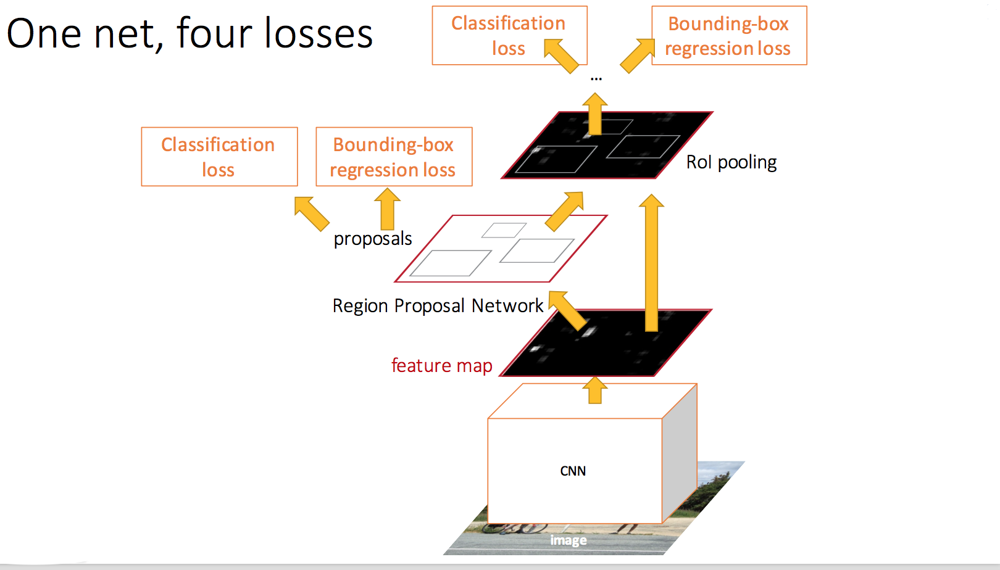

# Faster-RCNN

本篇文章主要讲了目标检测的一些背景，并对[Faster-RCNN](https://arxiv.org/abs/1506.01497)做了介绍。提出PaddlePaddle中支持该算法需要实现的操作,并对这些操作做了简单介绍，设计如何在PaddlePaddle中实现Faster-RCNN框架。在PaddlePaddle中对这些操作的细节实现不在本篇文档的范畴，每个操作实现，如果后续需要文档可以再补充。

### 背景

目前主流的目标检测有两种方式：一种是以R-CNN, Fast-RCNN, Faster-RCNN等为代表的提取Region Proposal的方法，另一种是以YoLo, SSD等为代表的采用回归的思想，不使用Region Proposal, 给定输入图像，直接在图像的多个位置上回归出bounding box，并得到分类结果的检测框架。由于具体应用对精度、速度的要求不同，这两套框架都是比较流行的框架。

### 短期目标

目前检测应用的目标是能够支持这两套主流的框架，如果在此基础上能够做出创新自然更好。

1. 发布Faster-RCNN, SSD两个检测框架，SSD的code正在review.
2. 提供Book篇章。

### 原理

如下图，主要是由Region Proposal Networks(RPN)和Fast_RCNN组成。

- RPN

    采用卷积神经网络提取proposals。首先这篇文章中作者提出anchor这个概念，也被称作priors 或者 default boxes，anchor是在以一个点为中心的周围，选取特征的区域，比如选取3x3，1x3，3x1等区域，论文默认是9种区域。理解了anchor之后，我们来看RPN是如何提取proposals的。RPN是一个卷积神经网络，理论来说可以是任意结构的卷积神经网络，作者文章中采用的是一种全卷积神经网络，经过神经网络就可以提取feature map，然后在feature map的每个点选取多个anchor作为proposals，同时卷积神经网络也可以得到每个proposals的分类概率。
    
    那么如何训练RPN呢？训练就需要cost，RPN网络cost包含两个，proposal分类的cost和坐标回归的cost。目前的训练都是有监督的训练，但是我们实际对每张图片标注的box相比生成的proposals要少非常多。那如何得到每个proposal的"真实"label？对于每个anchor，计算和标注的boxes的IoU(面积的交/面积的并)，并给定阈值，如果大于该阈值就认为它属于这一类，标记为1，否则标记为0。
    
    RPN网络类似注意力机制，他告诉RCNN部分应该关注的一些位置。

- RCNN

Faster-RCNN部分对RPN提取的大量proposals的位置进行修正，以及分类他们是哪一个具体的类别。RoIPooling, Faster-RCNN原理这里先不详细介绍。

    
 
图1. Faster-RCNN

### Extra Operation(Op)

#### Input of Network

- RoIDataLayer: 
    - data: shape (1, C, H, W)
    - gt_boxes
      - ground truth boxes
      - shape: T x 5, T表示该图片标注的box(object)个数
      - 每一维度：(x1, y1, x2, y2, cls), cls是object的label
    - im_info:
      - 输入图片height, width, scale比例信息, scale即固定一边长度，另一边的resize比例。(如果后续改进原图输入，scale可以默认为1)。
      - shape: (1, 3), （H, W, scale)
 
    实际在Paddle里对应3个input,每个input描述不同的信息。在reader里数据构造好即可，不需要实现。
 
#### RPN
 
- AnchorTargetLayer
   - 4个输入：
     - 分类score
     - gt_box
     - im_info
     - data
   - 4个输出：
       - rpn_labels: 依据anchors\_boxes和gt\_boxes的Intersection-over-Union (IoU) overlap 计算正负label(0, 1二值label)
         - 用于计算分类loss
       - rpn_bbox\_targets:  anchors\_boxes和gt\_boxes距离信息。
       - rpn_bbox\_inside\_weights: 正label的weight
       - rpn_bbox\_outside\_weights：负label的weight
         - 用于计算归回loss

#### Regions of Interest (RoI) Proposal
  
- ProposalLayer
   - 3个输入：
      - rpn_cls_prob: RPN中全卷积得到的分类概率，是一个卷积层
      - rpn_bbox_pred: RPN中全卷积预测的bbox的坐标, 是一个卷积层
      - im_info
   - 1个输出：
     - 称作：rpn\_rois， roi proposals
     - 依据rpn_cls_prob和rpn_bbox_pred得到proposals，使用nms去除冗余的proposals，得到top300个proposals。
    
   注意: 1) AnchorTargetLayer需要ground\_truth\_boxes，而该层不需要, 2）AnchorTargetLayer无需全卷积预测的bbox坐标，而该层需要。
      
- ProposalTargetLayer
  - 2个输入：
     - rpn_rois： 即ProposalLayer
     - gt_boxes
  - 5个输出：
     - labels: 依据all\_rois和gt\_boxes得到每个roi的真实label
         - 用于在RCNN部分计算分类loss
     - roi: roi是从all\_rois中selecting出来的
     - bbox\_targets
     - bbox\_inside\_weights
         - 用于在RCNN部分计算回归loss

#### RCNN

  - ROIPoolingLayer

### 问题

1. [py-faster-rcnn](https://github.com/rbgirshick/py-faster-rcnn) 上面列举的除过ROIPoolingLayer之外的操作都是python实现，检测的操作相对复杂，numpy矩阵操作还是相对简单，如果换成C++实现，工作量会较大。让PaddlePaddle可以支持Python的层，可以作为后续支持的功能，但不在这次faster_rcnn的支持范畴内，这次还会是主要实现C++的OP。

2. 上面对Op的整理，一个层可能有多个输出，这几个输出有分别连向不同的层，PaddlePaddle目前一个层只有一个输出，在具体实现过程需要思考：方案1：让PaddlePaddle支持多个输出，多个输出可自由连接入其他的层。 方案2：继续按照一个层一个输出实现，将上面Op再拆分或整合。

### 资料

[1] S. Ren, K. He, R. Girshick, and J. Sun. [Faster r-cnn: To- wards real-time object detection with region proposal net- works](https://arxiv.org/abs/1506.01497). arXiv preprint arXiv:1506.01497, 2015.

[2] code: [py-faster-rcnn](https://github.com/rbgirshick/py-faster-rcnn)
