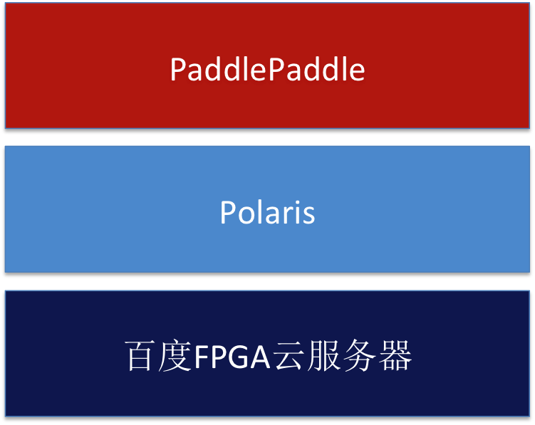

# Baidu FPGA on PaddlePaddle: Design Doc

我们计划利用百度FPGA云主机和深度学习加速库Polaris，将FPGA集成到PaddlePaddle，使其支持更多的异构硬件。
- 百度FPGA云服务器：百度云环境中配备的FPGA计算实例，通过该实例，可以快速地构建FPGA硬件加速程序[1]。
- Polaris：一个百度开发的基于FPGA的高性能深度学习计算库（待开源，包含头文件和.a文件），供用户方便的调用百度FPGA实现的功能\[[2](#references)\]。


我们计划基于重构中的PaddlePaddle进行开发，目标是：

- 百度FPGA支持大部分常见的深度学习Operator。
- 百度FPGA支持大部分常见的深度学习模型(包含图像、语音、NLP、广告)。


## Contents

- [Overview](#overview)
- [Actions](#actions)
 	- [CMake](#cmake)
	- [Layers](#layers)
	- [Activations](#activations)
	- [Unit Tests](#unit-tests)
	- [Protobuf Messages](#protobuf-messages)
	- [Python API](#python-api)
	- [Demos](#demos)
	- [Benchmarking](#benchmarking)
	- [Others](#others)

## Overview

我们会把Polaris作为第三方库集成进PaddlePaddle，利用百度FPGA云服务器能够快速构建基于FPGA的PaddlePaddle应用，整体框架图如下所示：
<div align="center">
<br/>
Figure 1. FPGA on Paddle.
</div>

## Actions
我们把集成方案大致分为了如下几个方面。

### CMake
我们会在`CMakeLists.txt`中会添加`WITH_FPGA`的选项，当设置这个值为`ON`的时候会启用FPGA编译功能。我们会在`cmake/external`目录新建`polaris.cmake`文件，它们会在编译PaddlePaddle的时候下载Polaris头文件和库，并放到PaddlePaddle的third_party目录中。

### Place
重构中的PaddlePaddle用Place类来标注数据在什么设备上，目前支持CPUPlace和GPUPlace。我们会在place.h中添加FPGAPlace，标注数据在FPGA设备上，并在其中添加int类型的deviceid来支持FPGA多设备。同时，我们参照CPUPlace和GPUPlace的实现，提供is_fpga_place等方法。

**备注**：重构中的PaddlePaddle有一些代码默认设备不是GPU就是CPU，如:
```C++
bool places_are_same_class(const Place &p1, const Place &p2) {
  return is_gpu_place(p1) == is_gpu_place(p2);
}
```
添加FPGAPlace后需要修改这部分代码的逻辑。

### Memory 
重构中的PaddlePaddle实现了buddy memomry allocator类来负责内存的管理，目前只支持CPU和GPU的版本。我们会添加一个FPGAAllocator来负责FPGA的内存管理。

### DeviceContext
重构中的PaddlePaddle实现了DeviceContext类来负责对应设备上面的资源管理，目前只支持CPU和GPU的版本。我们会添加一个FPGADeviceContext来负责管理FPGA设备的资源。

### Operator 
重构中的PaddlePaddle是基于Operator的，不同设备（CPU、GPU）共享一个Op定义，OpKernel提供Compute方法\[[3](#references))\]。FPGA的数据格式与CPU、GPU是一样的，因此我们计划添加XXX_op_FPGA.cc文件实现FPGAKernel的计算逻辑，注册到原有的Operator上。对于FPGA不支持的操作，我们在compute函数中加入判断:
```C++
PADDLE_ENFORCE(!platform::is_fpga_place(ctx.GetPlace()),
                   "It can not use FPGAPlace.");
```

**备注**：由于FPGA不如CPU和GPU灵活，因此FPGA只能支持大部分Operator，无法支持所有的Operator。

### Net
Net是包含了一系列的Operator，目前一个Net上的Operator只能运行在同一个设备上。由于FPGA不够灵活，部分Operator可能不支持FPGA，因此需要提供类似Parallel-nn的方法，即部分Operator在FPGA运行，部分Operator在CPU或GPU上运行。

### UnitTest 
FPGA相关代码的单元测试会添加到对应修改的模块中。例如在添加了FPGAPlace，就需要在place_test.cc中添加FPGA的单元测试。单元测试需要使用FPGA设备，我们会提供FPGA云服务器作为测试平台。

### Python API
目前只考虑v2 API，使用FPGA时只需在设置Place时设置成FPGA，其他配置不变。
```python
place = core.FPGAPlace()
```

## References
1. [百度FPGA云服务器](https://cloud.baidu.com/product/fpga.html)
2. [Baidu Polaris Project](http://fpga.baidu.com/)
3. [如何写新的Operator](https://github.com/PaddlePaddle/Paddle/blob/develop/doc/howto/dev/new_op_cn.md#%E5%AE%9A%E4%B9%89OpKernel%E7%B1%BB)
