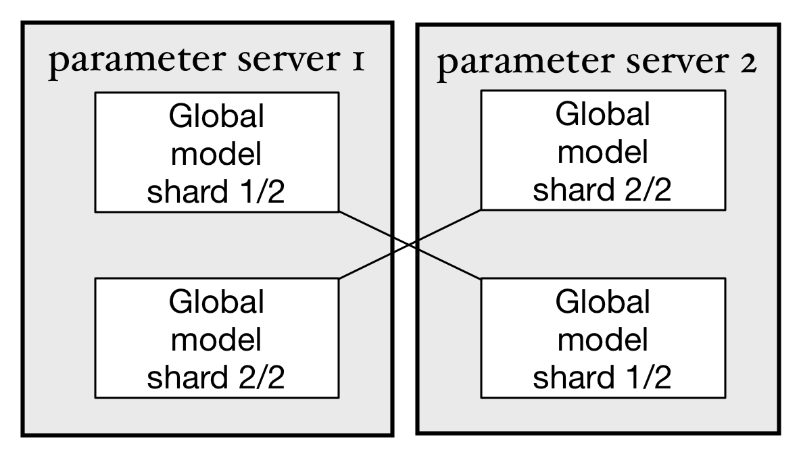
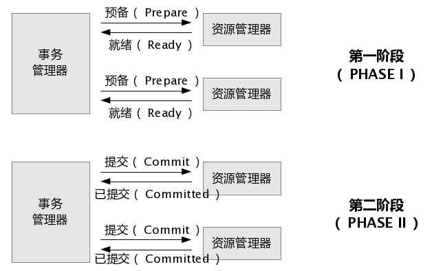
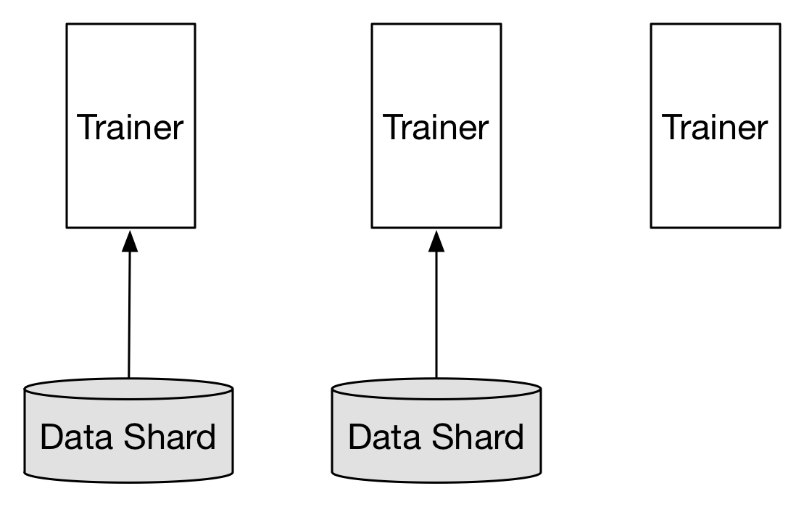
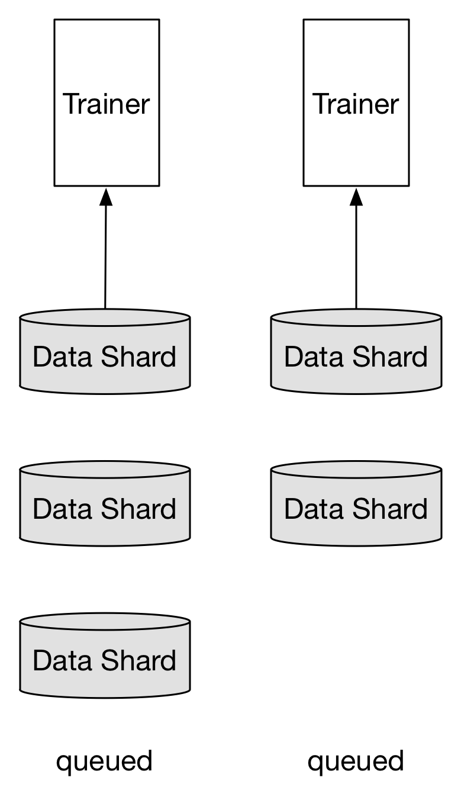

# Paddle大规模分布式训练设计

## 概览
参考[这里](https://github.com/PaddlePaddle/Paddle/pull/1620/files)

## 分布式训练架构

常见的深度学习分布式训练的架构如图：


为了完成一个深度学习的训练任务，集群中会运行多个trainer和parameter server，每个trainer启动时，会先尝试从parameter server集群下载最新的参数，然后以mini-batch为单位读取训练数据集中的一部分数据(Data shard)。在完成这个mini-batch数据的神经网络前馈和反向传播计算后，将参数梯度发送给对应的parameter server。随后trainer开始下一轮计算。

每个parameter server保存所有parameter的一个分片(Global model shard)，并负责接受所有trainer发送的梯度，完成SGD和优化算法，然后发送更新后的parameter到每个trainer。

这样，通过trainer和parameter server的分布式协作，可以完成神经网络的SGD方法的训练。Paddle可以同时支持同步SGD(synchronize SGD)和异步(asynchronize SGD)。

在使用同步SGD训练神经网络时，Paddle使用同步屏障(barrier)，使梯度的提交和参数的更新按照顺序方式执行。在异步SGD中，则并不会等待所有trainer提交梯度才更新参数，这样极大的提高了计算的并行性：parameter server不之间不相互依赖并行的接收梯度和更新参数，parameter server也不会等待trainer全部都提交梯度之后才开始下一步，trainer之间也不会相互依赖，并行的执行模型的训练。可以看出，虽然异步SGD方式会使参数的更新并不能保证参数的顺序的同步的更新，在任意时间某一台parameter server上保存的参数可能比另一台要更新，这样反而会给参数优化过程带来更多的随机性。在实践中，异步SGD在带来更高效率的同时并没有特别影响算法的准确性。

在上面的分布式计算模型中，使用异步SGD比同步SGD可以一定程度的提供训练任务的容灾性。假设在某一时刻，一个trainer进程停止工作，其他的trainer仍然可以完成对部分数据的训练。

参考上面所描述的Paddle实现细节，可以进一步的优化以下方面：
1. 目前模型的参数是保存在parameter server进程的内存中的。在同步SGD或异步SGD训练过程中任意一台parameter server不能异常退出，否则参数丢失，训练不能继续执行。需要考虑每个模型分片(model shard)保存多个副本(replica)防止parameter server单点故障。
1. 不能在一个训练任务中动态的增加或减少Trainer个数或parameter个数（异步SGD是否可以增加Trainer?）
1. 在同步SGD训练过程中，需要保证参数更新满足事务性操作。即可能在更新参数过程中，存放这个参数的shard所在的服务器故障，就需要rollback并重新更新这个参数shard的其他存活副本。
1. 为了支持大量的训练任务和使用模型的应用在一个集群上，需要支持训练任务节点的伸缩。
1. 支持训练任务的前置任务和后置任务，支持训练任务的定时调度和对在线流式数据的处理

## 模型参数数据备份
为了实现parameter server集群可以容忍单点故障，须将每个模型参数的分片在集群中存储多个副本。虽然也可以考虑使用校验和的技术减少副本大小，但为了整体系统的简单，优先选择使用副本的方式。



上图显示了在3台parameter server中实现每个模型参数的分片均保存两个副本的状态。parameter 负责存储
所有参数分片副本并在etcd中同步每个副本的状态。每个分片的多个副本中同时只有一个处于"master"状态，
处于"master"状态的副本是当前活动的副本。当一台parameter server故障时，集群中剩下的parameter server
会重新选举出新的"master"副本并继续提供服务。比如如果parameter server 3故障，仍然可以从parameter server 1和2中找出完整的3个副本。此时虽然性能会临时降低，但可以确保训练任务继续运行，只要有新的parameter server上线，并完成副本的重新分布，就可以恢复原先的集群状态。

用户在启动parameter server是可以指定副本的个数(>=1)，副本越多容灾能力越强，越少性能越好。但通常不会
使用>3个的副本配置。

etcd中数据存储格式为：
1. pserver集群状态`[CLUSTER_CHROOT]/pserver_cluster_status`
  ```json
  {
    "cluster_status": "OK|UNHEALTHY|UNKNOWN"
    "reason": "",
    "nodes": [0,1,2,3]
  }
  ```

1. 每个pserver的状态: [CLUSTER_CHROOT]/pservers/[pserverid]
  ```json
  {
    "id": 0,
    "instance": "pserver1",
    "status": "up",
    "start_time": 1490184573.25,
    "sync": true,
  }
  ```
1. parameter分片信息: [CLUSTER_CHROOT]/pshards/[shardid]/[replicaid]
  比如上图显示的分片将生成下面的4个etcd路径：
  ```bash
    /pshards/0/0
    /pshards/0/1
    /pshards/1/0
    /pshards/1/1
  ```
  每个replica的信息如下：
  ```json
  {
    "id": 0,
    "shardid": 0,
    "created": 1490184573.25,
    "modified": 1490184573.25,
    "status": "master", # indicates the replica is in use
  }
  ```

## 数据一致性
存在多个副本数据的情况下就需要考虑多个副本之间的数据一致性。如果使用数据强一致性（例如paxos/raft或两段式提交），
则在故障恢复时可以获得一个完整的数据集，但每次更新模型参数的性能会下降，因为需要保证多个副本都完全更新之后才算更新
成功。如果使用异步同步（最终一致性），则在重新选举"master"副本时，可能得到的副本并没有完成数据同步。

本文档讨论使用两阶段提交(2PC)实现模型副本数据的更新。
* 每个副本通常由多个parameter block组成，多个block之间可以并发更新，但更新同一个block需要保证顺序性。
* 每次需要更新一个block的时候，trainer首先向存放"master"副本的服务器提交“准备更新”请求，"master"副本检查其他副本的状态并创建一个更新事务，然后返回OK。
* trainer再向"master"发送变化部分的梯度数据和这份数据的id，然后"master"并发的更新本地和其他副本的模型数据，更新成功返回OK，如果有更新失败的节点，则执行"rollback"，退回到更新前状态并返回错误代码。



## 模型数据检查点(Checkpointing)
模型数据检查点，可以在磁盘上保存一份存储在parameter server内存中的模型数据的完整镜像。在一个不可中断并缺少备份的训练任务中，可以通过阶段性的在每个parameter server的 ***本地磁盘／分布式存储挂载点*** 保存检查点快照达到容灾的目的，比如每个pass或每n个mini-batch保存一次快照。在出现单点故障时，只需要恢复这台节点，或者将这台节点迁移到另一个节点并启动即可恢复训练任务。

这里需要用户额外注意，在您的实际环境中，训练任务的运行可能会占满trainer和parameter server之间的网络带宽，如果parameter server此时还需要通过网络访问分布式存储以保存快照，可能会造成网络拥塞，而出现阶段性的运行停滞。

## 训练数据的存储和分发
生产环境中的训练数据集通常体积很大，并被存储在诸如Hadoop HDFS, Ceph, AWS S3之类的分布式存储之上。这些分布式存储服务通常会把数据切割成多个分片分布式的存储在多个节点之上，而多个trainer通常也需要预先完成文件的切割。但通常的方法是从HDFS上将数据拷贝到训练集群，然后切割到多个trainer服务器上，如图(Mount/Copy)：


考虑到HDFS实际上已经完成了数据切割的任务，而且如果存在前置的数据预处理任务（Map-Reduce或Spark SQL），这些任务的输出也都存放于HDFS之上，则trainer可以直接调用HDFS LowLevel API，从元数据节点获得每个数据分片存储的位置，直接获得分片。

***注：每个数据分片保存多个mini_batch***

进一步优化，trainer可以寻找在物理网络拓扑中离自己最近的一个分片副本获取数据。

trainer和训练数据分片的均衡：
* 当trainer >= 数据分片：
  trainer个数和数据分片个数相同时，可以获得最高的吞吐量。当trainer个数再大于分片数量时，必然有Trainer获取不到数据分片，处于等待状态。但对整体任务运行没有影响，等待的trainer也会消耗很小的资源。

  

* 当trainer < 数据分片
  每个trainer负责多个数据分片，轮询方式完成一个分片训练之后开始下一个分片。

  

## 故障恢复
在通用集群上运行的应用和任务，通常需要有能够自动伸缩的能力，这样在在线集群进行扩容时，可以适当的减小训练任务的资源(进程数／并发数)，而不需要直接停止训练任务，修改参数后重新提交任务。

然而对于常见的在线服务（比如Web服务，RPC服务等），是可以“无状态”伸缩的，即扩容和缩容只需要增删对应的节点，集群能力就可以自动伸缩，Web服务的每个节点不会维护自身的状态变化和自身的数据，这些数据通常会借由外部的存储或服务完成，如MySQL，Redis等。而对于训练任务来说，每个parameter server都需要保存状态（mini-batch id）和数据(parameters)，在增删节点的时候都会涉及到数据重新分布（re-sharding）和处理数据同步的问题。

用户只要根据实际训练任务场景，配置parameter server和trainer的初始节点个数，最大节点个数和最小节点个数，模型副本个数，是否开启检查点等配置项，即可配置并启动一个可以容灾的训练集群。具体的过程如下：

1. 配置parameter server和trainer的初始节点个数、最大节点个数、最小节点个数、模型副本个数、是否开启检查点等配置以及训练任务相关配置。
1. 启动parameter server和trainer，每个实例会在etcd中注册一个带TTL（过期时间）的节点，并每隔一段时间(`<TTL`)更新这个节点的TTL。这样当某个parameter server或trainer失效时，etcd中的节点会消失，反应的状态。每个parameter server在所有的parameter server上会使用etcd watcher监听节点的变化状态，已完成后续处理。
1. parameter server如果开启了检查点，则先判断是否已经存在本地检查点快照数据，如果有，则从快照数据中加载状态和数据，并开始提供服务。如果没有则执行初始化启动步骤。
1. 提交用户定义的深度学习网络(topology)，并根据网络中参数完成pre-sharding，将参数block(每个参数分片由多个参数block组成)哈希到512或1024个slot中，每个slot即为一个参数分片。根据实际存在的parameter server个数，将slot和parameter server完成对应的映射，使slot可以平均存储在这些parameter server上。
1. parameter server开始监听端口并接收数据。每次接收到数据，都使用两段式提交方式同步到所有的副本。如果需要存储检查点，则在同步所有副本之后，保存检查点。
1. 当其中一台parameter server故障发生后（物理机停机，进程core dump等），其他的parameter server会收到etcd发送的watcher信号:
  ```json
  {
      "event": "removal",
      "node": {
          "createdIndex": 1,
          "key": "/mycluster/pservers/3",
          "modifiedIndex": 1,
          "value": "{...json...}"
      },
  }
  ```
  此时将暂停trainer的训练（此时要检查最后一次参数更新更新的状态，如果处于不同步状态（处于准备或提交但并无提交响应），需要执行rollback），然后执行执行re-sharding步骤：
  1. 根据现有存活的parameter server的个数，遍历所有的参数分片，找出那些分片已经丢失master分片，则在分片的副本中重新找出一个选作master。
  2. 重新分布每个slot，将slot平均分布在所有parameter server上，保证负载均衡。
  3. 重新开始trainer的训练。

新增节点的方法类似，此处不再赘述。

## 动态扩容/缩容
虽然故障恢复可以提供任意时刻的节点新增和删除仍然可以保证任务正常运行，但通常这样是比较暴力的。为了能graceful的关闭多个节点，parameter server需要提供对应的API接口：

```python
  def resize(n):
    # do resize
    return success
```

接口完成先发送信号暂停训练任务，re-shard数据分片，然后重新开启训练。这样可以避免程序bug导致的数据不同步问题出现。

## 性能考虑
由于每次数据提交都需要完成分片同步，而且在每个pass之后执行检查点保存，必然会带来parameter server性能下降。可以根据不同的场景配置不同的容灾方案。

* 测试任务／极短训练任务：如果训练任务在几十分钟或小时级别可以运行完成，可以考虑不开启副本也不开启检查点。
* 短期训练任务／测试任务：训练任务运行时间如果在数小时或数天范围，可以考虑只使用一个副本（每个slot只保存一份），并开启检查点。在这个时长内出现不可恢复的硬件故障的概率极低。
* 大型训练任务：训练时间以周或月为单位。建议开启多个副本和检查点。这样可以在任意一个pass停止任务，并重新从这个pass开始训练。或者在通用集群运行时，可以考虑动态扩容和缩容。

## 实现考虑
由于两阶段提交和数据备份同步、选举部分实现比较复杂，可以考虑使用一些开源库函数，比如2pc，raft库等，后期在优化过程中逐步替换。

## 附录
### 引用

* [Large Scale Distributed Deep Networks](http://papers.nips.cc/paper/4687-large-scale-distributed-deep-networks.pdf), Jeffrey Dean, Greg S. Corrado, Rajat Monga, Kai Chen, Matthieu Devin, Quoc V. Le, Mark Z. Mao, Marc’Aurelio Ranzato, Andrew Senior, Paul Tucker, Ke Yang, Andrew Y. Ng

### 术语
* model: 指深度学习训练之后得到的所有参数，使用这个神经网络可以完成对新数据的预测
* parameters: 神经网络中的参数，包括权重w和偏置b。一个神经网络的模型由大量的参数组成
* shard: 分片，通常指将一个整体拆分成多份的其中的一份。
* model shard: 将一个神经网络参数拆分成多份，每个shard分别存储在其中一台parameter server之上
* parameter block: 多个parameter block构成一个model shard
* 单点故障: 任意时刻只可能同时有一台服务器故障。由于集群中同时存在两台机器故障的概率极低（(平均故障率*平均故障修复时间)^2）只对特殊在线系统考虑两台以上同时故障的容灾。

### TODO:
All-Reduce和Ring的不同设计考虑
