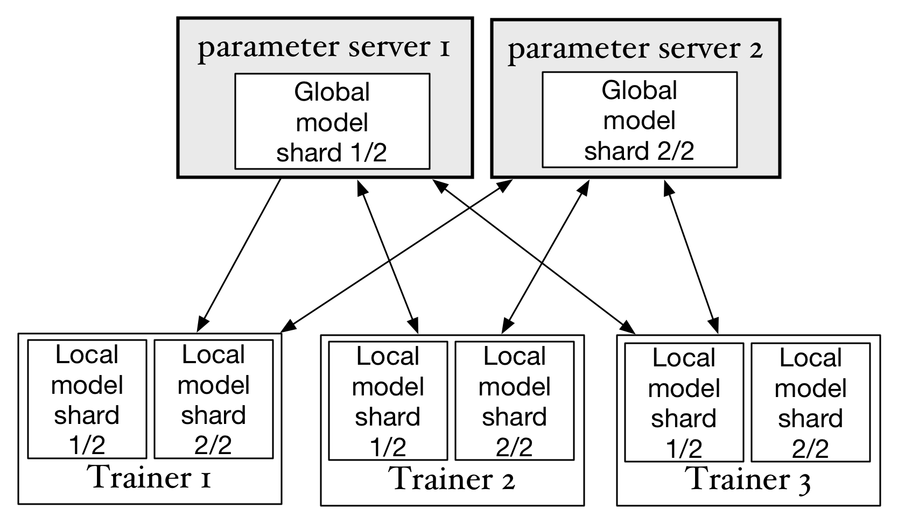
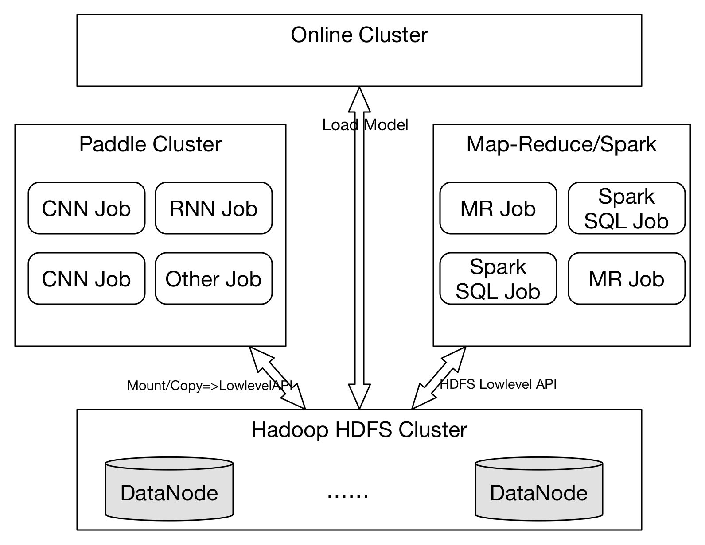
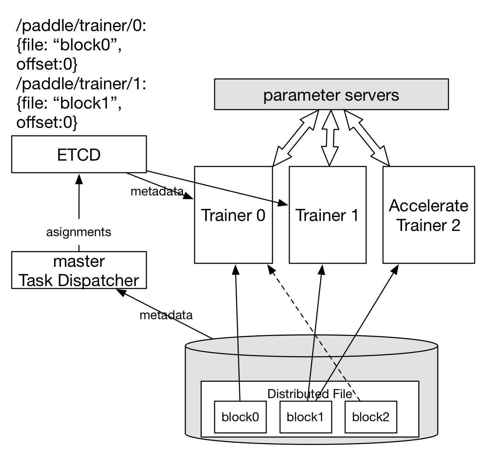

# Paddle大规模分布式训练设计

## 概览
参考[这里](https://github.com/PaddlePaddle/Paddle/pull/1620/files)

## 分布式训练架构

常见的深度学习分布式训练的架构如图：



为了完成一个深度学习的训练任务，集群中会运行多个trainer和parameter server，每个trainer启动时，会先尝试从parameter server集群下载最新的参数，然后以mini-batch为单位读取训练数据集中的一部分数据(Data shard)。trainer会在训练过程中持续与parameter server通讯，上传计算出来的梯度以及下载最新的模型。

每个parameter server保存所有parameter的一个分片(Global model shard)，并负责接受所有trainer发送的梯度，完成SGD和优化算法，然后发送更新后的parameter到每个trainer。

这样，通过trainer和parameter server的分布式协作，可以完成神经网络的SGD方法的训练。Paddle可以同时支持同步SGD(synchronize SGD)和异步SGD(asynchronize SGD)。

在使用同步SGD训练神经网络时，Paddle使用同步屏障(barrier)，使梯度的提交和参数的更新按照顺序方式执行。在异步SGD中，则并不会等待所有trainer提交梯度才更新参数，这样极大的提高了计算的并行性：parameter server之间不相互依赖，并行的接收梯度和更新参数，parameter server也不会等待trainer全部都提交梯度之后才开始下一步，trainer之间也不会相互依赖，并行的执行模型的训练。可以看出，虽然异步SGD方式会提高参数更新并行度, 但是并不能保证参数同步更新，在任意时间某一台parameter server上保存的参数可能比另一台要更新，与同步SGD相比，梯度会有噪声。

在上面的分布式计算模型中，使用异步SGD比同步SGD可以一定程度的提供训练任务的容灾性。假设在某一时刻，一个trainer进程停止工作，其他的trainer仍然可以完成对部分数据的训练。

参考上面所描述的Paddle实现细节，可以进一步的优化以下方面：
1. 目前模型的参数是保存在parameter server进程的内存中的。在同步SGD或异步SGD训练过程中任意一台parameter server不能异常退出，否则参数丢失，训练不能继续执行。需要考虑每个模型分片(model shard)保存多个副本(replica)防止parameter server单点故障。
1. 不能在一个训练任务中动态的增加或减少Trainer个数或parameter个数（异步SGD是否可以增加Trainer?）
1. 在同步SGD训练过程中，需要保证参数更新满足事务性操作。即可能在更新参数过程中，存放这个参数的shard所在的服务器故障，就需要rollback并重新更新这个参数shard的其他存活副本。
1. 为了支持大量的训练任务和使用模型的应用在一个集群上，需要支持训练任务节点的伸缩。
1. 支持训练任务的前置任务和后置任务，支持训练任务的定时调度和对在线流式数据的处理

## 模型参数检查点(Checkpointing)
模型数据检查点的实现，可以有效的避免parameter server的单点或多点同时故障。模型参数检查点通过定期向磁盘上保存一份存储在parameter server内存中的模型数据的完整镜像，来保证训练过程可以从中间状态重新启动。在一个不可中断并缺少备份的训练任务中，可以通过阶段性的保存每个parameter server的数据快照(snapshot)到 ***分布式存储服务／分布式存储挂载点*** 达到容灾的目的，比如每隔10分钟或1小时保存最新的快照，并删除更早的快照。在出现单点故障时，只需要恢复这台节点，或者将这台节点迁移到另一个节点并启动即可恢复训练任务。


### 快照保存的设计如下：

前置要求：
* 所有parameter server在etcd上注册自己的id节点为TTL节点`/paddle/pservers/[id]`，并保持心跳。同时使用watcher监听`/paddle/pservers`目录，监听parameter server增加或丢失的消息。
* 所有trainers在etcd `/paddle/trainers/[id]` 下注册节点。并监听暂停信号：`/paddle/trainers/pause`（监听节点创建和删除），`re-fetch` 信号。trainer在收到pause创建的信号之后，需要保存trainer的reader所读取的文件信息(文件名／文件元数据)，和读取的offset到:`/paddle/trainers/[id]`的内容中。

程序流程：
1. 满足条件""每个pass或每n个mini-batch"时，parameter server原子写入`/paddle/trainers/pause`暂停所有trainer上传新的梯度
2. parameter server在etcd服务中创建`/paddle/checkpoints/[snapshot uuid]/[parameter server id]`TTL节点，标识快照开始更新。然后开始向磁盘／存储服务中一个新的文件写入快照数据，并在写入过程中定时更新 etcd的checkpoint TTL节点已保证心跳。
3. 任意一个parameter server完成检查点更新后，创建etcd目录`/paddle/checkpoints/[snapshot uuid]/finished/[parameter server id]`，写入完成的timestamp。然后检查是否所有的parameter server都完成。如果是，跳到第5步；否则循环等待。
4. 如果在任意时间点，收到parameter server增加或丢失的消息，则需要回滚整个集群训练过程到上一个检查点：

  * 如果没有处在暂停状态，则暂停所有的参数更新
  * 删除etcd中`/paddle/checkpoints/[snapshot uuid]`的路径，清理没有成功执行的检查点任务。
  * 从etcd中读取检查点的uuid和timestamp，然后解析所有存储在磁盘上的检查点文件(可能有多个文件)，判断对应uuid是否相同，如果都不同，则报错退出（FATAL error）。如果有相同的文件，则加载这个检查点文件，并覆盖内存中的参数。
  * 原子性创建etcd节点：`/paddle/trainer/re-fetch` (即多个parameter server不重复创建)，通知trainer重新获取参数
  * 删除`/paddle/trainers/pause` 节点，重新开启训练过程，trainer需要从`/paddle/checkpoints/latest`中找到上一个检查点的file和对应的offset，并将reader重新设置到这个位置。

5. 尝试获取`/paddle/checkpoints/finish_lock`分布式锁(使用etcd3或者客户端wrapper)。获取锁之后，更新 `/paddle/checkpoints/latest`的内容为最新的checkpoint的uuid，timestamp；从`/paddle/trainers/[id]`中获取file和offset并更新到`/paddle/checkpoints/latest/files/[id]`中；删除每个pserver的上一个snapshot文件；释放锁；删除`/paddle/trainers/pause`节点。

这里需要用户额外注意，在您的实际环境中，训练任务的运行可能会占满trainer和parameter server之间的网络带宽，如果parameter server此时还需要通过网络访问分布式存储以保存快照，可能会造成网络拥塞，而出现阶段性的运行停滞。

### ETCD文件一览
***注：TTL节点表示这个节点在创建者消失时，在TTL时间内也会消失***

* `/paddle/pservers/[id]`: TTL节点。id是parameter server的id，保存parameter server的信息。
* `/paddle/checkpoints/latest`: 最新的checkpoint的信息。json格式保存timestamp, uuid
* `/paddle/checkpoints/latest/files/[trainer id]`: 保存最新的checkpoint对应的每个trainer读取数据的文件和offset
* `/paddle/checkpoints/[snapshot uuid]/[parameter server id]`: TTL节点。uuid是checkpoint生成的唯一snapshot id
* `/paddle/checkpoints/[snapshot uuid]/finished/[parameter server id]`: 同上
* `/paddle/trainers/[id]`: TTL节点，保存trainer信息。如果发生全局暂停，则节点中以json格式保存trainer正在读取的文件和offset
* `/paddle/trainers/pause`: 控制trainer暂停上传梯度
* `/paddle/trainers/re-fetch`: 控制trainer重新从parameter server读取参数并覆盖本地参数

## 训练数据的存储和分发

### 现在的方法
生产环境中的训练数据集通常体积很大，并被存储在诸如Hadoop HDFS, Ceph, AWS S3之类的分布式存储之上。这些分布式存储服务通常会把数据切割成多个分片分布式的存储在多个节点之上，而多个trainer通常也需要预先完成文件的切割。但通常的方法是从HDFS上将数据拷贝到训练集群，然后切割到多个trainer服务器上，但这样的效率是底下的。如图(Mount/Copy)：



### 期望的方法

考虑到HDFS实际上已经完成了数据切割的任务，而且如果存在前置的数据预处理任务（Map-Reduce或Spark SQL），这些任务的输出也都存放于HDFS之上，则trainer可以直接调用HDFS LowLevel API，从元数据节点获得每个数据分片存储的位置，直接获得分片。

***注：每个数据分片保存多个mini_batch***

我们将使用如下的设计完成数据分发:



如图，数据存储在分布式文件系统中，并将预处理之后的文件切割成3个block存储在不同的机器上。在训练任务开始时，master读取这个分布式文件的元数据，并将一个block分配给一个trainer，然后将分配信息写入etcd中。随后trainer从etcd中获取到数据的分配信息并开始执行训练。一个block数据训练完成后，master负责在将新的block分配给一个trainer（图中虚线所示）。

master不会直接发送数据给Trainer而是负责协调训练数据的分配，并以ETCD为协调中心。所以master是一个无状态程序，任务运行过程中，master停止后只需要重新启动即可。

## 第一版**不需要**支持的特性
### 推测执行/加速执行(TODO)
在异构集群中，如果存在某些trainer执行速度过慢会影响整体集群的速度（如图中Trainer 1），此时master将负责启动一个新的Trainer(Accelerate Trainer 2)，使用同样的训练数据block。哪个trainer先完成block的训练，则把另一个慢速的kill掉。

### 关于存储的考虑
* 图像／音频类数据，预处理之后以何种方式分布式存储，如何切割?
* 支持流式数据接口和常规文件接口
* 对不同的分布式存储，需要实现不同的reader wrapper

### 动态扩容/缩容
虽然故障恢复可以提供任意时刻的节点新增和删除仍然可以保证任务正常运行，但通常这样是比较暴力的。为了能graceful的关闭多个节点，master需要提供对应的API接口：

```python
  def resize(n):
    save_checkpoint()
    pause_all_trainers()
    start_and_wait_trainers(n - self.num_trainers)
    start_and_wait_pservers(n - self.num_pservers)
    do_parameter_re_hash()
    trainers_re_fetch()
    start_all_trainers()
    return success
```

要实现`do_parameter_re_hash()`，将现有的parameter能够在增加parameter servers时，完成重新分布，需要实现以下的细节：

```
parameters = large vector
<..............................>
|___| |___| |___|
  ^
  |
parameter block
需要：
                hash to          map to
parameter block --------> 128~1024 slots --------> parameter servers
```

接口完成先发送信号暂停训练任务，保存参数的checkpoint，然后重新开启训练。这样可以避免程序bug导致的数据不同步问题出现。

## 实现考虑
由于两阶段提交和数据备份同步、选举部分实现比较复杂，可以考虑使用一些开源库函数，比如2pc，raft库等，后期在优化过程中逐步替换。

## 附录
### 引用

* [Large Scale Distributed Deep Networks](http://papers.nips.cc/paper/4687-large-scale-distributed-deep-networks.pdf), Jeffrey Dean, Greg S. Corrado, Rajat Monga, Kai Chen, Matthieu Devin, Quoc V. Le, Mark Z. Mao, Marc’Aurelio Ranzato, Andrew Senior, Paul Tucker, Ke Yang, Andrew Y. Ng

### 术语
* model: 指深度学习训练之后得到的所有参数，使用这个神经网络可以完成对新数据的预测
* parameters: 神经网络中的参数，包括权重w和偏置b。一个神经网络的模型由大量的参数组成
* shard: 分片，通常指将一个整体拆分成多份的其中的一份。
* model shard: 将一个神经网络参数拆分成多份，每个shard分别存储在其中一台parameter server之上
* parameter block: 多个parameter block构成一个model shard
* 单点故障: 任意时刻只可能同时有一台服务器故障。由于集群中同时存在两台机器故障的概率极低（(平均故障率*平均故障修复时间)^2）只对特殊在线系统考虑两台以上同时故障的容灾。

### TODO:
All-Reduce和Ring的不同设计考虑
