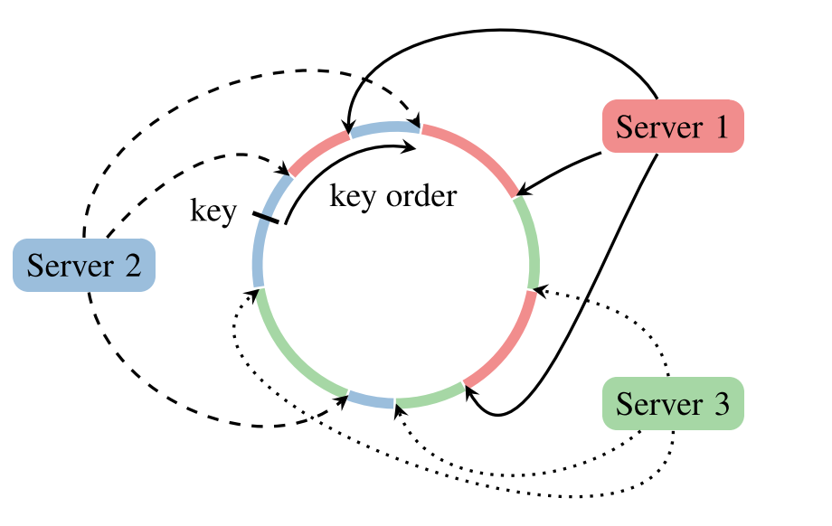

# Design Doc: Parameter Server Process

Parameter Server process 是Paddle中负责模型的存储，更新和模型分片一致性的组件，在整个系统中的作用请参考 [distributed training design doc](./README.md) ，本文档包含PServer，PClient，PServerContoller等，涉及到的配置参数均使用大写字母


## 术语

- PServer: Parameter Server Server，负责模型存储，调用分布式更新，响应PClient请求
- PClient: Parameter Server Client，负责均衡PServer请求，打包并转发RPC请求
- PServerController：负责启动Server，动态扩容，容灾等
- model: 指深度学习训练之后得到的所有参数，使用这个神经网络可以完成对新数据的预测
- Tensor: 一个NDArray结构，Trainer与PServer, PClient交互的基本数据结构
- shard: 全量模型在某个PServer上的局部分片，通常指将一个Model整体拆分成多份的其中的一份。
- parameter block: 多个parameter block构成一个model shard(现存的model并行策略是parameter block based，在新架构中继续沿用)

##  PServer

PServer负责以下功能:

1、模型存储，2、注册服务并监听端口事件，3、PServer个数的动态扩张收缩，4、负责序列化传输数据。

发送接收调用都使用rpc 接口，见下文中的RPCServer，例如使用golang rpc实现对应的接口

```c++
class Evaluator;
class ParameterUpdater;
/* Because there is no Tensor data structure,  \ 
optimizer in PServer does not need the Tensor shape,  \
we just define Vector as Tensor, should be replace with `real Tensor` \
after the refactoring finish. */
typedef /*Vector*/ Tensor<DIM=1, PVALUE>;
template<PKEY, PVALUE>
class PServer {

RWLock lock;
/* pserver_id used by checkpoint */
int32_t pserver_id;
/* start Pserver config, should be persist in ectd for PServer node recovery */
PServerConfig config;   

// part 1: store model in PServer
// use Tensor as store fundamental unit

syncThreadPool threadPool;

/*
when init() calls, create SHARD_NUM Shard_Store;
parameters:
SHARD_NUM : int, store in PServerConfig.
	model shard in one PServer node;
*/
typedef unordered_map<block_id, Tensor<PVALUE>> Shard_Store;
/* 2d pointer store a vector of shard pointer. each shard should be unordered_map<block_id, Tensor> parameterMap; 
block_id is the parameter block id, after scling with the Sclicer(see PClient), slice parameter Matrix generate parameter block; 
*/
Shard_Store **store_pool;  
 
public:
  /* init */
  int32_t init();
  /* used by PServerController check status */
  bool is_started;
  int32_t isStartedAndAlive(); 
  
  /* deserilize/unarchive sending data */
  void PullParameters_process_handler(RpcRequest, RpcResponse);
  /* deserilize/unarchive updating data, need to call setUpdater first time */
  void UpdateParameters_process_handler(RpcRequest, RpcResponse);
  /*  get Parameters thread for parallel */
  int32_t thread_hPullParameters(int32_t thread_id, <map<string/*pname*/>*Tensor params);
  /* set Parameters thread for parallel */
  int32_t thread_UpdateParameters(int32_t thread_id, <map<string/*pname*/>*Tensor params);
  
  /* set updater/optimizer */
  int32_t set_updater(updater_name) {
   updatebase = updater;
  }
private:
// apply update
ParameterUpdater *updatebase;
 /* part 2 : checkpoint, ignore the difference of save time between PServer nodes. */
  int32_t saveCheckPoint() {
    /*
    1, counter match save checkpoint condition, grab the RWLock;
    2, start new thread, generate unique UUID, write to pfs(filesystem), (TODO: Stop update and wait?)
    3, write etcd `/checkpoint/pserver_id : {"uuid": [UUID], "md5", "MD5 sum", "timestamp": xxxx}`
    4, delete earlier checkpoint not equal to UUID
    5, release lock, wait write thread join;  */
    return SUCCESS;
  }
  int32_t recoveryFromCheckPoint() {
    /*
    1, getUUIDFrometcd(); 
    2, tryLoadCheckPoint();
    3, PServerController call start interface. */
    return SUCCESS;
  }
  
private:

  
//part 3 : auto scaling of PServers 
/* part 3.a. Trainer/worker auto scaling insert or remove during training */
 unordered_map<string/*trainer name*/, Trainer*>
/* part 3.b. PServer auto scaling during training */
rehash key based on Pserver, see PClient Part
} // PServer


class ParameterUpdater {
Optimizer *base;
}

class SparseParameterUpdater{
  //TODO: need to discussed
}
class SparseParameterUpdater {
  
}
/* 目前支持sgd 类算法，不支持owlqn, L-BFGS等算法
   sgd (momentum, adagram, adadelta, adam)，pass based
   async-sgd
*/
class SGDOptimizer : Optimizer {
  ...
}
class ASGDOptimizer : Optimizer {
  ...
}

```




## PClient

PClient 负责均衡PServer请求，打包rpc请求转发PServer。

```c++
/* named the block slicer, cut Parameter into blocks, and deletermine its pserver_id(shard_id)*/
class Slicer;
template<PKEY, PVALUE>
PClient {
public:
/* get Parameters */
int32_t PullParameters(<map<string/*pname*/>*Tensor params);
/* set Parameters */
int32_t UpdateParameters(<map<string/*pname*/>*Tensor params)
  
/* pack request as rpc call and serilize/archive receive data */
void PullParameters_rpc_handler(RpcRequest, RpcResponse);
/* pack request as rpc call and serilize/archive sending data */
void UpdateParameters_rpc_handler(RpcRequest, RpcResponse);

private:
/* use param_id and node_id as hash key, balance parameter between shard and PServers */
  Slicer _slice;


}

template<PKEY>
class Slicer {
  /* impl hash function generate evenly distributed shard_id/PServerid, when auto scaling of PServer, then store  */
  hash(param_id, node_id) 
    
// auto scaling, do not implement in v1, 
//TODO: need more detail
  rehash(param_id, node_id); // generate new server hash id for each parameter, moving parameter to new PServer node
}
```


## RPCServer

接口类，屏蔽rpc实现，方便移植rpc lib

```c++
/* RpcRequest Header, Used for request, package up request into RpcImpl Call */
struct RpcRequest {
    uint64_t _request_id;                // request_id 
    int32_t _src_id;                     // request source node_id or process_id, is unique in k8s.
    int32_t _target_id;                  // request target. same as before
    std::string _target_method_name;     // Command bewteewn two nodes . e.g 
  /*format example, [COMMAND_NODE]
    SetUpdater_server_id;
    PullParameters_server_id;   
    UpdateParameters_server_id;
    SaveCheckPoint_server_id;
    
    RegisterTrainer_trainer_id;
    DeregisterTrainer_trainer_id;
	....
	DoOperation_server_id; [COMMAND_extension]
  */
    BinaryArchive _args;                 // other arguments for extension  
    static uint64_t s_buffer_size;      
}
// Used for response, package up response into binary
struct RpcResponse {
public:
    uint64_t _request_id;
    int32_t _target_id;
    std::string _target_method_name;
    BinaryArchive _archive;
    int32_t _error_code;                  // return status code
```


```c++
class RPCServer {
  /* ONLY use this method create RPC Calls */
  void static createRequest(RPCRequest*, RPCResponse);  
  static RPCServer& singleton();
  // send rpc call asynchronize
  void Send(bool sync, ...);
  RPCImpl *rpcimpl;
}
```

## PServerController

根据ParameterServer参数创建和管理PServer instance，从命令行读取参数，从etcd读取参数，运行开始将存活的PServer instance配置存储在etcd中

- 启动和运行参数包括：

  这部分参数都会存储于etcd中，用于自动扩容和容灾，运行可以从命令行读取，也可以从etcd读取

`/PS_DESIRED`:, 启动PServer instance个数，etcd存储格式 `/PS_DESIRED:3`

`/ROOT_PORT`：显式指定根端口，PServer端口从PORT+1开始，直到找到可用端口，例如ROOT_PORT=8000, 则PServer0_Port=8000，PServer0_Port=8001,…，当前存在的PServer实例配置以etcd实时存储为准

etcd存储格式 `ROOT_PORT:8000, /PS/0:8000，/PS/1:8001 `

`/CHECKPOINT_PERIOD`:PServer运行保存快照存储的时间间隔，default filled

`/CHECKPOINT_DIR`:保存快照的路径，default filled

- 创建PServer接口

```c++
int32_t loadConfig(fromCLi);
int32_t loadConfig(frometcdDir);
// create PServer fron scratch or recovery from config  
static PServer* create(PServerConfig& );
// create PServer in fault tolenrant, recovery from checkpoint 
static PServer* create(const char* checkpoint_dir);
```

- 管理PServer实例

```c++
int32_t start();   // start PServer
int32_t wait();    //wait join
int32_t countAlive(); // count alive instance
```


