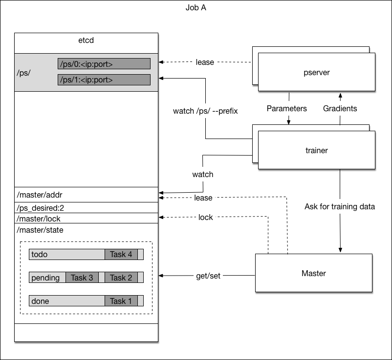

# Design Doc: Distributed Training

## Objective

In [this slides](https://www.slideshare.net/cxwangyi/paddlepaddle-a-complete-solution-for-businesses), we explained that we'd like PaddlePaddle running on general-purpose clusters like those managed by Kubernetes, so to address demands for AI from both Internet and non-Internet industries.

This poses technical challenges to PaddlePaddle:

1. Support fault-recovery.
1. Support both offline and online training.
1. [Serverless computing](https://en.wikipedia.org/wiki/Serverless_computing) of distributed training.

## Training Job

A training job will be created once user asks Paddle cloud to train a model. The training job is made up of different processes that collaboratively consume data and produce a trained model. There are three kinds of processes:

1. the *master server process*, which dispatches tasks to
1. one or more *trainer processes*, which run distributed training and synchronize gradients/models via
1. one or more *parameter server processes*, where each holds a shard of the global model, and receive the uploaded gradients from every *trainer process*, so they can run the optimize functions to update their parameters.

Their relation is illustrated in the following graph:

By coordinating these processes, PaddlePaddle supports use both Synchronize Stochastic Gradient Descent (sync SGD) and Asynchronous Stochastic Gradient Descent (async SGD) to train user-defined neural network topologies.

When training with sync SGD, parameter servers wait for all trainers to finish gradients update and then send the updated parameters to trainers, training can not proceed until the trainer received the updated parameters. This creates a synchronization point between trainers. When training with async SGD, each trainer upload gradient and download new parameters individually, without the synchronization with other trainers. Using asyc SGD will be faster in terms of time per pass, but have more noise in gradient since trainers are likely to have a stale model.

### Master Server Process

The master server process will:

- Partition a dataset into [tasks](#task) and dispatch tasks to trainers.
- Keep track of training progress on the dataset with [task queue](#task-queue). A training job will iterate on the dataset for a full pass until it goes into next pass.

#### Task

A task is a data shard to be trained. The total number of tasks will be much bigger than the total number of trainers. The number of data instances inside a task will be much bigger than the mini-batch size.

#### Task Queue

The master server has three task queues to track training progress. As illustrated in the graph below, Job A and Job B both have one master server. Each master server process has three task queues.

- The todo queue holds tasks to be dispatched. When a job starts, the master server fills in the todo queue with all tasks.
- The pending queue holds tasks that are currently training by trainers.
- the done queue holds tasks that are already trained.

The life cycle of a single task is illustrated below:

1. When a new pass of training starts, all tasks will be placed in the todo queue.
1. Upon trainer requests for new task, the master server will dispatch a task from todo queue to it, put the task in the pending queue and wait for completion.
1. The trainer will work on its task and tell the master server once the task is completed and ask for new task. The master server will dispatch a new task to that trainer.
1. If a task fails for any reason in trainer, or takes longer than a specific period of time,  the master server will move the task back to the todo queue. The timeout count for that task will increase by one. If the timeout count is above a threshold, the task is likely to cause a trainer to crash, then it will be discarded.
1. The master server will move completed task to the done queue. When the todo queue is empty, the master server will start a new pass by moving all tasks in the done queue to todo queue and reset the timeout counter of all tasks to zero.

### Trainer Process

The trainer process will:

- Request tasks from the master.
- Work on the tasks
- Upload gradient to parameter servers, and update local model by downloading new parameters from parameter servers.

### Parameter Server Process

Parameter server processes hold the parameters collaboratively. The parameters are partitioned on different parameter servers.

The parameter server will:

- Receive gradient from the trainers, update its parameters, and give the trainers the latest parameters.
- Periodically save its parameters to distributed file system by overriding the previous save.

### Optimization Algorithms

The communication pattern between the trainers and the parameter servers depends on the category of optimization algorithm:

- Synchronous Stochastic Gradient Descent (sync-SGD)

	Parameter server will wait for all trainer finish n-th mini-batch calculation and send their gradients before broadcasting new parameters to every trainer. Every trainer will wait for the new parameters before starting n+1-th mini-batch.

- Asynchronous Stochastic Gradient Descent (async-SGD)

	There will no synchronization between different trainers, and parameter server updates its parameter as soon as it receives new gradient:

	- Each trainer uploads its accumulated gradient every n mini-batches.
	- Every m mini-batches, the trainer downloads new parameters from parameter server.
	- n and m do not have to be equal.

## Fault Tolerant

The training job will pause if the master server processes is dead, or any of the parameter server process is dead. They will be started by [Kubernetes](https://kubernetes.io/) and recover in few minutes. Please refer to [fault recovery](#fault-recovery).

The training job will continue to make progress if there is at least one training process running. The strategy depends on the type of optimization algorithm:

- sync-SGD

	TODO

- async-SGD

	Since async-SGD does not require synchronization between mini-batches, the system will by definition make process if at least one trainer is running.

## Fault Recovery

PaddlePaddle uses [etcd](https://github.com/coreos/etcd) to keep track of the states of processes. Because etcd is a distributed reliable key-value store, the restarted process can recover its states from etcd. The model parameters are periodically saved into distributed file system, so a restarted parameter server can recover its parameters from the saved file.

Now we will introduce how each process recovers from a failure, the graph below shows how etcd is used:

### Master Server Process

When the master is started by the Kubernetes, it executes the following steps at startup:

1. Grabs a unique *master* lock in etcd, which prevents concurrent master instantiations.
1. Recovers the task queues from etcd if they already exist, otherwise, the master will create them.
1. Write its ip address to */master/addr* so that trainers can discover it.
1. Listens to trainers' request of task, dispatch one upon request, and updates task queue using an etcd transaction to ensure lock is held during the update.

When the master server process is dead for any reason, Kubernetes will restart it. It will be online again with all states recovered from etcd in few minutes.

### Trainer Process

When the trainer is started by the Kubernetes, it executes the following steps at startup:

1. Watches the available parameter server prefix keys `/ps/` on etcd and waits until the count of parameter servers reaches the desired count */ps_desired*.
1. Finds and watches */master/addr* to get master's address.
1. Requests for tasks from the master to start training.

When a trainer fails, Kuberentes would try to restart it. The recovered trainer would fetch tasks from master and go on training.

### Parameter Server Process

When the parameter server is started by Kubernetes, it executes the following steps at startup:

1. Read desired total number of parameter servers from etcd `/ps_desired`
1. Search through etcd keys `/ps/<index>` (`/ps/0`, `/ps/1`, ...) to find the first non-existant key whose index is smaller than the total number of parameter servers. Set the key using a transaction to avoid concurrent writes. The parameter server's index is inferred from the key name.

	The desired number of parameter servers is 3:

	

	The third parameter server joined:

	

1. The parameter server can load parameters if there are already saved parameters in the save path (inferred from its index).
1. Now the parameter server is ready for the trainers' requests.

If the parameter server's etcd lease expires, the parameter server will kill itself.

## Parameter Server Checkpointing
See [here](./checkpointing.md)

## Store and dispatching trainning data
See [here](./data_dispatch.md)

## Dynamic Scaling

### Trainer Scaling

TODO

### Parameter Server Scaling

Not planned for v1.

## Training Dataset Format

TODO

## User Interface

TODO
