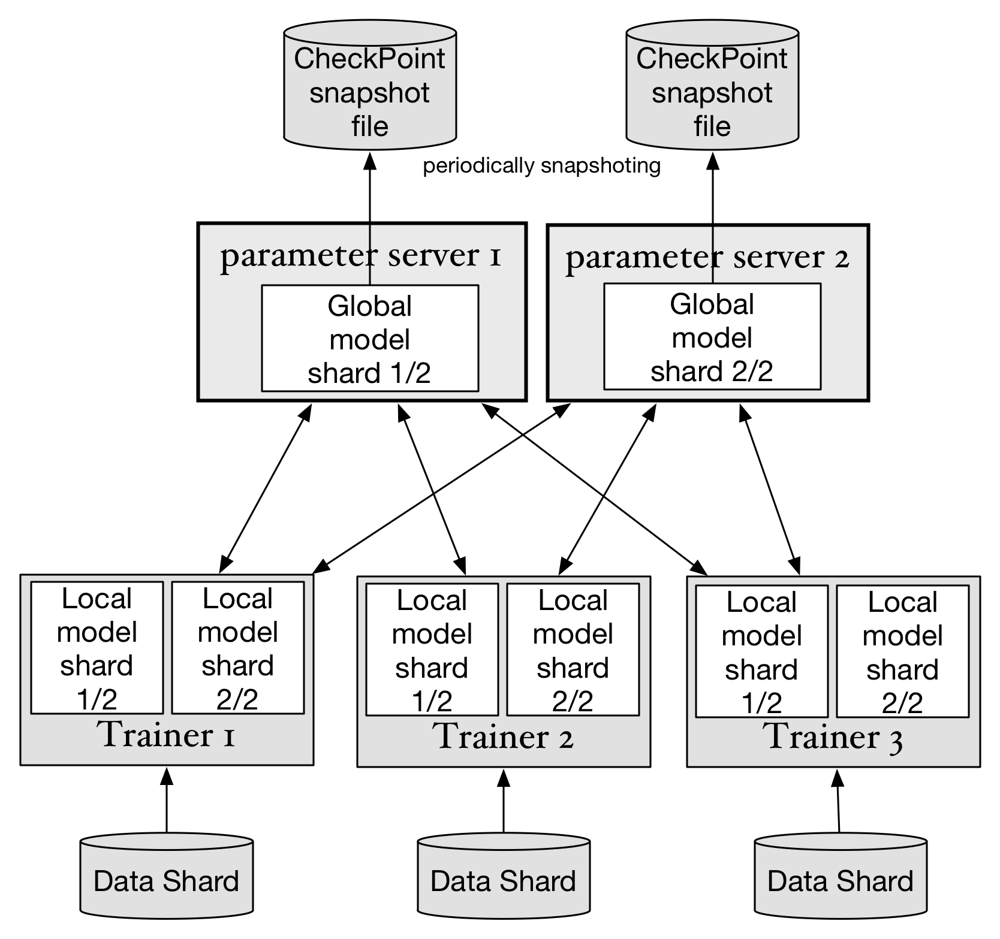

## 模型参数检查点（Checkpointing）
模型数据检查点的实现，可以有效的避免parameter server的单点或多点同时故障。模型参数检查点通过定期向磁盘上保存一份存储在parameter server内存中的模型数据的完整镜像，来保证训练过程可以从中间状态重新启动。在一个不可中断并缺少备份的训练任务中，可以通过阶段性的保存每个parameter server的数据快照（snapshot）到 ***分布式存储服务*** 达到容灾的目的，比如每隔10分钟最新的快照，并删除更早的快照。在出现单点故障时，只需要恢复这台节点，或者将这台节点迁移到另一个节点并启动即可恢复训练任务。

### 快照保存的设计如下：

说明：

* parameter server在集群中启动后，自动挂载分布式存储目录，并把快照保存到这个目录下。
* ***注：每个parameter server的检查点各自独立保存，暂时不考虑多个parameter server同步的保存一个特定时间点的全局检查点，因为这样做也没法保证消除随机性。***

检查点保存程序流程：

1. 如果满足条件"每隔10分钟"时，parameter server会获取parameters内存的`read_lock`，启动一个新的线程开始保存检查点。如果已经正在执行保存检查点的线程，则忽略。由于对parameters的更新需要获取parameters内存的`write_lock`，所以在写入快照的过程中，parameter server会暂停参数更新并等待。
2. parameter server生成一个UUID，向指定的目录中一个新的文件（文件名为此UUID）写入快照数据。在快照写入完成后，计算这个文件的MD5 sum。然后在etcd的`/checkpoints/[pserver_id]`中写入json内容：`{"uuid": [UUID], "md5", "MD5 sum", "timestamp": xxxx}`。
3. 删除磁盘目录中不是当前uuid的快照文件。
4. 释放对paramters内存的锁定，停止保存检查点的线程。

这里需要用户额外注意，在您的实际环境中，训练任务的运行可能会占满trainer和parameter server之间的网络带宽，如果parameter server此时还需要通过网络访问分布式存储以保存快照，可能会造成网络拥塞，而出现阶段性的运行停滞。

### 从快照恢复

在parameter server第一次启动或任意时间parameter server故障后被Kubernetes重新启动，则需要回滚到上一个检查点：

  1. 从etcd中读取节点：`/checkpoints/[pserver_id]`获取最新的检查点的文件uuid
  1. 从磁盘文件中加载uuid文件名的检查点快照文件，并加载其中的参数
  1. 如果上面两步出现错误，则使用启动参数定义的初始化方法初始化参数
  1. 开始提供服务

## TODO List
### 推测执行/加速执行（TODO）
在异构集群中，如果存在某些trainer执行速度过慢会影响整体集群的速度（如图中Trainer 1），此时master将负责启动一个新的Trainer（Accelerate Trainer 2），使用同样的训练数据block。哪个trainer先完成block的训练，则把另一个慢速的kill掉。

### 动态扩容/缩容
目前只考虑动态扩容trainer数量，可以减小系统复杂性。

## 术语
* model: 指深度学习训练之后得到的所有参数，使用这个神经网络可以完成对新数据的预测
* parameters: 神经网络中的参数，包括权重w和偏置b。一个神经网络的模型由大量的参数组成
* shard: 分片，通常指将一个整体拆分成多份的其中的一份。
* model shard: 将一个神经网络参数拆分成多份，每个shard分别存储在其中一台parameter server之上
* parameter block: 多个parameter block构成一个model shard
* 单点故障: 任意时刻只可能同时有一台服务器故障。由于集群中同时存在两台机器故障的概率极低（（平均故障率*平均故障修复时间）^2）只对特殊在线系统考虑两台以上同时故障的容灾。
