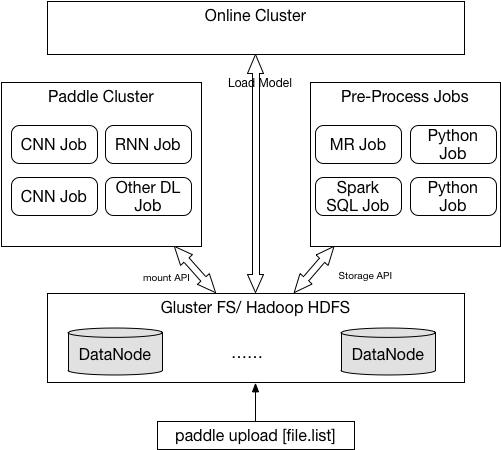

## 训练数据的存储和分发

### 流程介绍
生产环境中的训练数据集通常体积很大，并被存储在诸如Hadoop HDFS, Ceph, AWS S3之类的分布式存储之上。这些分布式存储服务通常会把数据切割成多个分片分布式的存储在多个节点之上。这样就可以在云端执行多种数据类计算任务，包括：

* 数据预处理任务
* Paddle训练任务
* 在线模型预测服务



### 训练数据的存储

选择GlusterFS作为训练数据的存储服务(后续的实现考虑HDFS)。

在Kubernetes上运行的不同的计算框架，可以通过Volume或PersistentVolume挂载存储空间到每个容器中。

在存储中的共享位置，需要保存PaddlePaddle book中的所有dataset数据，并且可以被提交的job直接使用。

### 上传训练文件

使用下面命令，可以把本地的训练数据上传到存储集群中

```
paddle upload train_data.list
```

其中`.list`文件描述了训练数据的文件和对应的label，对于图像类数据，`.list文件`样例如下，每一行包含了图片文件的路径和其label：

```
/data/image1.jpg   1
/data/image1.jpg   5
/data/image1.jpg   2
/data/image1.jpg   5
/data/image1.jpg   1
/data/image1.jpg   8
...
```

对于文本类训练数据样例如下(机器翻译)，一行中包含源语言，目标语言的文本(label)：

```
L&apos; inflation , en Europe , a dérapé sur l&apos; alimentation	Food : Where European inflation slipped up

L&apos; inflation accélérée , mesurée dans la zone euro , est due principalement à l&apos; augmentation rapide des prix de l&apos; alimentation .	The skyward zoom in food prices is the dominant force behind the speed up in eurozone inflation .
...
```

### 使用reader

使用v2 API编写训练任务是，可以编写如下简单的reader，返回文件中的各列，然后在调用`trainer.train()`时传入，完成训练数据的读取：

```python
def train():
    fp = open("/glusterfs/mount/dir/yourfile_%d.list" % TRAINER_ID, "r")

    def reader():
        for l in fp:
            yield l[:-1].split("\t")

    return reader
```

## TODO

### 支持用户自定义的数据预处理job
### 支持SSTable格式的key-value数据
