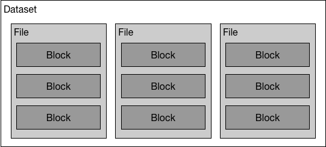

# Design Doc: Master Server

For an overview of master server's role, please refer to [distributed training design doc](./README.md). In this design doc we will discuss the master server in more details. The master will be implemented in [Go](https://golang.org/).

## Dataset



A dataset is a list of files in *RecordIO* format. A RecordIO file consists of chunks, whereas each chunk consists some records.

## Task Queue

As mentioned in [distributed training design doc](./README.md), a *task* is a data shard that the master server assigns to the trainer process to train on. A task consists of one or multiple *chunks* from one or multiple files. The master server maintains *task queues* to track the training progress.

### Task Queue Creation

1. Each trainer will make an RPC call (using Go's [rpc](https://golang.org/pkg/net/rpc/) package) to the master server, telling it the RecordIO files representing the dataset specified by the user. Since every trainer will tell the master server the same dataset, only the first RPC call will be honored.

	The RPC interface is:
	```go
	func (m *RPCServer) ReportDataset(Paths []string, dummy *int) error {
	}
	```
1. The master server will scan through each RecordIO file to generate the *chunk index* and know how many chunks does each file have. A chunk can be referenced by the file path and the index of the chunk within the file. The chunk index is in memory data structure that enables fast access to each chunk, and the index of the chunk with the file is an integer start from 0, representing the n-th chunk within the file.

	The definition of the chunk is:
	```go
	type Chunk struct {
		Idx   int // index of the chunk within the file
		Path  string
		Index recordio.Index // chunk index
	}
	```
1. Chunks are grouped into tasks, and tasks are filled into the todo queue. The pending queue and the done queue are initialized with no element.

	The definition of the task is:
	```go
	type Task struct {
		Index  int
		Chunks []Chunk
	}
	```

	The elements in the tasks queues is of type `TaskEntry`, containing a timeout counter (described in [task retry logic](#task-retry-logic)), and a task:
	```go
	type TaskEntry struct {
		NumTimeout int
		Task       Task
	}
	```

	The definition of task queues is:
	```go
	type TaskQueues struct {
		Todo    []TaskEntry
		Pending map[int]TaskEntry // map from task index to task entry
		Done    []TaskEntry
	}
	```

### Task Queue Persistence

The task queues need to be persisted on [etcd](https://github.com/coreos/etcd) for fault recovery. Since the task queues only change once a task is completed or timed out, which is not very frequent, we can afford to synchronize with etcd every time the task queues change.

We will serialize the task queues data structure with [gob encoding](https://golang.org/pkg/encoding/gob/), compress with gzip, and save into etcd synchronously under key `/task_queues`.

### Task Dispatch

The trainer will make an RPC call to master to get a new task when:

- the trainer first started, or
- the trainer finishes a task.

The RPC interface is:
```go
func (m *RPCServer) GetTask(finished *Task, result *Task) error {
}
```
Argument `finished` will be `nil` when the trainer is just started.

During the RPC call the master will do the following:

- Make a copy of the task queues, and update the copy reflecting the finished tasks and the new pending tasks.
- Synchronize the copy of task queues with etcd using a transaction conditioned on holding the master lock.
- Replace the task queues with the copy and report to the trainer with the new tasks if succeeded, or discard the copy and report the error to the trainer if failed.

### Task Retry Logic

When a task is dispatched to the trainer, the master will schedule a function for execution after the timeout duration (based on the moving average of task completion time). If the task entry in still in the pending queue, its timeout counter will increase by one, and the task will be moved to todo queue. If the timeout counter is above the threshold, the master will log the error and discard the task.

Please note that since a timed out task could be completed after it has been dispatched for retry, so it is possible for a task to be processed multiple times. We do not try to prevent it from happening since it's fine to train on the same task multiple times due to the stochastic nature of the stochastic gradient decent algorithm.
