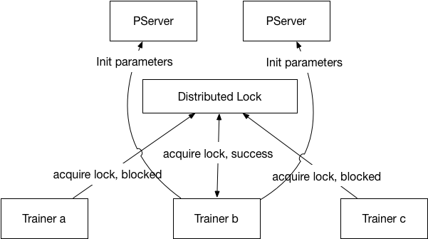
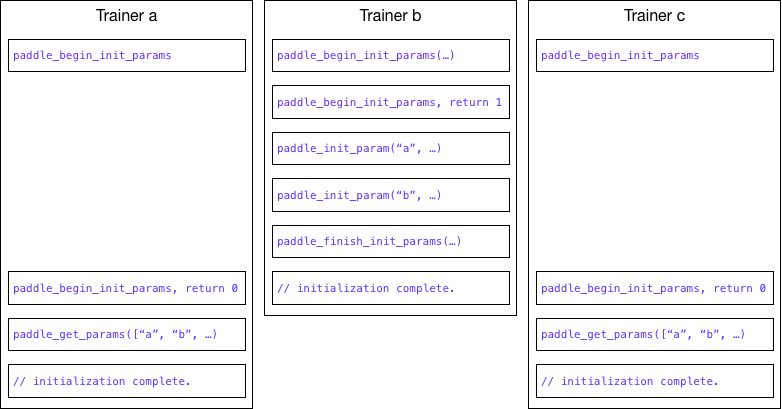

# Design Doc: The Client Library of Parameter Server

For an overview of trainer's role, please refer to [distributed training design doc](README.md). In this design doc, we will discuss the parameter server's client library, which will manage communication with parameter servers. The library will be implemented in [Go](https://golang.org/) and made available as a static or dynamic library with a C header file.

## Parameter Partition

Each parameter will be partitioned into parameter blocks to make the parameters evenly distributed on parameter servers. The partition is done automatically by the client library. The *sparse parameter* require a little different treatment:

### Sparse Parameter

The sparse parameter is a parameter that is updated sparsely. The name is somewhat misleading, it does not have a sparse representation, it has the same representation as a dense vector.

Because a sparse parameter is updated sparsely, the trainer will have to partition the sparse parameter. Because the parameter server will merge all sparse parameter shard into the same file when saving the parameter. It needs special naming convention:

If a sparse parameter is partitioned into n shards, they should be named as:

```text
name:sparse-0
name:sparse-1
...
name:sparse-n-1
```

The library is unaware of the partition, and treat each parameter independently. Only when saving parameters, the parameter servers will merge the sparse parameters according to the naming convention.

## Model Optimization Using Gradients

There are two ways to perform model optimization using gradients:

- On Client

  The client does multiple steps of forward and backward update. In each step, the gradients are calculated and a new model is generated. After some steps, the client will calculate the difference between the newest model and the old model at step 0. The difference will be updated to parameter servers. Parameter servers will just update parameters using the difference without any optimization using gradients (such as Adam and L1 regularization).

- On Parameter Server

  The client will send accumulated gradients to parameter servers, the parameter server will do the optimization using gradients.

## L1 and L2 Regularization

PaddlePaddle allows L1 or L2 regularizations to be specified per parameter, so when the trainer initializes the parameter it needs include a parameter configuration when L1 or L2 regularization is necessary.

## Parameter Initialization

The parameters on parameter servers need to be initialized. To provide maximum flexibility, the trainer will initialize the parameters. Only one trainer will do the initialization, the other trainers will wait for the completion of initialization and get the parameters from the parameter servers.

### Trainer Selection

To select the trainer for initialization, every trainer will try to get a distributed lock, whoever owns the lock will do the initialization. As illustrated below:



### Trainer Selection Process

The trainer select process is encapsulated in the C API function:
```c
int paddle_begin_init_params(paddle_pserver_client* client, const char* config_proto);
```
The selected trainer's call to `paddle_begin_init_params` will return with 1, and the other trainers' call to `paddle_begin_init_params` will return 0. `paddle_get_params` will be blocked until initialization is completed. As illustrated below:



## C Interface

```c
typedef enum {
  PADDLE_ELEMENT_TYPE_INT32   = 0,
  PADDLE_ELEMENT_TYPE_UINT32  = 1,
  PADDLE_ELEMENT_TYPE_INT64   = 2,
  PADDLE_ELEMENT_TYPE_UINT64  = 3,
  PADDLE_ELEMENT_TYPE_FLOAT32 = 4,
  PADDLE_ELEMENT_TYPE_FLOAT64 = 5,
} paddle_element_type;

typedef struct {
  char*               name;
  paddle_element_type element_type;
  unsigned char*      content;
  int                 content_len;
} paddle_parameter, paddle_gradient;

typedef int paddle_pserver_client;

/**
 * @brief creates a pserver client that talks to etcd for coordination.
 */
paddle_pserver_client paddle_new_etcd_pserver_client(char* etcd_addr);

/**
 * @brief creates a pserver client given pserver addresses.
 *
 * @param pserver_addrs comma-separated pserver addresses.
 * @param selected if current pserver client is selected to initialize all parameter servers.
 */
paddle_pserver_client paddle_new_pserver_client(char* pserver_addrs, int selected);
void paddle_pserver_client_release(paddle_pserver_client c);

/**
 * @brief paddle_begin_init_params begins to initialize parameters on
 * parameter servers.
 *
 * paddle_begin_init_params will be called from multiple trainers,
 * only one trainer will be selected to initialize the parameters on
 * parameter servers. Other trainers need to get the initialized
 * parameters from parameter servers using @paddle_get_params.
 *
 * @return 1 if the trainer is selected to initialize parameter
 * servers, otherwise 0.
 */
int paddle_begin_init_params(paddle_pserver_client client);

/**
 * @brief paddle_init_param initializes the parameter on parameter
 * servers.
 *
 * @param param the parameter to initialize.
 * @param param_config_proto the configuration for the parameter.
 * @param config_len the length of param_config_proto
 * @return 0 if successful, otherwise -1. On failure, the trainer
 * needs to restart the entire initialization process (starting from
 * @paddle_begin_init_param). Or simply exit the program and wait for
 * the cluster management system to restart the trainer.
 */
int paddle_init_param(paddle_pserver_client client, paddle_parameter param, const unsigned char* param_config_proto, int config_len);

/**
 * @brief paddle_finish_init_params tells parameter servers client has
 * sent all parameters to parameter servers as initialization.
 *
 * @return 0 if successful, otherwise -1. On failure, the trainer
 * needs to restart the entire initialization process (starting from
 * @paddle_begin_init_param). Or simply exit the program and wait for
 * the cluster management system to restart the trainer.
 */
int paddle_finish_init_params(paddle_pserver_client client);

/**
 * @brief paddle_send_grads sends gradients to parameter servers for
 * updating parameters.
 *
 * @param grads the array of gradients to send.
 * @param len the length of the gradient array.
 * @param learning_rate the learning rate for the gradients.
 * @return 0 if successful, otherwise -1.
 */
int paddle_send_grads(paddle_pserver_client client, const paddle_gradient* grads, int len);

/**
 * @brief paddle_get_params gets parameters from parameter servers.
 *
 * paddle_get_params will block until parameters are initialized on
 * the parameter servers.
 *
 * @param dst the destination array of parameter pointers to save to.
 * The parameter pointer must be pre-popullated with required parameter name,
 * and the content of parameter must be pre-allocated of the size of required
 * parameter on pserver.
 * @param len the length of the names array and the paddle_parameter
 * array.
 * @return 0 if successful, otherwise -1.
 */
int paddle_get_params(paddle_pserver_client client, paddle_parameter** dst, int len);

/**
 * @brief paddle_save_model indicates parameters to save the parameter
 * to the given path
 *
 * @param path the path to save parameters.
 * @return 0 if successful, otherwise -1.
 */
int paddle_save_model(paddle_pserver_client client, const char* path);
```
