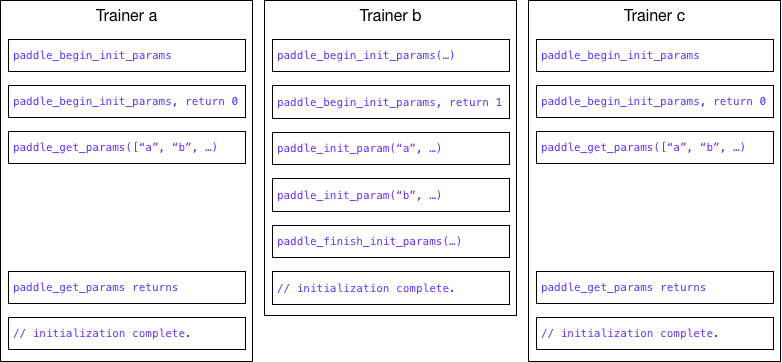

# Design Doc: The Client Library of Parameter Server

For an overview of trainer's role, please refer to [distributed training design doc](README.md). In this design doc, we will discuss the parameter server's client library, which will manage communication with parameter servers. The library will be implemented in [Go](https://golang.org/) and made available as a static or dynamic library with a C header file.

## Parameter Initialization

The parameters on parameter servers need to be initialized. To provide maximum flexibility, we need to allow trainer initialized the parameters. Only one trainer will do the initialization, the other trainers will wait for the completion of initialization and get the parameters from the parameter servers.

### Trainer Selection

To select the trainer for initialization, every trainer will try to get a distributed lock, whoever owns the lock will do the initialization. As illustrated below:


### Selection Process

The select process is encapsulated in the C API function:
```c
int paddle_begin_init_params(paddle_pserver_client* client, const char* config_proto);
```
The selected trainer's call to `paddle_begin_init_params` will return with 1, and the other trainers' call to `paddle_begin_init_params` will block until initialization is done, and return 0. As illustrated below:



## C Interface

```c
#define PADDLE_ELEMENT_TYPE_INT32   0
#define PADDLE_ELEMENT_TYPE_UINT32  1
#define PADDLE_ELEMENT_TYPE_INT64   2
#define PADDLE_ELEMENT_TYPE_UINT64  3
#define PADDLE_ELEMENT_TYPE_FLOAT32 4
#define PADDLE_ELEMENT_TYPE_FLOAT64 5

typedef struct {
  char* name;
  int   element_type;
  void* content;
  int   content_len;
} paddle_parameter, paddle_gradient;

typedef struct paddle_pserver_client paddle_pserver_client;

paddle_pserver_client* paddle_new_pserver_client();
void paddle_pserver_client_release(paddle_pserver_client* client);

/**
 * @brief paddle_begin_init_params begins to initialize parameters on
 * parameter servers.
 *
 * paddle_begin_init_params will be called from multiple trainers,
 * only one trainer will be selected to initialize the parameters on
 * parameter servers. Other trainers will be blocked until the
 * initialization is done, and they need to get the initialized
 * parameters from parameter servers using @paddle_get_params.
 *
 * @param config_proto serialized parameter server configuration in
 * Protocol Buffers format.
 * @return 1 if the trainer is selected to initialize parameter
 * servers, otherwise 0.
 */
int paddle_begin_init_params(paddle_pserver_client* client, const char* config_proto);

/**
 * @brief paddle_init_param initializes the parameter on parameter
 * servers.
 *
 * @param param the parameter to initialize.
 * @return 0 if successful, otherwise -1. On failure, the trainer
 * needs to restart the entire initialization process (starting from
 * @paddle_begin_init_param). Or simply exit the program and wait for
 * the cluster management system to restart the trainer.
 */
int paddle_init_param(paddle_pserver_client* client, paddle_parameter params);

/**
 * @brief paddle_finish_init_params tells parameter servers client has
 * sent all parameters to parameter servers as initialization.
 *
 * @return 0 if successful, otherwise -1. On failure, the trainer
 * needs to restart the entire initialization process (starting from
 * @paddle_begin_init_param). Or simply exit the program and wait for
 * the cluster management system to restart the trainer.
 */
int paddle_finish_init_params(paddle_pserver_client* client);

/**
 * @brief paddle_send_grads sends gradients to parameter servers for
 * updating parameters.
 *
 * @param grads the array of gradients to send.
 * @param total the total number of gradient inside the gradient array.
 * @param learning_rate the learning rate for the gradients.
 * @return 0 if successful, otherwise -1.
 */
int paddle_send_grads(paddle_pserver_client* client, const paddle_gradient* grads, int total, double learning_rate);

/**
 * @brief paddle_set_params sets parameters to parameter servers.
 *
 * @param params the array of parameters to set to parameter servers.
 * @param total the total number of parameters inside the parameter
 * array.
 * @return 0 if successful, otherwise -1.
 */
int paddle_set_params(paddle_pserver_client* client, const paddle_parameter* params, int total);

/**
 * @brief paddle_get_params gets parameters from parameter servers.
 *
 * @param names the array of names of the parameters to get.
 * @param dst the destination array of parameters to save to.
 * @param total the total number of parameters to get.
 * @return 0 if successful, otherwise -1.
 */
int paddle_get_params(paddle_pserver_client* client, const char** names, paddle_parameter* dst, int total);

/**
 * @brief paddle_save_model indicates parameters to save the parameter
 * to the given path
 *
 * @param path the path to save parameters.
 * @return 0 if successful, otherwise -1.
 */
int paddle_save_model(paddle_pserver_client* client, const char* path);
```
