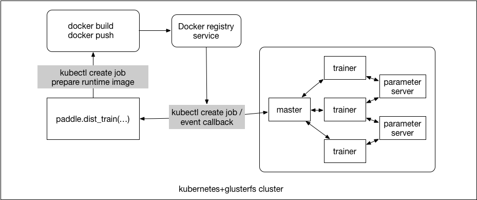

# Submit a Distributed Training Job

If a user wants to start up a distributed training job, he will submit the distributed training job with Python code.

If a user wants to start up a local train, he will start up a PaddlePaddle production Docker container firstly, and then
execute `python train.py` in the Docker container. The details about PaddlePaddle Docker image is [here](../../../paddle/scripts/docker/README.md).

## Runtime Environment On Kubernetes

For a distributed training job, there is two Docker image called *runtime Docker image* and *base Docker image*. The runtime Docker image is the Docker image that gets scheduled by Kubernetes to run during training. The base Docker image is for building the runtime Docker image.

- Base Docker Image

  Usually, the base Docker image is PaddlePaddle product Docker image including paddle binary files and trainer startup script file. And of course, users can specify any image name hosted on any docker registry which users have the access right.

- Runtime Docker Image

  The trainer package which user upload and some Python dependencies are packaged into a runtime Docker image based on base Docker image.

- Python Dependencies

  You need to provide requirments.txt file in your "trainer" package. Example:
  ```txt
  pillow
  protobuf==3.1.0
  ```
  More [details](https://pip.readthedocs.io/en/1.1/requirements.html) about requirements.

  An example project looks like:
  ```bash
    paddle_example
      |-quick_start
        |-trainer.py
        |-dataset.py
        |-requirments.txt
  ```

## Submit Distributed Training Job With Python Code

- `paddle.job.dist_train()` will call the Job Server API `/v1/packages` to upload the trainer package and save them on CephFS, and then call `/v1/trainer/job` to submit the PaddlePaddle distributed job.
- `/v1/trainer/job` will start a building job for preparing the runtime Docker image. When the building job is finished, Job Server will submit the PaddlePaddle distributed job to Kubernetes.
- *NOTE*: The first stage, we only implement submit the PaddlePaddle job in `paddle.job.dist_train()`

You can call `paddle.job.dist_train` and provide distributed training configuration as the parameters:
```python
paddle.job.dist_train(
    trainer=paddle.trainer.SGD(...,
                              paddle.updater.Adam(...)),
    reader=reader,
    paddle_job=PaddleJob(
      job_name="quickstart",
      use_gpu=True,
      cpu_num=4,
      gpu_num=2,
      memory="1G"
      input=/quickstart/input,
      output=/quickstart/output,
      base_image="paddlepaddle/paddle:0.10.rc2")
```

The pseudo code of `paddle.job.dist_train` is as follows:
```python
  def dist_train(trainer, reader, num_passes=1, event_handler=None, feeding=None, paddle_job=None):
    # if the code is running on cloud, set PADDLE_ON_CLOUD=YES
    if os.getenv("PADDLE_ON_CLOUD", "NO") == "NO":
      #submit the paddle job
      paddle_job.submit()
    else:
      #start the training
      trainer.train(reader, num_passes, event_handler, feeding)
```

parameter | required | default | explain
  --- | --- | --- | ---
job_name|YES||you should special a uniq job name which in a namespace
trainer_package|YES|| entry point for startup trainer process
input| YES || input directory on distributed file system
output|YES|| output directory on distributed file system
pservers|YES|| parameter server process count
base-image|YES||PaddlePaddle production Docker image
memory|YES|| limits for memory
use_gpu|NO|false| whether use GPU
cpu_num|NO|1| if `use_gpu=false`, this parameter is required
gpu_num|NO|1| if `use_gpu=true`, this parameter is required

- Startup Parameter Server and Trainer Jobs
  - Deploy parameter server job, it's a Kubernetes ReplicaSet.
  - Deploy trainer job, it's a Kubernetes Job.

# Job Server

- RESTful API

  Job server provides a RESTful HTTP API, receive the trainer package and display
  PaddlePaddle job related informations.
  - `POST   /v1/package` receive the trainer package and save them on CephFS
  - `POST   /v1/trainer/job` submit a trainer job
  - `GET    /v1/jobs/` list all jobs
  - `GET    /v1/jobs/<job-name>` the status of a job
  - `DELETE /v1/jobs/<job-name>` delete a job
  - `GET    /v1/version` job server version

- Build Runtime Docker Image on Kubernetes

  `paddle.job.dist_train` will upload the trainer package to Job Server and then save them on the distributed filesystem, and then start up a job for building the runtime Docker image, Parameter Server and Trainer will use this runtime Docker image.

  There are some benefits for building runtime Docker image on JobServer:
  - **Docker in Docker** should mount `docker.sock` in the container and set `--privileged`, if the code running in a kubernetes pod, it's not safe.
  - Users only need to upload the training package files, does not dependency docker engine, docker registry.
  - If we want to change another image type, such as RKT, the user does not need to care about it.

- Start Up Parameter Server and Trainer Jobs
  `POST /v1/trainer/job` receives the distributed training parameters, and deploy the job as follows:
  - Deploy PServer job, it's a Kubernetes ReplicaSet.
  - Deploy Trainer job, it's a Kubernetes Job.
