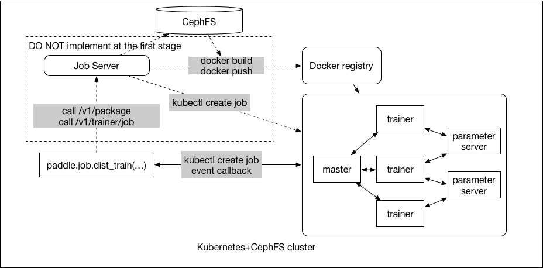

# Submit a Distributed Training Job

The user can submit a distributed training job with Python code, rather than with a command-line interface.

## Runtime Environment On Kubernetes

For a distributed training job, there is two Docker image called *runtime Docker image* and *base Docker image*. The runtime Docker image is the Docker image that gets scheduled by Kubernetes to run during training. The base Docker image is for building the runtime Docker image.

- Base Docker Image

  Usually, the base Docker image is PaddlePaddle product Docker image including paddle binary files and trainer startup script file. And of course, users can specify any image name hosted on any docker registry which users have the access right.

- Runtime Docker Image

  The trainer package which user upload and some Python dependencies are packaged into a runtime Docker image based on base Docker image.

  - Python Dependencies

    You need to provide requirements.txt file in your "trainer" package. Example:
    ```txt
    pillow
    protobuf==3.1.0
    ```
    More [details](https://pip.readthedocs.io/en/1.1/requirements.html) about requirements.

    An example project looks like:
    ```bash
      paddle_example
        |-quick_start
          |-trainer.py
          |-dataset.py
          |-requirements.txt
    ```

## Submit Distributed Training Job With Python Code


- `paddle.job.dist_train()` will call the Job Server API `/v1/packages` to upload the trainer package and save them on CephFS, and then call `/v1/trainer/job` to submit the PaddlePaddle distributed job.
- `/v1/trainer/job` will start a building job for preparing the runtime Docker image. When the building job is finished, Job Server will submit the PaddlePaddle distributed job to Kubernetes.
- *NOTE*: For the first version, we will not prepare the runtime docker image, instead, we will mount the trainer package in a temporary folder into the base docker image. We will not support custom Python dependencies in the first version as well.

You can call `paddle.job.dist_train` and provide distributed training configuration as the parameters:
```python
paddle.job.dist_train(
    trainer=paddle.trainer.SGD(...,
                              paddle.updater.Adam(...)),
    reader=reader,
    paddle_job=PaddleJob(
      pserver_bucket="stander",
      base_image="yancey1989/paddle-cloud",
      job_name="paddle-job",
      namespace="paddle-cloud",
      cpu_num=3,
      memory="1G"
      trainer_package="/example/word2vec",
      entry_point="python %s" % __file__)
```

The pseudo code of `paddle.job.dist_train` is as follows:
```python
  def dist_train(trainer, reader, num_passes=1, event_handler=None, feeding=None, paddle_job=None):
    # if the code is running on cloud, set PADDLE_ON_CLOUD=YES
    if os.getenv("PADDLE_ON_CLOUD", "NO") == "NO":
      #submit the paddle job
      paddle_job.submit()
    else:
      #start the training
      trainer.train(reader, num_passes, event_handler, feeding)
```

parameter | required | default | explain
  --- | --- | --- | ---
job_name|YES||you should special a unique job name which in a namespace
entry_point|YES|| entry point for startup trainer process
trainer_package|YES|| trainer package file path, you can special a cloud path with `pfs://home/paddle` or a local path in Docker container with `/home/paddle`
base_image|YES||PaddlePaddle production Docker image
memory|YES|| memory for the trainers totally used
cpu_num|YES|1| CPU count for the trainers totally used
gpu_num|NO|0| GPU count for the trainers totally used
pserver_bucket|NO|mini| you can special `pserver-bucket` for the PServer resource
pservers|NO|1| custom PServer count
pserver_cpu|NO|1| custom PServer CPU count
pserver_memory|NO|1| custom PServer memory limit

### Special Resource for Distributed Training Job
- PServer Resource
  - Special `pserver_bucket`
    - `pserver_bucket=mini` for only on PServer process.
    - `pserver_bueckt=stander` for many PServer processes.
    - `pserver_bucket=premium` for large PServer processes
  - Custom PServer Resource
    You can also custom the PServer resource without special `pserver_bucket`
    - You *must* set `pservers` to special the PServer process count.
    - You *must* set `pserver_memory` to special the memory limit for each PServer process.
    - You *must* set `pserver_cpu` to special the CPU count for each PServer process.

- Trainer Resource
  - you *may* special `gpu_num` for the trainers totally used. By default, trainer count equal GPU count.
  - you *must* special `cpu_num` for the trainers totally used. if `gpu_num=0`, trainer count equal CPU count.  
  - you *must* special `memory` for the trainers totally used, you can express memory as a plain integer using one of these suffixes: E, P, T, G, M, K.

### Deploy Parameter Server, Trainer and Master Process
  - Deploy PaddlePaddle Parameter Server processes, it's a Kubernetes ReplicaSet.
  - Deploy PaddlePaddle Trainer processes, it's a Kubernetes Job.
  - Deploy PaddlePaddle Master processes, it's a Kubernetes ReplicaSet.

# Job Server

- RESTful API

  Job server provides a RESTful HTTP API, receive the trainer package and display
  PaddlePaddle job related informations.
  - `POST   /v1/package` receive the trainer package and save them on CephFS
  - `POST   /v1/trainer/job` submit a trainer job
  - `GET    /v1/jobs/` list all jobs
  - `GET    /v1/jobs/<job-name>` the status of a job
  - `DELETE /v1/jobs/<job-name>` delete a job
  - `GET    /v1/version` job server version

- Build Runtime Docker Image on Kubernetes

  `paddle.job.dist_train` will upload the trainer package to Job Server and then save them on the distributed filesystem, and then start up a job for building the runtime Docker image, Parameter Server and Trainer will use this runtime Docker image.

  There are some benefits for building runtime Docker image on JobServer:
  - On Paddle Cloud, the user will run the trainer code in a Jupyter Notebook which is a Kubernetes Pod, if we want to execute `docker build` in the Pod, we should mount the host's `docker.sock` to the Pod, user's code will connect the host's Docker Engine directly, it's not safe.
  - Users only need to upload the training package files, does not need to install docker engine, docker registry as dependencies.
  - If we want to change another image type, such as RKT, the user does not need to care about it.

- Deploy Parameter Server, Trainer and Master Processes

  `POST /v1/trainer/job` receives the distributed training parameters, and deploy the job as follows:
  - Deploy PaddlePaddle Parameter Server processes, it's a Kubernetes ReplicaSet.
  - Deploy PaddlePaddle Trainer processes, it's a Kubernetes Job.
  - Deploy PaddlePaddle Master processes, it's a Kubernetes ReplicaSet.
