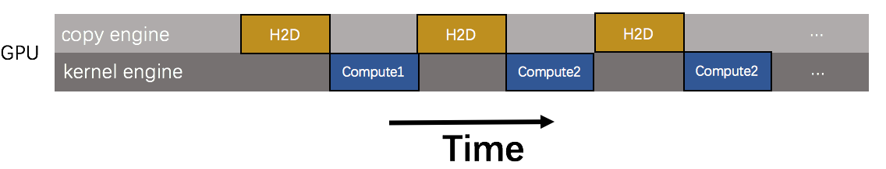
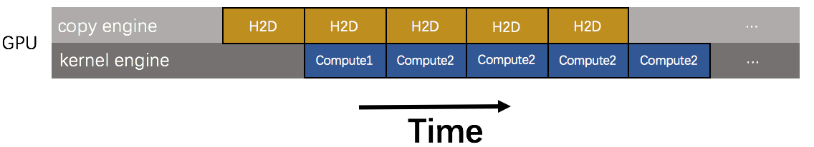

# Design Doc: Concurrent data transfer and kernel execution.
Training deep learning model on GPU involves three stages: loading data from disk, copying the data from the CPU side to the GPU side, and executing training program on GPU. We need an efficient mechanism to take full use of hardware resources to make those stages executed concurrently. At present, Fluid uses producer-consumer mechanism at the python side to load data from disk. So this design doc mainly solves the time overlap of data transfer and kernel execution.

## Challenge

The data transfer between CPU and GPU is synchronized, by default. A timeline for the execution of training model on `GPU` is shown in the following diagram.

<p align="center"><br/></p>

In the schematic, we assume that the time required for data transfer and kernel execution is approximately the same. Obviously, the overlap of these operations is zeros. Our target is making use of the hardware resource to parallel data transfer and kernel execution. Just like the following schematic shows.
  
<p align="center"><br/></p>
  
## Solution
One feasible method is to use [staging area](https://en.wikipedia.org/wiki/Staging_(data)). A staging area is an intermediate storage area used for data processing during the [extract, transform and load (ETL)](https://en.wikipedia.org/wiki/Extract,_transform,_load) process. The data staging area sits between the data source(s) and the data target(s), which are often data warehouses, data marts, or other data repositories.   
The staging area has one fixed-size buffer and two methods, `put` and `get`. `put` and `get` access buffer in a thread-safe way. The operation of `put` puts data into the buffer, and `get` removes a data from the buffer. When the program runs, the staging area should be warmed up. At first, `put` is called to put some data in the staging area. After that, `get` is called when the kernel begins executing, and one data is extracted from the staging area. At the same time, `put` is called and a new data is copied from CPU side to the staging area. Because the operation of data transfer is asynchronous, so the `put` method will return immediately.     

The GPU provided by NVIDIA generally has two engines: a copy engine and a computing engine. To make two engines working at the same time, we need to use the [stream mechanism](https://devblogs.nvidia.com/parallelforall/gpu-pro-tip-cuda-7-streams-simplify-concurrency/) provided by CUDA. As long as data transfer and kernel execution are in different streams and the kernel does not use the data being transferred, the data transfer and kernel execution can be done at the same time on GPU.  

To support the above description, we need to define a new class: `Channel`. Here, we borrow the concept of [`Channel`](https://www.golang-book.com/books/intro/10#section2) in the go language.

```
template <typename T>
class Channel {
 private:
  using ChannelElement = std::vector<T>;

  std::size_t capacity_;
  std::size_t bytes_limit_;
  std::size_t current_bytes_;
  std::mutex mu_;
  std::condition_variable empty_cond_var_;
  std::condition_variable full_cond_var_;
  std::deque<ChannelElement> channel_;

 public:
  explicit Channel(std::size_t capacity, std::size_t bytes_limit);

  void Put(ChannelElement* buffer_element) { ... }
  void Get(ChannelElement* buffer_element) { ... }
  size_t Size() { ... }
  void Clear()  { ... }
};
};
```

**Take the [recognize_digits_mlp](https://github.com/PaddlePaddle/Paddle/blob/develop/python/paddle/v2/fluid/tests/book/test_recognize_digits_mlp.py) as an example to show the model definition after using the staging area mechanism.**

```
...
chan_list_name = "chan_list"
with fluid.go(concurrent_program, chan_list_name):
    image = fluid.layers.data_layer(...)
    label = fluid.layers.data_layer(...)
    chan_list = fluid.channel_list.make(type=var.CHANNEL_LIST, name=chan_list_name)
    places = get_places() 
    with parallel.for(places) as for_loop:
        chan = fluid.channel_list.get_channel(chan_list, type=var.CHANNELTYPE,name="chan_{}".format(for_loop.i))
        fluid.channle.send(chan, data=[for_loop.input(image), for_loop.input(label)])

with fluid.go(main_program, chan_list_name):
    chan_list = fluid.channel_list.make(type=var.CHANNEL_LIST, name=chan_list_name)
    places = get_places() 
    with parallel.for(places) as for_loop:
        chan = fluid.channel_list.get_channel(chan_list, type=var.CHANNELTYPE,name="chan_{}".format(for_loop.i))
        image, label = fluid.channel.recv(chan)
        y_predict = fluid.layers.fc(input=image, size=1, act=None)
        cost = fluid.layers.square_error_cost(input=y_predict, label=label)
        avg_cost = fluid.layers.mean(x=cost) 
        ...
        
for i in range(buffer_size):
    data = next(train_reader())
    executor.run(concurrent_program, feed=feeder.feed(data))

for pass_id in range(PASS):
    for data in train_reader():
        executor.run(concurrent_program, feed=[...])
        executor.run(main_program, fetch=[...])

for i in range(buffer_size):
    executor.run(main_program, fetch=[...])

```
In Python code, we define two `program`, `concurrent_program` used to send data into `Channel` and `main_program` used to get data from the `Channel` and execute training. If you're familiar with [`Goroutine`](https://www.golang-book.com/books/intro/10#section1) in the go language, you'll find that `main_program` and `concurrent_program` just like two `Goroutine`.

In `concurrent_program`, `fluid.channel_list.make` gets a `chan_list` according to the `chan_list_name`. `fluid.channel_list.make` creates a `global_variable` and puts it into `concurrent_program.global_block`. And then `places = fluid.get_places()` gets all available device on the current machine. The `places` is used in `parallel.for`. In `parallel.for`, according to `name="chan_{}".format(for_loop.i)`, `fluid.channel_list.get_channel` gets a `chan` from `chan_list`. After that, `fluid.channle.send` sends `image` and `label` to this `channel`.

In `main_program`, roughly similar to the `concurrent_program`, the difference is that `main_program` gets `image` and `label` from `chan` by `fluid.channle.recv`. The names of `chan_list` in `concurrent_program` and `main_program` are the same, so the two `chan_list` are the same variable at the c++ side.


## Reference
[Staging area](https://en.wikipedia.org/wiki/Staging_(data))  
[Producer-Consumer](https://en.wikipedia.org/wiki/Producer–consumer_problem)    
[How to Overlap Data Transfers in CUDA C/C++](https://devblogs.nvidia.com/parallelforall/how-overlap-data-transfers-cuda-cc/)   
