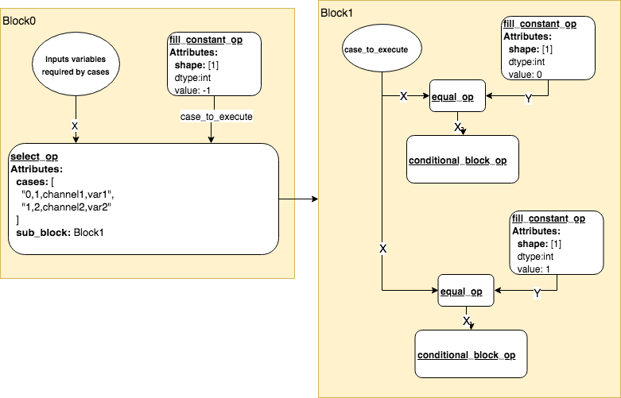
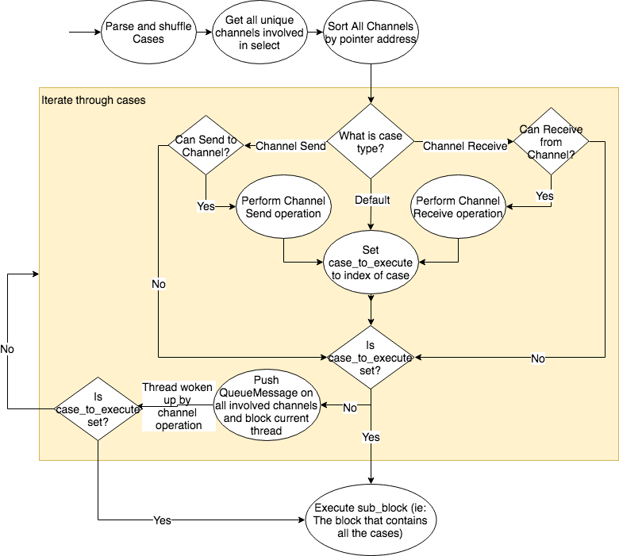

# select_op Design

## Introduction

In golang, the **select** statement lets a goroutine wait on multiple 
communication operations at the same time. The **select** blocks until
one of its cases can run, then executes the case.  If multiple cases
are ready to run, then one case is choosen at random to be executed.

With the introduction of CSP for Paddle, we mimic this behavior by 
creating a ***select_op***.  The ***select_op*** works in conjunction
with the **channel_send_op**, **channel_receive_op**, and 
**channel_close_op**.

## How to use it

The **select_op** is available as a c++ operator.  However most users
will prefer to use the much simplier Python API.

- **fluid.Select()**: Creates a Select block and adds it to the main
program block.  Within the select block, users can add cases by calling 
**select.case** or **select.default** method.

- **fluid.Select.case(channel_action, channel, result_variable)**: Represents
a fluid channel send/recv case.  This method creates a SelectCase block
guard and adds it to the Select block.  The arguments into this method tells
the select which channel operation to listen to.

- **fluid.Select.default()**: Represents the fluid default case.  This default
case is executed if none of the channel send/recv cases are available to
execute.

**Example:**
```
x = fill_constant(shape=[1], dtype=core.VarDesc.VarType.INT32, value=0)
y = fill_constant(shape=[1], dtype=core.VarDesc.VarType.INT32, value=1)
 
while_cond = fill_constant(shape=[1], dtype=core.VarDesc.VarType.BOOL, value=True)
while_op = While(cond=while_cond)    
 
with while_op.block():
    with fluid.Select() as select:
        with select.case(fluid.channel_send, channel, x):
            # Send x, then perform Fibonacci calculation on x and y
            x_tmp = fill_constant(shape=[1], dtype=core.VarDesc.VarType.INT32, value=0)
            assign(input=x, output=x_tmp)
            assign(input=y, output=x)
            assign(elementwise_add(x=x_tmp, y=y), output=y)
        with select.case(fluid.channel_recv, quit_channel, result2):
            # Exit out of While loop
            while_false = fill_constant(shape=[1], dtype=core.VarDesc.VarType.BOOL, value=False)
            helper = layer_helper.LayerHelper('assign')
            helper.append_op(
                type='assign',
                inputs={'X': [while_false]},
                outputs={'Out': [while_cond]})
```

## How it Works

### Program Description

<p align="center">
<br/>
</p>

The python select API will add the **select_op** to the current block.  In addition, it will
iterate through all it's case statements and add any input variables required by case statements
into **X**.  It will also create a temp variable called **case_to_execute**.  This variable is
filled in by the select_op after it has completed processing the case statements.

If there are no available cases to execute (ie: all cases are blocked on channel operations, and
there is no default statement), then the select_op will block the current thread.  The thread will 
unblock once there is a channel operation affecting one of the case statements, at which point, the
**select_op** will set the **case_to_execute** variable to the index of the case to execute.

Finally the select_op will call executor.run on the **sub_block**.

Cases are represented by a **conditional_block_op** whose's condition is set as the output of 
equal(**case_to_execute**, **case_index**).  Since each case index is unique in this sub-block, 
only once case will be executed.

### select_op flow

<p align="center">
<br/>
</p>

The select algorithm is inspired by golang's select routine.  Please refer to 
http://www.tapirgames.com/blog/golang-concurrent-select-implementation for more information.

## Backward Pass

TODO