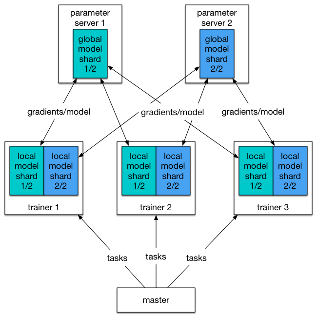

# Distributed Training Design Doc

## Objective

We want Paddle to support training on the general-purpose cluster. The cluster runs Paddle, the Web server (e.g., Nginx), the log collector (e.g., fluentd), the distributed queue service (e.g., Kafka), the log joiner and other data processors written using Storm, Spark, and Hadoop MapReduce on the same cluster. As illustrated in the following graph:

This poses new challenges for Paddle,

- Paddle need to be fault tolerant.
- Input training data can be online data from real time logs or batch data from distributed file system.
- User needs a simple way to train model on Paddle cloud. Complexities such as job scheduling should be hidden from user.

## Training Job

A training job will be created once user asks Paddle cloud to train a model. The training job is made up of different processes that collaboratively consume data and produce a trained model. There are three kinds of processes:

- Master process
- Trainer process
- Parameter server process

One training job will only have one master process, typically multiple trainer processes and parameter server processes. Their relation is illustrated in the following graph:

### Master Process

Master process will:

- Keep a list of alive trainers and a list of alive parameter servers and do health check.
  - If a trainer is dead it will update the task queue accordingly as mentioned in [task queue](#task-queue).
  - If a parameter server is dead or a new parameter server joins, it will broadcast this information to all trainers.
- Dispatches tasks to trainers. A *task* is a unit of data that a trainer needs to train on.
- Keep track of training progress on the dataset with *task queue*. A training job will iterate on the dataset for a full pass until it goes into next pass.

#### Task Queue

Master process has three task queues to track training progress as shown in the graph below:

- The todo queue holds tasks to be dispatched. When a job starts, the master process fills in the todo queue with all tasks.
- The pending queue holds tasks that are currently training by trainers, and a mapping from trainers to their training tasks.
- the done queue holds tasks that are already trained.

A dataset will be sharded into tasks and dispatched by the master process. The life cycle of a single task is illustrated below:

1. When a new pass of training starts, all tasks will be placed in the todo queue.
1. The master process will dispatch few tasks to each trainer at a time, puts them in the pending queue and waits for completion.
1. The trainer will work on it's tasks and tell the master process once a task is completed. The master process will dispatch a new task to that trainer.
1. If a trainer is dead. the master process will move it's tasks back to the todo queue.
1. The master process will move completed task to the done queue. When the todo queue is empty, the master process will start a new pass by moving all tasks in the done queue to todo queue.

### Trainer Process

The trainer process will train its current tasks, tell parameter servers its accumulated gradient, and download the latest model from parameter servers.

The trainer holds entire network model while each parameter server holds a shard of the model. So trainer needs to communicate will all parameter servers.

Communication involves two parts:

- Upload accumulated gradient. Upload can be configured to happen every **n** mini-batches.
- Download new model. Download can be configured to happen every **m** mini-batches. **n** and **m** do not have to be equal.

### Parameter Server Process

Parameter server processes hold model together. Since model parameters are sharded and saved on different parameter servers. All parameter servers collabratively form the global view of a trained model.

## Fault Tolerant

TODO

## User Interface

TODO
