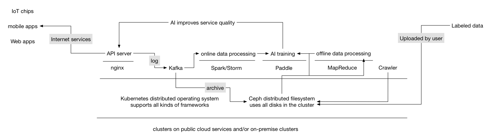
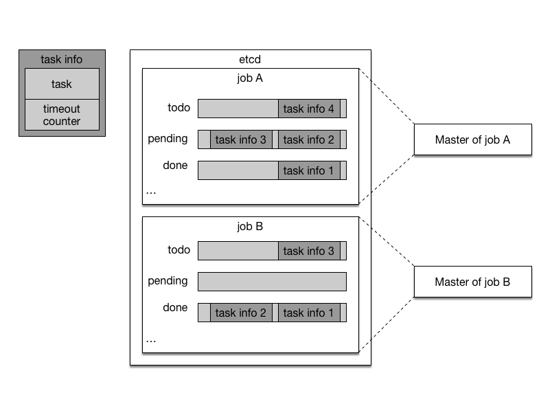
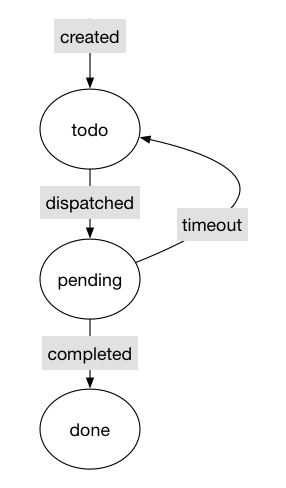
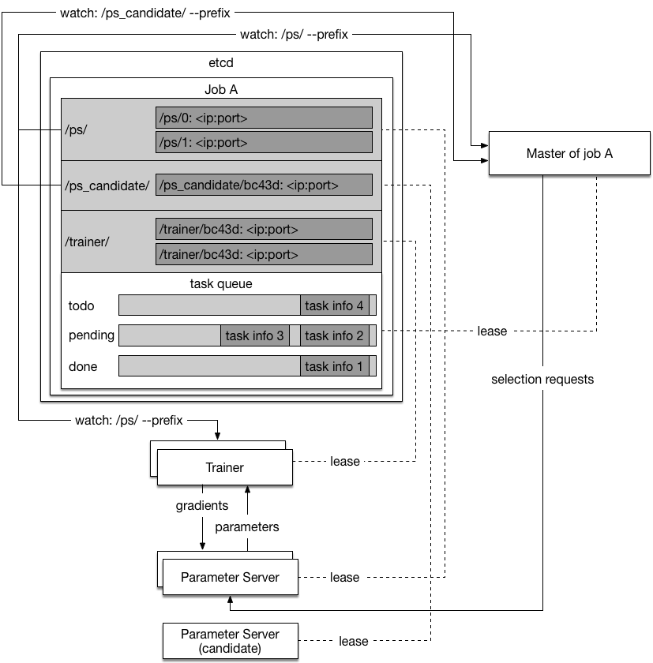
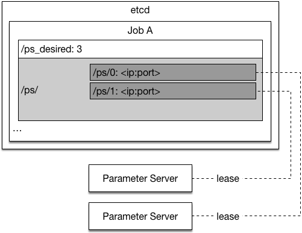
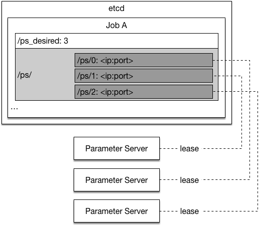

# Design Doc: Distributed Training

## Objective

We want Paddle to support training on the general-purpose cluster. The cluster runs Paddle, the web server (e.g., Nginx), the log collector (e.g., fluentd), the distributed queue service (e.g., Kafka), the log joiner and other data processors written using Storm, Spark, and Hadoop MapReduce on the same cluster. As illustrated in the following graph:

This poses new challenges for Paddle,

- Paddle need to be fault tolerant.
- Input training data can be online data from real time logs or batch data from distributed file system.
- User needs a simple way to train model on Paddle cloud. Complexities such as job scheduling should be hidden from user.

## Training Job

A training job will be created once user asks Paddle cloud to train a model. The training job is made up of different processes that collaboratively consume data and produce a trained model. There are three kinds of processes:

- Master process
- Trainer process
- Parameter server process

One training job will only have one master process, typically multiple trainer processes and parameter server processes. Their relation is illustrated in the following graph:

### Master Process

The master process will:

- Shard dataset into [tasks](#task) and dispatch tasks to trainers.
- Keep track of training progress on the dataset with [task queue](#task-queue). A training job will iterate on the dataset for a full pass until it goes into next pass.

Now we will explain the concepts mentioned above:

#### Task 

A task is a piece of sharded data to be trained. The total number of tasks will be much bigger than the total number of trainers. The number of data instances inside a task will be much bigger than the mini-batch size.

#### Task Queue

Master process has three task queues to track training progress. As illustrated in the graph below, Job A and Job B both have one master process. Each master process has three task queues.

- The todo queue holds tasks to be dispatched. When a job starts, the master process fills in the todo queue with all tasks.
- The pending queue holds tasks that are currently training by trainers.
- the done queue holds tasks that are already trained.

The life cycle of a single task is illustrated below:

1. When a new pass of training starts, all tasks will be placed in the todo queue.
1. The master process will dispatch few tasks to each trainer at a time, puts them in the pending queue and waits for completion.
1. The trainer will work on it's tasks and tell the master process once a task is completed. The master process will dispatch a new task to that trainer.
1. If a task timeout. the master process will move it back to the todo queue. The timeout count will increase by one. If the timeout count is above an threashold, the task is likely to cause a trainer to crash, so it will be discarded.
1. The master process will move completed task to the done queue. When the todo queue is empty, the master process will start a new pass by moving all tasks in the done queue to todo queue and resetting the timeout counter of all tasks to zero.

### Trainer Process

The trainer process will:

- Receive the tasks from the master.
- Work on the tasks: alculate and upload gradient to the parameter servers, and update local model by downloading new parameters from the parameter servers.

### Parameter Server Process

Parameter server processes hold the parameters collabratively. The parameters are sharded on different parameter servers.

The parameter server will:

- Receive gradient from the trainers, update its parameters, and give the trainers the latest parameters.
- Periodically save its parameters to distributed file system by overriding the previous save.

### Optimization Algorithms

The communication pattern between the trainers and the parameter servers depends on the category of optimization algorithm:

- Synchronous Stochastic Gradient Decent (sync-SGD)

	Parameter server will wait for all trainer finish n-th mini-batch calculation and send their gradients before broadcasting new parameters to every trainer. Every trainer will wait for the new parameters before starting n+1-th mini-batch.
  
- Asynchronous Stochastic Gradient Decent (async-SGD)

	There will no synchronization between different trainers, and parameter server updates its parameter as soon as it receives new gradient:

	- Each trainer uploads its accumulated gradient every **n** mini-batches.
	- Every **m** mini-batches, the trainer downloads new parameters from parameter server.
	- **n** and **m** do not have to be equal.

## Fault Tolerant

The training job will pause if the master process is dead, or any of the parameter server process is dead. They will be started by [Kubernetes](https://kubernetes.io/) and recover in few minutes. Please refer to [fault recovery](#fault-recovery).

The training job will continue to make progress if there is at least one training process running. The strategy depends on the type of optimization algorithm:

- sync-SGD

	TODO

- async-SGD

	Since async-SGD does not require synchronization between mini-batches, the system will by definition make process if at least one trainer is running.

## Fault Recovery

PaddlePaddle uses [etcd](https://github.com/coreos/etcd) to keep track of the states of processes. Because etcd is a distributed reliable key-value store, the restarted process can recover its states from etcd. The model parameter are periodically saved into distributed file system, so a restarted parameter server can recover its parameters from the saved file.

Now we will introduce how each process recovers from failure, the graph below provides an illustration:

### Master Process

When the master is started by the Kubernetes, it executes the following steps at startup:

1. Grabs a unique *master* lock in etcd, which prevents concurrent master instantiations.
1. Recovers the task queues from etcd if they already exists, otherwise the master will create them.
1. Watches the trainer prefix keys `/trainer/` on etcd to find the live trainers.
1. Starts dispatching the tasks to the trainers.

The master process will kill itself if its etcd lease expires.

When the master process is dead for any reason, Kubernetes will restart it. It will be online again with all states recovered from etcd in few minutes.

### Trainer Process

When the trainer is started by the Kubernetes, it executes the following steps at startup:

1. Watches the available parameter server prefix keys `/ps/` on etcd and waits until count of parameter servers reaches the desired count.
1. Generates an unique ID, and sets key `/trainer/<unique ID>` with its contact address as value. The key will be deleted when the lease expires, so the master will be aware of the trainer being online and offline.
1. Waits for tasks from the master to start training.

If trainer's etcd lease expires, it will try set key `/trainer/<unique ID>` again so that the master process can discover the trainer again.

### Parameter Server Process

When the parameter server is started by Kubernetes, it executes the following steps at startup:

1. Read desired total number of parameter servers from etcd `/ps_desired`
1. Search though etcd keys `/ps/<index>` (`/ps/0`, `/ps/1`, ...) to find the first non-existant key whose index is smaller than the total number of parameter servers. Set the key using a transaction to avoid concurrent writes. The parameter server's index is inferred from the key name.

	The desired number of parameter servers is 3:
	
	
	
	The third parameter server joined:
	
	

1. The parameter server can load parameters if there are already saved parameters in the save path (inferred from its index).
1. Now the parameter server is ready for the trainers' requests.

If the parameter server's etcd lease expires, the parameter server will kill itself.

## Dynamic Scaling

### Trainer Scaling

TODO

### Parameter Server Scaling

Not planned for v1.

## Training Dataset Format

TODO

## User Interface

TODO
