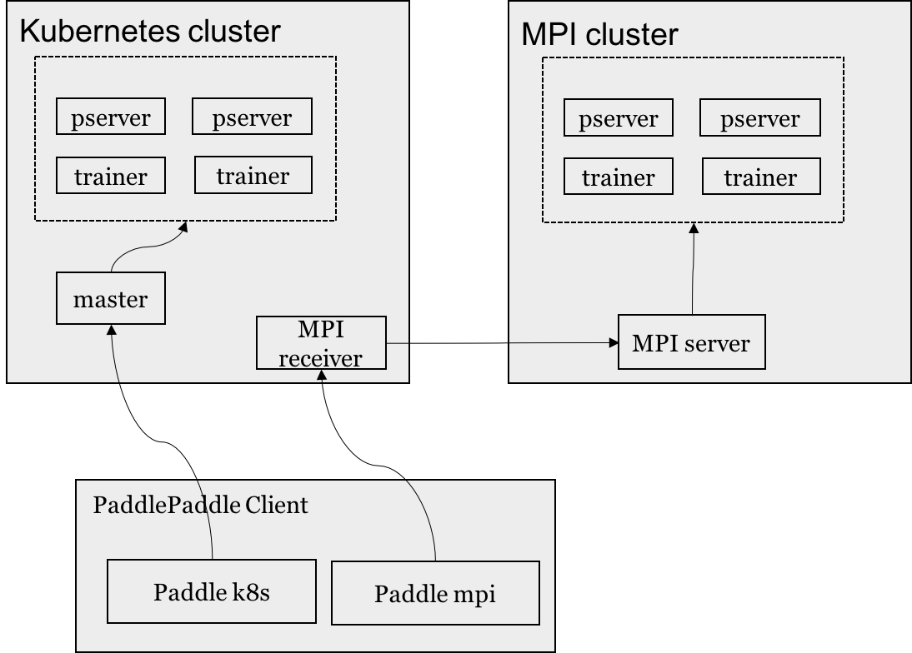

# PaddlePaddle Client
PaddlePaddle client is command line interface for running PaddlePaddle distributed training job or start up a local training job.

The relation of PaddlePaddle, kubernetes and docker:




# Running local training job
You can execute the command: `paddle train` with flag `--locally` to start up a local train.
```bash
paddle train \
  --locally \
  --job-name=quickstart \
  --package-path=./demo \
  --module=demo.train \
  --input=<input_dir> \
  --output=<output_dir> \
  --image=<paddle_image> \
  --env=NUM_PASS=4
```
- `job-name`: your local training job name
- `package-path`: your trainer code python package
- `module`: include a main function, trainer entrance.
- `input`: input directory, for local train, it's a host path.
- `output`: output directory, for local train, it's a host path.
- `base-image`: paddlepaddle production image
- `env`: environment varible

When users start a local training job, PaddlePaddle client starts a docker container like:
```bash
docker run --rm \
  --name quickstart \
  -v <host input dir>:/input \
  -v <host output dir>:/output \
  -v <package files>:/package \
  -e NUM_PASS=4 \
  paddlepaddle/paddle:0.10.0rc3 \
  -e PYTHONPATH=/package \
  python /package/train.py
```


# Running distributed training job

## Configurate PaddlePaddle client

You should configure PaddlePaddle client by the configuration file firstly, the default path:
`$HOME/.paddle/config`.

```yaml
apiVersion: v1
dockerRegistry:
  domain: domain.com //default is docker.io
  username: <username>
  password: <password>
paddleServer: http://<paddle server domain>:<paddle server port>
```


## Submit a distributed training job
Users will submit a distributed training job with the command: `paddle train` without flag `--locally`.

```bash
paddle train \
  --job-name=cluster-quickstart \
  --package-path=$PWD/quick_start \
  --module=quick_start.train \
  --input=<input-dir> \
  --output=<output-dir> \
  --trainers=4 \
  --pservers=2 \
  --base-image:<paddle-k8s-image> \
  --use-gpu=1 \
  --gpu-num=1 \
  --env="NUM_PASS=5"
```

- `job-name`: you should specify a unique job name
- `package-path`: python package files on your host
- `module`: include the main function, trainer entrance
- `input`: input directory on distributed file system
- `output`: output directory on distributed file system
- `trainers`: trainer process count
- `pserver`: parameter process count
- `base-image`: your trainer docker image, include your trainer files and dependencies.
- `use-gpu`: whether it is a GPU train
- `gpu-num`: how much GPU card for one paddle trainer process, it's requirements only if `use_gpu=1`,
- `env`: environment variable

## Package into a docker image

- `Runtime docker image` and `base docker image`

  For a distributed training job, there is two docker image called `runtime docker image` and `base docker image`, the `runtime docker image` is actually running in kubernetes.

  - `runtime docker image` include user's package files and all dependencies.
  - `base docker image` usually is PaddlePaddle product docker image including paddle binary files and some scripts used for starting up the trainer process and fetch some information of pod. And of course, users can also build their own paddle binary files into the custom `base docker image` with [this doc](../../../paddle/scripts/docker/README.md).

  `runtime docker image` will be built by PaddlePaddle client automatic, here is a simple example project:
  ```bash
  paddle_example
    |-quick_start
      |-trainer.py
      `-dataset.py
    requirments.txt
  ```
  - `requirements.txt` list python dependencies package, you can create is like:

    ```txt
    pillow
    protobuf==3.1.0
    ```
    some other details is [here](https://pip.readthedocs.io/en/1.1/requirements.html).
  - `quick_start` directory include the trainer package files.

  Execute the command: `paddle train...`, PaddlePaddle client will upload the trainer package files and setup parameters to [Paddle Server](#paddle-server).

## Paddle Server
Paddle server is running on kubernetes, users will configure the server address in [PaddlePaddle client configuration file](#configurate-paddlepaddle-client)

- HTTP server

  Paddle server is an HTTP server, Receiver the trainer files and saves them on GlustereFS.

- Startup pservers and trainers

  Paddle Service will deploy pserver and trainer on kubernetes, they are also job resource, naming `<job-name>-pserver` and `<job-name>-trainer`.
  - Setup pserver job.
  - Setup trainer job, trainer process will be setup until the status of all pserver pod becoming `RUNNING` and fetch all pserver's IP as trainer setup parameters.
  - Setup trainer process in trainer pod.

## Data source
- Distributed file system

  You can upload your training data to distributed file system, such as GlustereFS,
  PaddlePaddle support a default reader for reading data from distributed file system.
- HTTP server

  TODO
- Real-time data

  TODO

## PaddlePaddle client commands:
To run local training job with flag `--locally` and distributed training job without it.
- `paddle train`: start a training job
- `paddle prediction`: start a prediction job
- `paddle list`: list all PaddlePaddle jobs in current namespace
- `paddle cancel`: cancel a running job.
- `paddle status`: status of a PaddlePaddle job
- `paddle version`: show PaddlePaddle client and PaddlePaddle server version info.

## Work feature
- V1
  - Paddle server is a local version, build `runtime docker image`, deploy trainer and pserver job on user's host.
  - implement `paddle train`, `paddle list`, `paddle cancel`
- V2
  - Paddle server is running on kubernetes, users will only upload the package files and some setup parameters and building `runtime docker image` on kubernetes.
  - implement `paddle prediction` and other feature.
