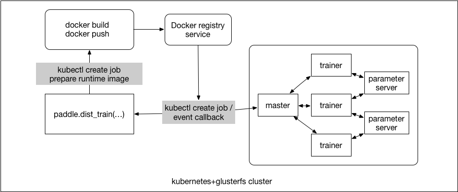

# Submit a Distributed Training Job

If a user wants to start up a local train, he will start up a PaddlePaddle product Docker container firstly, and then
execute `python train.py` in the Docker container.The details about PaddlePaddle Docker image is [here](../../../paddle/scripts/docker/README.md)

If a user wants to start up a distributed training job, he will submit the distributed training job in python code, or use a command line tool.

The relation of PaddlePaddle, kubernetes and docker:


# Runtime Environment On kubernetes

For a distributed training job, there is two docker image called `runtime docker image` and `base docker image`, the `runtime docker image` is actually running in kubernetes.

- Base Docker Image

  Usually, the `base docker image` is PaddlePaddle product docker image including paddle binary files and trainer startup script file. And of course, users can specify any image name hosted on any docker registry which users have the right access.

- Runtime Docker Image

  Package the trainer package which user upload and some python dependencies into a `runtime docker image` base on `base docker image`, this is done automatically by Job Server.

- Python Dependencies

  Users will provide a `requirments.txt` file in trainer packages, to list python dependencies packages, such as:
  ```txt
  pillow
  protobuf==3.1.0
  ```
  some other details about `requirements` is [here](https://pip.readthedocs.io/en/1.1/requirements.html).

  Here is an example project:
  ```bash
    paddle_example
      |-quick_start
        |-trainer.py
        |-dataset.py
        |-requirments.txt
  ```
  Execute the command: `paddle train --trainer-package=./paddle_eample/quick_start ...`, PaddlePaddle client will upload the trainer package(quick_start)and setup parameters to [Job Server](#job-server)

## Submit a Distributed Training Job In Python Code


Users will call `paddle.dist_train` and provide distributed training configuration as the parameters.
```python
paddle.dist_train(
    model,
    trainer=paddle.trainer.SGD(...,
                              paddle.updater.Adam(...)),
    reader=reader,
    job_name="quickstart",
    trainers=8,
    pservers=4,
    input=/quickstart/input,
    output=/quickstart/output,
    base_image="paddlepaddle/paddle:0.10.rc2",
    use_gpu=False)
```

- Build Runtime Docker Image on Kubernetes

  `paddle.dist_train` will deploy a kubernetes job, build and push runtime docker image in the pod. Parameter Server and Trainer pod will use the runtime docker image.

  There are some benefits for building Docker image on the kubernetes:
  - `Docker in Docker` should mount `docker.sock` in the container and set `--privileged`, if the code running in a kubernetes pod, it's not safety.
  - Users only need to upload the training package files, does not dependency docker engine, docker registry.
  - If we want to change another image type, such as RKT, the user does not need to care about it.

- Startup Parameter Server and Trainer Job
  - Deploy parameter server job, it's a kubernetes StatefulSet.
  - Deploy trainer job, it's a kubernetes Job.

## Submit a Distributed Training Job With a Command Line Tool


- Configurate PaddlePaddle Client

Users should configure PaddlePaddle client by the configuration file firstly, the default path:
`$HOME/.paddle/config`.

```yaml
apiVersion: v1
dockerRegistry:
  domain: domain.com //default is docker.io
  username: <username>
  password: <password>
jobServer: http://<job server domain>:<job server port>
```

- Submit a Distributed Training Job
Users will execute the command `paddle job submit` and provides distributed training configuration as the parameters.
  ```bash
  paddle job submit\
    --job-name=cluster-quickstart \
    --trainer-package=$PWD/quick_start \
    --entry-point="python train.py" \
    --input=<input-dir> \
    --output=<output-dir> \
    --trainers=4 \
    --pservers=2 \
    --base-image:<paddle-image> \
    --use-gpu=true \
    --trainer-gpu-num=1 \
    --env="NUM_PASS=5"
  ```
  - `job-name`: you should specify a unique job name
  - `trainer-package`: python package files on your host
  - `entry-point`: an entry point for startup trainer process
  - `input`: input directory on distributed file system
  - `output`: output directory on distributed file system
  - `trainers`: if `use-gpu=false`, users should configurate the trainer process count
  - `pserver`: parameter process count
  - `base-image`: your trainer docker image, include your trainer files and dependencies.
  - `use-gpu`: whether it is a GPU train
  - `trainer-gpu-num`: how much GPU card for one paddle trainer process, it's requirements only if `use-gpu=true`,
  - `env`: environment variable

  The command `paddle train` will package the trainer package to a `trainer.tar.gz` file, call `POST /v1/package` to upload the trainer package file. and then call `POST /v1/trainer/job` to start up a distributed job.

- PaddlePaddle Client Commands:
  The command line tool also supports the following subcommands:
  - `paddle train`: start a training job
  - `paddle list`: list all PaddlePaddle jobs in current namespace
  - `paddle cancel`: cancel a running job.
  - `paddle status`: status of a PaddlePaddle job
  - `paddle version`: show job client and job server version info.
  - `paddle upload`: upload training data to distributed storage.
  - `paddle download`: download training data from a distributed storage.


# Job Server
Job server is running on kubernetes, users will configure the server address in [PaddlePaddle client configuration file](#configurate-paddlepaddle-client)

- RESTful API

  Job server provides a RESTful HTTP server receives the trainer packages, list PaddlePaddle job etc...
  - `POST   /v1/package` receive the trainer package and save them on GlustereFS
  - `POST   /v1/trainer/job` submit a trainer job
  - `GET    /v1/jobs/` list all job
  - `GET    /v1/jobs/<job-name>` the status of a job
  - `DELETE /v1/jobs/<job-name>` cancel a job
  - `GET    /v1/version` job server version

- Build Runtime Docker Image On Kubernetes

  Job Server deploys a kubernetes Job and builds runtime docker image in Pod, pserver and trainer pod will use this runtime docker image to startup pserver and trainer process.

- Start Up PSrvers and Trainers Job
  - Deploy pserver job, it's a kubernetes StatefulSet.
  - Deploy trainer job, it's a kubernetes Job.

# Work Feature
- V1
  - Submit a distributed training job in python code.
- V2
  - Submit a distributed training job with command line tool, build/push docker image and deploy pserver/trainer job in Job Server.
