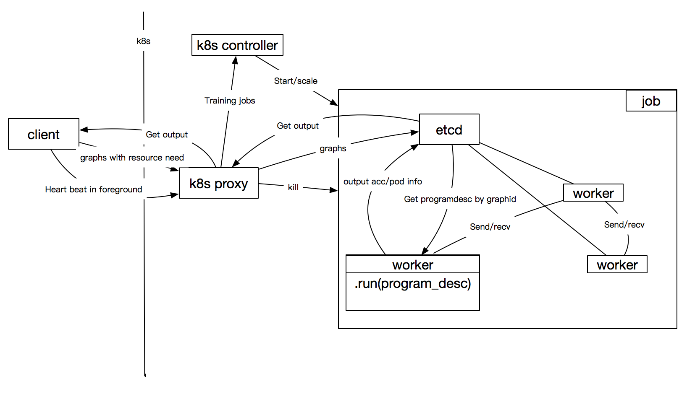
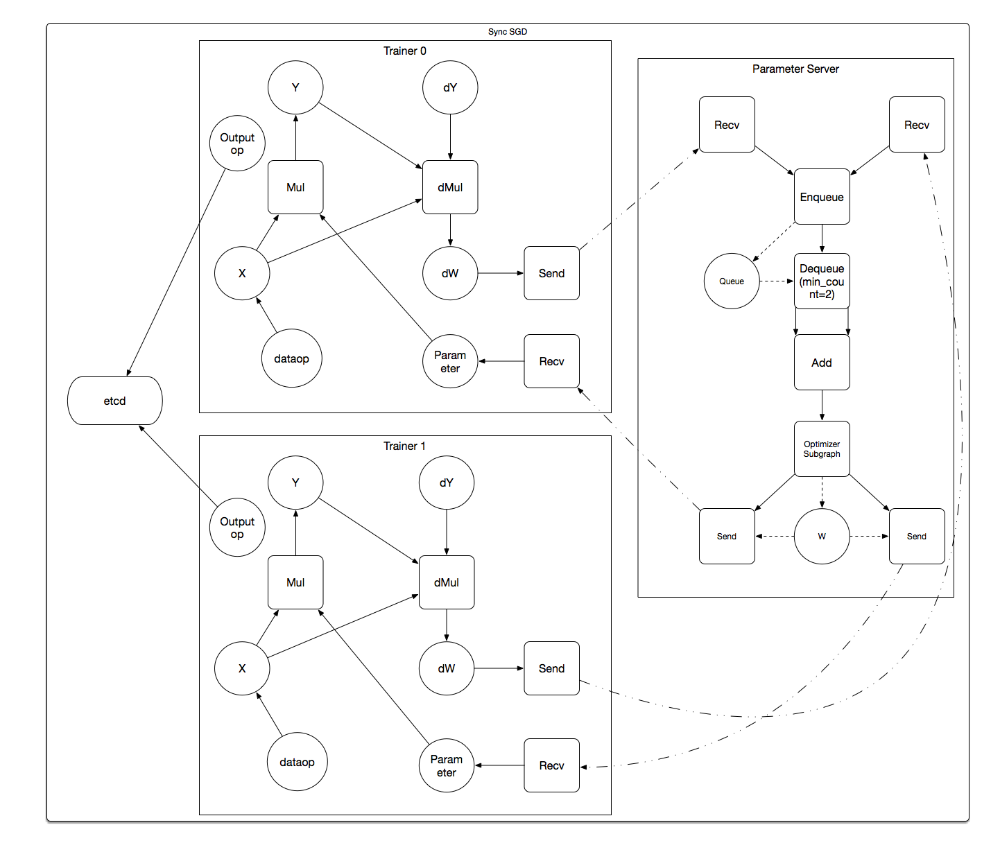

## Workflow
All modules are decoupled when we store data to storage.

- Transpile program desc to sub-program descs(graphs) and
- Store graphs to etcd
	- one graph has unique ID. 
	- one graph has the desired resource.
- Start worker(pod) to run one graph
   - worker stores pod info to etcd, so 
   - the graphs can communicate with each other by graphID.

## Architect graph
<div style="align: center">

</div>

- foreground job: when the client exits the jobs will be killed.
- background job: client's death doesn't affect the job.


<div style="align: center">

</div>
- OutputOperator appends fetchlist to etcd periodically.

## Peudo code of users
```
...
# get graphs and their relation.
# the trainers iteration is implemented by fluid op.
t_graphs,p_graphs = fluid.dist_transpiler(tainers_num=,tainer_pass_num=,pserves_num=,mode=sync)

job_name = "test_1"

# you can kill  a job first.
#if fluid.k8s.find(job_name):
#	fluid.k8s.kill(job_name)

# start etcd and keep heart-beat if need.
job, err = fulid.k8s.init_job(job_name, run_type=foreground)
if err is not null:
   print "start job:", job_name, " errors:", err
   sys.exit(1)
   
# store graphs to etcd.
trainers = job.add_workers(t_graphs,cpu=,gpu=,mem)
pservers = job.add_workers(p_graphs,cpu=,gpu=,mem)

# pod info will be stored to etcd after pod start.
pserver.start()
trainer.start()

# get fetchlist from etcd through k8s proxy.
# and the job can be killed by the result.
accs = trainers.get(acc)
for c in acc:
    print(" acc:" + str(c))

jobs.stop()
```


## Data base 
- etcd is a key-value storage, but we can convert a table to key-value style easily by use combination key.
- We store info in multiple tables because some of them may be changed more frequently than others.

### Table: graph_program_desc

| column name | description|
|----------|-------------|
| graphID |  ID of graph, key    |
| program_desc| program desc to be executed    |
| send_var_graph_map|map of variable and graphID|
| recv_var_graph_map|map of variable and graphID|
|resource|resource needed by this graph|

### Table: graph_pod
| column name | description|
|----------|-------------|
|graphID|ID of graph|
|pod_name|pod name which executes graph, may be changed|
|pod_ip|pod ip which execut graph|
|pod_port|pod port which executes graph|

### Table: graph_output
| column name | description|
|----------|-------------|
|graphID|ID of graph|
|output|output of this graph,it's a list|
|checkpoint|last checkpoint of this graph|


## Fault tolerant
Workers can communicate with others correctly by graphID.

## Auto scaling
TODO

## Discussion
- Is database like mysql is enough for us?
