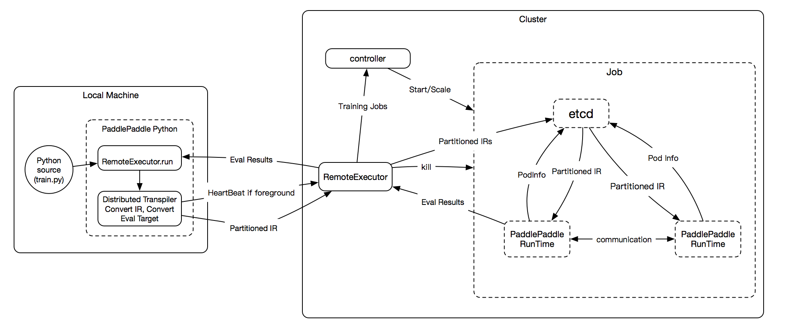

## Abstract
We propose some details to implement 	`RemoteExecutor`:

- Each `Partitioned IR(intermediate representation)` has unique `IRID`.
- We store `Partitioned IR` with their relationship and resource need into etcd.
- Each `PaddlePaddle Runtime` runs `Partitioned IR` getted from etcd by `IRID`. 
- The executed `Partitioned IR` can communicate with each other by `IRID` even if some of them aborted unnormally.

## Architect graph
<div style="align: center">

</div>

- foreground job: when the client exits the jobs will be killed.
	-  It's convenient for user to debug theire program.
	-  It needs a `HeartBeat` to `RemoteExecutor` to report that client is living.OtherWise,the `RemoteExecutor` will kill the job.
- background job: client's death doesn't affect the job.

## Peudo code of users
```
import RemoteExecutor as remotor
...
# get IRs and their relation.
# the trainers iteration is implemented by fluid op.
trainer_IR,pserver_IR = fluid.dist_transpiler(tainers_num=,tainer_pass_num=,pserves_num=,mode=sync)

job_name = "test_1"

# you can kill  a job first.
#if remotor.find(job_name):
#	remotor.kill(job_name)

# start etcd and keep heart-beat if need.
job, err = remotor.init_job(job_name, type=foreground)
if err is not null:
   print "start job:", job_name, " errors:", err
   sys.exit(1)
   
# store IRs with resource need to etcd.
trainers = job.add_workers(trainer_IR,cpu=,gpu=,mem=)
pservers = job.add_workers(pserver_IR,cpu=,gpu=,mem=)

# start trainers and pserver pods.
# pod info will be stored to etcd after pod start.
pserver.start()
trainer.start()

# get results from trainers or others.
while True:
	accs = trainers.get(acc)
	for c in acc:
	    print(" acc:" + str(c))
	# exits?

jobs.stop()
```


## Storage 
- etcd is a key-value storage, but we can convert a table to key-value style easily by use combination key.
- We store info in multiple tables because some of them may be changed more frequently than others.

### Table: IR_Resource

| column name | description|
|----------|-------------|
| IRID |  unique ID of IR    |
| IR| `ProgramDesc`    |
| send_var_IR_map|map of variable and IRID which will be sended|
| get_var_IR_map|map of variable and IRID which will be getted|
|resource|resource needed by this IR|

### Table: IR_Pod
Table maybe changed since some pods maybe dead.

| column name | description|
|----------|-------------|
|IRID|unique ID of IR|
|pod_name|pod name which executes IR|
|pod_ip|pod ip|
|pod_port|pod port|

### Table: IR_CheckPoints
| column name | description|
|----------|-------------|
|IRID|unique ID of IR|
|checkpoint|last checkpoint of this IR|


## Fault tolerant
IR's Executor can communicate with others correctly by IRID.

-  When send/get meets error or timeout,workers should get new IR's relation from etcd and retry again.
- Trainers 
	- When a trainer starts, it should determine to initialize parameter from pserver or from the startup_program_desc. 
- Pservers 
	- When a pserver starts, it should determine to load checkpoint or not.

## Auto scaling
TODO

## Reference
[Design Doc: Distributed Training Architecture](https://github.com/PaddlePaddle/Paddle/blob/develop/doc/design/dist_refactor/distributed_architecture.md)
