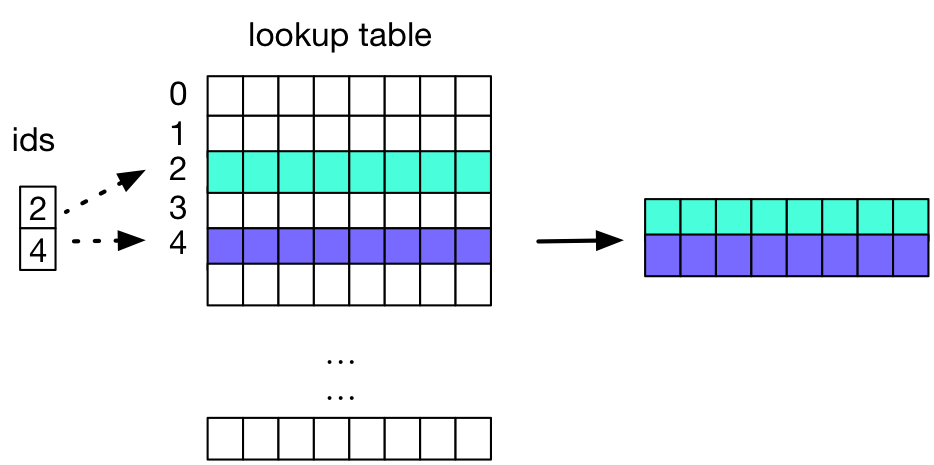
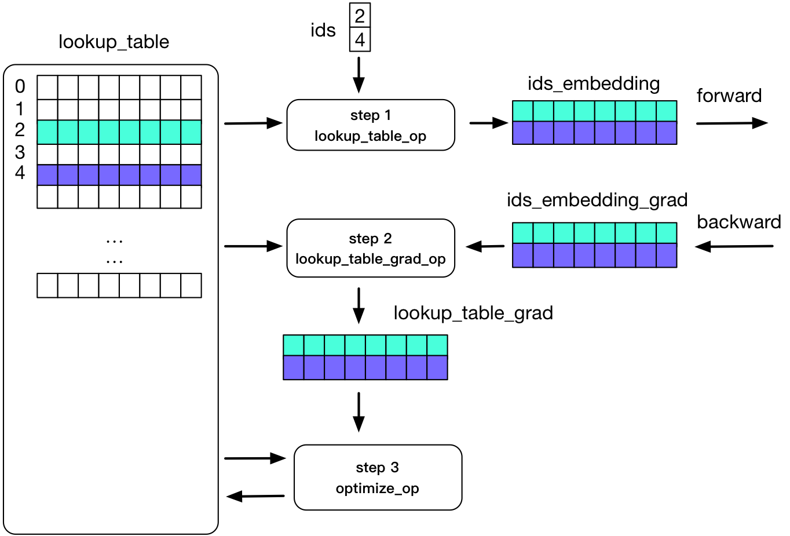

## Distributed lookup table design

## Background

Embedding is a popular technique used in neural network to support applications such as search engines, advertising systems, and recommendation systems.

Embeddings are stored in a lookup table (or hash table), that given a word id, returns the embedding (which is an array of numbers). 

It works as below:



## Problem
The column number of the lookup_table is proportional to the range of id. In internet scale, the range of id may be very large, say 100000000000, if the size of an embedding value is 40 Byte, then the whole memory the `lookup_table` will use can be 3725.29GB:

```shell
3725.29GB = 100000000000 * 40 / 1024.0 / 1024.0 / 1024.0
```
This cannot be stored in the memory of a single machine, so we need to add a distributed lookup table that stores it in a cluster and provide the interface to get value and set value.


## Training Process
The training process with lookup table on a single machine is as follows:


1. In forward pass. `lookup_table_op` convert ids into a dense tensor `ids_embedding`. `ids_embedding` will be used by the following operators.
```
lookup_table_op(lookup_table, ids) -> ids_embedding
```
1. In backward pass. `lookup_table_grad_op` convert dense tensor `ids_embedding_grad` into a tensor with id information.
```
lookup_table_grad_op(lookup_table, ids_embedding_grad) -> lookup_table_grad
```
1. In optimization pass. optimize op apply gradient to `lookup_table`.
```
optimize_op(lookup_table, lookup_table_grad) -> lookup_table
```

All the operators above access the `lookup_table` directly in memory. If we change `lookup_table` into a distributed service, all the op that will use lookup_table need to access it using some RPC calls.

## TODO

1. Implement `distributed lookup table`, with service part and client part. The client should provide four interfaces:
    - `Pull(ids) -> embedding_values` pull embedding_values according to ids.
    - `Push(grad, update_method)` push `grad` to the distributed lookup table and update it to the parameter using `update_method `, this interface use is asynchronous.
    - `Save()` save the model to a persistent file system, such as HDFS.
    - `Load()` load the model from a persistent file system, such as HDFS.

    The details will be proposed in another PR.
1. Design and implement `lookup_table_op` and `lookup_table_grad_op ` with distributed lookup table client.
1. Implement the Python wrapper for above ops, users can choose and config to use these ops.
1. The distributed Fluid should support this `distributed lookup table service` on kubernetes.
1. Implement a `distributed transpiler` that can change the program into a distributed one which will use the `distributed lookup table service`.

## Things need to be discussed
In the above design, the parameter update is done within `distributed lookup table service`, the interface is `Push(grad, update_method)`, this is different than the current design of PaddlePaddle Fluid. Currently, parameter update is done by Operators. How should we impelement these update_method?
