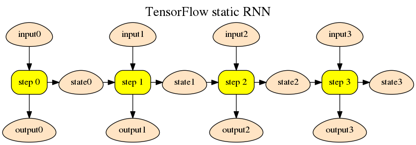

# Design of Dynamic RNN with Beamsearch
With a `while-loop` and an array of states, one can implement a RNN model in Python easily,
while how to build a RNN using Paddle operators in the similar intuitive way is a question.

One of the mature DL platforms, TensorFlow, offers a mass of operators for mathematical and conditional operations,
in that way, TF users can simulate the Python-way and uses some dynamic RNN, encoder or decoder to build a RNN model represented as a graph and the model supports large-scale computation.

That is a good way to follow, by turning a complex algorithm into the combination of several highly-reusable operators, make our framework more flexible.

In this documentation, we will first give a glimpse of the dynamic encoder and dynamic decoder in TensorFlow, then propose a general scheme of our dynamic RNN's design.

## Dynamic RNN in TensorFlow

### static RNN
The most basic of a RNN is `RNNCell`, it has a `__call__` method that supports `output, next_state = call(input, state)`.
the basic way to define a static RNN like follows

```python
dataset = tf.placeholder(...)
lstm = tf.contrib.rnn.BasicLSTMCell(sate_size)

for step_input in dataset:
    output, state = lstm(step_input, state)
```

the code above will build a RNN with `step_input` and last `state` as inputs, the operators in `BasicLSTMCell` will be copied each step, 
and finally a very wide and big static graph will be generated.

<p align="center">

</p>

### dynamic RNN

With the `while_loop` and some other conditional operators, one can turn the static RNN into a dynamic RNN. 
Some code snippets as follows

```python
_, output_final_ta, final_state = while_loop(
    cond=lambda time, *_: time < time_steps,
    body=_time_step,
    loop_vars=(time, output_ta, state),
    parallel_iteratioons=parallel_iterations)
```

the `cond` is a conditioinal method that determine whether to continue loop,
the `body` 

For more details, reference https://www.tensorflow.org/api_docs/python/tf/nn/dynamic_rnn


## Design of Dynamic RNN

Due to the totally different underlying architecture, it is hard to copy the design of dynamic operators from TensorFlow, but the ideas behind design are worth learning, that is

1. introducing some general conditional operators to simulate a programming language,
2. a `TensorArray` to store inputs and outputs in RNN's time steps.

```python
input = pd.data(xxx) # a data layer
# if dynamic, vararray will extend dynamicly if more entries needed
states = pd.VarArray(dynamic=True)
step_inputs = pd.VarArray().segment(input) # segment is an operator

# a scalar
time = pd.Variable(shape=[0], dtype=pd.int32)
# segmented steps, size() is an operator which takes an VarArray as input and
# output a scalar tensor.
num_steps = step_inputs.size()

W = pd.parameter()
U = pd.parameter()

boot_state = some_op()

whl = pd.while_loop()

# by default, exec_immediately is True, that means when exit the with-statement of
# whl.loop(), whl() will be called
with whl.loop(exec_immediately=True):
    time_ = whl.loop_var(time)
    to_stop = pd.less_than(time_, num_steps)
    whl.break_if(to_stop)

    input = step_inputs.get(time_)
    # if time-1 less than 0, boot_state return instead
    prestate = states.get(minus(time, 1), boot_state)
    state = states.get(time_)

    tmp = add(matmul(W, input), matmul(U, prestate))
    act = sigmoid(tmp)
    state.update(act)

# concaterate all states in all time steps to a large tensor
allstates = states.concat(axis=1)
```

some important concepts lists below

### while_loop operator
The `while_loop` operator takes two arguments, one is a executable graph, another is `loop_var`s. 
The executable graph will be executed in each step, and `break_if` might stop the loop.

The `loop_var` stores the variables that need to retrieved from the previous time step, for example, the `time_` is incremented in the last step, latest value will be retrieved in current step.

Similar to current `RecurrentOp`'s design, an array of Scopes (named step-scopes) will be created to store temporary output variables created during different time steps.
During backpropogration, `while_loop` just exeucute the backward graph in the correspoinding step-scope from the last time step to the first.

### VarArray data type
`VarArray` is a very important concepts introduced to help the implementation of both the RNN and `while_loop`.
It is an array of variables, with several operators such as `get`, `update`, `size`, all these operators are wrapped as helper functions in python wrapper.

### some comparation operators
Not limited to
- `less_than`
- `less_equal_than`
- `greater_than`
- `greater_equal_than`
