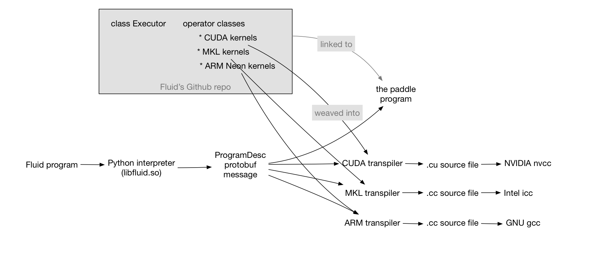

# Design Doc: PaddlePaddle Fluid

## Why Fluid

When Baidu developed PaddlePaddle in 2013, the only well-known open source deep learning system was Caffe.  However, when it open-sourced PaddlePaddle in 2016, there had been many other choices over there.  We were facing a challenge -- why would we open source yet another one?

Fluid is the answer.  Fluid is similar to PyTorch and TensorFlow Eager Execution, which describes the "process" of training or inference a model, but not the model itself.  Indeed, in PyTorch, Eager Execution, and Fluid, there is no such a concept of the model at all. I will explain in this article, Fluid is currently more extreme in this idea than PyTorch and Eager Execution, and we are pushing Fluid towards a compiler and even a new programming language for deep learning

## The Evolution of Deep Learning Systems

Deep learning infrastructure is one of the fastest involving technology.  Within only four years, there have been three generations of technologies invented. 

| Since around | model = sequence of layers | model = graph of operators | No model |
|--|--|--|--|
| 2013 | Caffe, Theano, Torch, PaddlePaddle | | |
| 2015 | | TensorFlow, MxNet, Caffe2, ONNX, n-graph | |
| 2016 | | | PyTorch, TensorFlow Eager Execution, PaddlePaddle Fluid |

From the above table, we see that the technology is evolving towards the removal of the concept of the model.  To better understand the reason, let us compare the *programming paradigms*, or, the ways we program deep learning applications using these systems.

## Deep Learning Programming Paradigms

With any system listed as the first or second generation, e.g., Caffe or TensorFlow, an AI application training program looks like the following:

```python
x = layer.data("image")
l = layer.data("label")
f = layer.fc(x, W)
s = layer.softmax(f)
c = layer.mse(l, s)

for i in xrange(1000): # train for 1000 iterations
    m = read_minibatch()
    forward({input=x, data=m}, minimize=c)
    backward(...)
    
print W # print the trained model parameters.
```

The above program includes two parts:

1. the first part describes the model, and
2. the second part describes the training process (or inference process).

This paradigm has a well-known problem that limits programmers' productivity.  Suppose that we made some mistakes at configuring the model in the first part of the program, when we run the program, it wouldn't prompt error messages until the execution enters the second part, when the invocation to `forward` or `backward` raise errors.   It is difficult for the programmer to realize and locate that there is a mistake many lines away from where the error appears.

This problem of hard to debug a program is the primary reason that programmers prefer PyTorch than elder systems.  Using PyTorch, we would write the above program like the following

```python
W = tensor(...)

for i in xrange(1000): # train for 1000 iterations
    m = read_minibatch()
    x = m["image"]
    l = m["label"]
    f = layer.fc(x, W)
    s = layer.softmax(f)
    c = layer.mse(l, s)
    backward()
    
print W # print the trained model parameters.
```

We can see that the main difference is the moving of the model configuration, the first part, into the train loop.  This change would allow that mistakes in model configuration reported where they appear.  This change also represents the model, or its forward pass, by the process in the training loop.

## Describe Arbitrary Models for the Future

Describing the process instead of the model also brings Fluid the flexibility to define models not yet invented.

As we can program the process, we can write an RNN as a loop, instead of an RNN layer or operator.  A PyTorch example could look like

```python
for i in xrange(1000):
    m = read_minibatch()
    x = m["sentence"]
    for t in xrange x.len():
        h[t] = the_step(x[t])
```        

With Fluid, the training loop and the RNN in the above program are not Python loop, but a "loop structure" provided by Fluid and implemented in C++:

```python
train_loop = layers.While(cond)
with train_loop.block():
  m = read_minibatch()
  x = m["sentence"]
  rnn = layers.While(...)
  with rnn.block():
    h[t] = the_step(input[t])
```    

A real Fluid example is [here](https://github.com/PaddlePaddle/Paddle/blob/a91efdde6910ce92a78e3aa7157412c4c88d9ee8/python/paddle/v2/fluid/tests/test_while_op.py#L36-L44).

From these examples, you can see that Fluid programs look similar to their PyTorch equivalent, except that Fluid's loop structure, wrapped with Python's `with` statement, could run much faster than Python's loop.

We have more examples of the [`if-then-else`](https://github.com/PaddlePaddle/Paddle/blob/develop/doc/design/if_else_op.md) structure of Fluid.

## Turing Completeness

In computability theory, a system of data-manipulation rules, such as a programming language, is said to be Turing complete if it can be used to simulate any Turing machine.  For a programming language, if it provides if-then-else and loop, it is Turing complete.  From above examples, Fluid seems Turing complete; however, I would like to point out is a slight difference between the if-then-else of Fluid and that in a programming language is that the former runs both of its branches.  It splits the input minibatch into two -- one for the true condition and one for the false.  I am not sure if this is equivalent to the if-then-else that makes programming languages Turing-complete.  I talked with [Yuang Yu](https://research.google.com/pubs/104812.html), but I need to figure out more.

## The Execution of a Fluid Program

There are two ways to run a Fluid program.  When we run an example program, it creates a protobuf message [`ProgramDesc`](https://github.com/PaddlePaddle/Paddle/blob/a91efdde6910ce92a78e3aa7157412c4c88d9ee8/paddle/framework/framework.proto#L145) that describes the process and conceptually likes an [abstract syntax tree](https://en.wikipedia.org/wiki/Abstract_syntax_tree).

We have a C++ class [`Executor`](https://github.com/PaddlePaddle/Paddle/blob/develop/paddle/framework/executor.h), which runs a `ProgramDesc` like that an interpreter runs a Python program.

We are moving towards a compiler, which we will explain in more details later in this article.

## Backward Compatibility

Given all advantages from the removal of the concept *model*, hardware manufacturers might still prefer the existence of the concept model, so they could build their hardware reads and runs a trained model for inference.  For example, Nervana, a startup company acquired by Intel, has been working on an XPU that reads models in the format known as [n-graph](https://github.com/NervanaSystems/ngraph).  Similarly, [Movidius](https://www.movidius.com/) is producing a mobile deep learning chip that reads and runs graphs of operators too.  The well-known [ONNX](https://github.com/onnx/onnx) is also a file format of graphs of operators.

For Fluid, we can write a converter that extracts parts in the `ProgramDesc` protobuf message, converts them into a graph of operators, and exports into the ONNX or n-graph format.

## Towards a Deep Learning Language and the Compiler

We can change the if-then-else and loop structure a little bit in the above Fluid example programs so to make it a new programming language, different from Python.

Even if we don't invent a new language, as long as we get the `ProgramDesc` message filled in, we can write a transpiler, which translates each invocation to an operator into a C++ call to a kernel function of that operator. For example, a transpiler that weaves the CUDA kernels outputs an NVIDIA-friendly C++ program, which can be built using `nvcc`.  Another transpiler could generate MKL-friendly code that should be built using `icc` from Intel.  More interestingly, we can translate a Fluid program into its distributed version of two `ProgramDesc` messages, one for running on the trainer process, and the other one for the parameter server.  For more details of the last example, let us check the [concurrent programming design](concurrent_programming.md).  The following figure explains this two-stage process:


