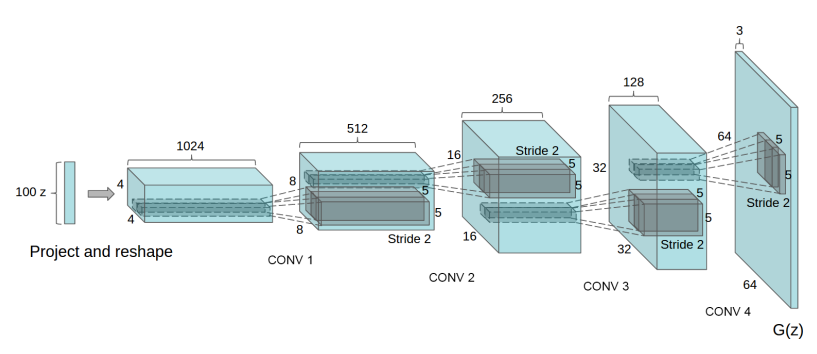

# Design for GAN

GAN (General Adversarial Net) is an important model for unsupervised learning and widely used in many areas. 

It contains several important machine learning concepts, including building and running subgraphs, dependency tracing, different optimizers in one executor and so forth.

In our GAN design, we wrap it as a user-friendly easily customized python API to design different models. We take the conditional DC-GAN as an example due to its good performance on image generation.

## The Conditional-GAN might be a class. 
This design we adopt the popular open source design in https://github.com/carpedm20/DCGAN-tensorflow and https://github.com/rajathkmp/DCGAN. It contains following data structure:

### DCGAN(object):
which contains everything required to build a GAN model. It provides following member functions methods as API:

### __init__(...):
Initialize hyper-parameters (like conv dimension and so forth), and declare model parameters of discriminator and generator as well.

### generator(z, y=None):
Generate a fake image from input noise z. If the label y is provided, the conditional GAN model will be chosen.
Returns a generated image.

### discriminator(image):
Given an image, decide if it is from a real source or a fake one. 
Returns a 0/1 binary label.

### build_model(self):
build the whole GAN model, define training loss for both generator and discrimator.

<p align="center">
<br/>
Borrow this photo from the original DC-GAN paper.
</p>

## Discussion on Engine Functions required to build GAN
- Trace the ternsor and variable dependency in the engine executor. (Very critical, otherwise GAN can'be be trained correctly)
- Different optimizers responsible for optimizing different loss.

To be more detailed, we introduce our design of DCGAN as following:

### Class member Function: Initializer
- Set up hyper-parameters, including condtional dimension, noise dimension, batch size and so forth.
- Declare and define all the model variables. All the discriminator parameters are included in the list self.theta_D and all the generator parameters are included in the list self.theta_G.
```python
class DCGAN(object):
  def __init__(self, y_dim=None):
  
    # hyper parameters  
    self.y_dim = y_dim # conditional gan or not
    self.batch_size = 100
    self.z_dim = z_dim # input noise dimension

    # define parameters of discriminators
    self.D_W0 = pd.Variable(shape=[3,3, 1, 128], data=pd.gaussian_normal_randomizer())
    self.D_b0 = pd.Variable(np.zeros(128)) # variable also support initialization using a  numpy data
    self.D_W1 = pd.Variable(shape=[784, 128], data=pd.gaussian_normal_randomizer())
    self.D_b1 = pd.Variable(np.zeros(128)) # variable also support initialization using a  numpy data
    self.D_W2 = pd.Varialble(np.random.rand(128, 1))
    self.D_b2 = pd.Variable(np.zeros(128))
    self.theta_D = [self.D_W0, self.D_b0, self.D_W1, self.D_b1, self.D_W2, self.D_b2]

    # define parameters of generators
    self.G_W0 = pd.Variable(shape=[784, 128], data=pd.gaussian_normal_randomizer())
    self.G_b0 = pd.Variable(np.zeros(128)) # variable also support initialization using a  numpy data
    self.G_W1 = pd.Variable(shape=[784, 128], data=pd.gaussian_normal_randomizer())
    self.G_b1 = pd.Variable(np.zeros(128)) # variable also support initialization using a  numpy data
    self.G_W2 = pd.Varialble(np.random.rand(128, 1))
    self.G_b2 = pd.Variable(np.zeros(128))
    self.theta_G = [self.G_W0, self.G_b0, self.G_W1, self.G_b1, self.G_W2, self.G_b2]
```

### Class member Function: Generator
- Given a noisy input z, returns a fake image.
- Concatenation, batch-norm, FC operations required;
- Deconv layer required, which is missing now...
```python
def generator(self, z, y = None):
    # input z: the random noise
    # input y: input data label (optional)
    # output G_im: generated fake images
    
    if not self.y_dim:
      z = pd.concat(1, [z, y])
      
    G_h0 = pd.fc(z, self.G_w0, self.G_b0)
    G_h0_bn = pd.batch_norm(G_h0)
    G_h0_relu = pd.relu(G_h0_bn)
    
    G_h1 = pd.deconv(G_h0_relu, self.G_w1, self.G_b1)
    G_h1_bn = pd.batch_norm(G_h1)
    G_h1_relu = pd.relu(G_h1_bn)
    
    G_h2 = pd.deconv(G_h1_relu, self.G_W2, self.G_b2))
    G_im = pd.tanh(G_im)
    return G_im
```

### Class member function: Discriminator
- Given a noisy input z, returns a fake image.
- Concatenation, Convolution, batch-norm, FC, Leaky-ReLU operations required;
```python
def discriminator(self, image):
    # input image: either generated images or real ones
    # output D_h2: binary logit of the label

    D_h0 = pd.conv2d(image, self.D_w0, self.D_b0)
    D_h0_bn = pd.batchnorm(h0)
    D_h0_relu = pd.lrelu(h0_bn)
    
    D_h1 = pd.conv2d(D_h0_relu, self.D_w1, self.D_b1)
    D_h1_bn = pd.batchnorm(D_h1)
    D_h1_relu = pd.lrelu(D_h1_bn)
    
    D_h2 = pd.fc(D_h1_relu, self.D_w2, self.D_b2)
    return D_h2
```

### Class member function: Build the model
- Define data readers as placeholders to hold the data;
- Build generator and discriminators;
- Define two training losses for discriminator and generator, respectively. 
```python
def build_model(self):

    # input data
    if self.y_dim:
        self.y = pd.data(pd.float32, [self.batch_size, self.y_dim])
    self.images = pd.data(pd.float32, [self.batch_size, self.im_size, self.im_size])
    self.faked_images = pd.data(pd.float32, [self.batch_size, self.im_size, self.im_size])
    self.z = pd.data(tf.float32, [None, self.z_size])
    
    # step 1: generate images by generator, classify real/fake images with discriminator
    if self.y_dim: # if conditional GAN, includes label
      self.G = self.generator(self.z, self.y)
      self.D_t = self.discriminator(self.images)
      # generated fake images
      self.sampled = self.sampler(self.z, self.y)
      self.D_f = self.discriminator(self.images)
    else: # original version of GAN
      self.G = self.generator(self.z)
      self.D_t = self.discriminator(self.images)
      # generate fake images
      self.sampled = self.sampler(self.z)
      self.D_f = self.discriminator(self.images)
    
    # step 2: define the two losses
    self.d_loss_real = pd.reduce_mean(pd.cross_entropy(self.D_t, np.ones(self.batch_size))
    self.d_loss_fake = pd.reduce_mean(pd.cross_entropy(self.D_f, np.zeros(self.batch_size))
    self.d_loss = self.d_loss_real + self.d_loss_fake
    
    self.g_loss = pd.reduce_mean(pd.cross_entropy(self.D_f, np.ones(self.batch_szie))
```

## Main function for the demo:
```python
# pd for short, should be more concise.
from paddle.v2 as pd
import numpy as np
import logging

if __name__ == "__main__":

    # dcgan
    dcgan = DCGAN()
    dcgan.build_model()

    # load mnist data
    data_X, data_y = self.load_mnist()
    
    # Two subgraphs required!!!
    d_optim = pd.train.Adam(lr = .001, beta= .1).minimize(self.d_loss, )
    g_optim = pd.train.Adam(lr = .001, beta= .1).minimize(self.g_loss)

    # executor
    sess = pd.executor()
    
    # training
    for epoch in xrange(10000):
      for batch_id in range(N / batch_size):
        idx = ...
        # sample a batch
        batch_im, batch_label = data_X[idx:idx+batch_size], data_y[idx:idx+batch_size]
        # sample z
        batch_z = np.random.uniform(-1., 1., [batch_size, z_dim])

        if batch_id % 2 == 0:
          sess.eval(d_optim, 
                   feed_dict = {dcgan.images: batch_im,
                                dcgan.y: batch_label,
                                dcgan.z: batch_z})
        else:
          sess.eval(g_optim,
                   feed_dict = {dcgan.z: batch_z})
```
