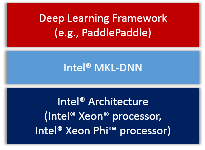

# Intel® MKL-DNN on PaddlePaddle: Design Doc

我们计划将Intel深度神经网络数学库(**MKL-DNN**\[[1](#references)\])集成到PaddlePaddle，充分展现英特尔平台的优势，有效提升PaddlePaddle在英特尔架构上的性能。

我们短期内的基本目标是：

- 完成常用layer的MKL-DNN实现。
- 完成常见深度神经网络VGG，GoogLeNet 和 ResNet的MKL-DNN实现。


## Contents

- [Overview](#overview)
- [Actions](#actions)
 	- [CMake](#cmake)
	- [Layers](#layers)
	- [Activations](#activations)
	- [Weights](#weights)
	- [Unit Tests](#unit-tests)
	- [Protobuf Messages](#protobuf-messages)
	- [Python API](#python-api)
	- [Demos](#demos)
	- [Benchmarking](#benchmarking)
	- [Others](#others)
- [Design Concerns](#design-concerns)

## Overview

我们会把MKL-DNN作为第三方库集成进PaddlePaddle，整体框架图
<div align="center">
<br/>
Figure 1. PaddlePaddle on IA.
</div>

## Actions
我们把集成方案大致分为了如下几个方面。

### CMake
我们会在`CMakeLists.txt`中会添加`WITH_MKLDNN`的选项，当设置这个值为`ON`的时候会启用编译MKL-DNN功能。同时会自动开启OpenMP用于提高MKL-DNN的性能。

同时，我们会引入`WITH_MKLML`选项，用于选择是否使用MKL-DNN自带的MKLML安装包。这个安装包可以独立于MKL-DNN使用，但是建议在开启MKL-DNN的同时也打开MKLML的开关，这样才能发挥最好的性能。

所以，我们会在`cmake/external`目录新建`mkldnn.cmake`和`mklml.cmake`文件，它们会在编译PaddlePaddle的时候下载对应的软件包，并放到PaddlePaddle的third party目录中。

**备注**：当`WITH_MKLML=ON`的时候，会优先使用这个包作为PaddlePaddle的CBLAS和LAPACK库，所以会稍微改动`cmake/cblas.cmake`中的逻辑。

### Layers
所有MKL-DNN相关的C++ layers，都会按照PaddlePaddle的目录结构存放在
`paddle/gserver/layers`中，并且文件名都会一以*MKLDNN*开头。

所有MKL-DNN的layers都会继承于一个叫做`MKLDNNLayer`的父类，该父类继承于PaddlePaddle的基类`Layer`。

在`MKLDNNLayer`中会提供一些必要的接口和函数，并且会写好`forward`和`backward`的基本逻辑。部分函数定义为纯虚函数，子类只需要实现这些函数即可。

### Activations
由于在PaddlePaddle中，激活函数是独立于layer概念的，所以会在`paddle/gserver/activations`目录下添加`MKLDNNActivation.h`和`MKLDNNActivation.cpp`文件用于定义和使用MKL-DNN的接口。

### Weights
由于有些layer是含有参数的，我们会尽量让MKL-DNN的参数与PaddlePaddle中`parameter`共享一块内存。
同时，由于MKL-DNN在训练时使用的参数layout可能与PaddlePaddle默认的`nchw`不一致，我们会在网络训练的开始和结束时分别转换这个layout，使得最终保存的参数格式与PaddlePaddle一致。

### Unit Tests
会在`paddle/gserver/test`目录下添加`test_MKLDNN.cpp`和`MKLDNNTester.*`用于MKL-DNN的测试。
测试分为每个layer(或activation)的单元测试和简单网络的整体测试。
每个测试会对比PaddlePaddle中CPU算出的结果与MKL-DNN的结果，小于某个比较小的阈值认为通过。

### Protobuf Messages
根据具体layer的需求可能会在`proto/ModelConfig.proto`里面添加必要的选项。

### Python API
目前只考虑**v1 API**。

计划在`python/paddle/trainer/config_parser.py`里面添加`use_mkldnn`这个选择，方便用户选择使用MKL-DNN的layers。

具体实现方式比如：

```python
use_mkldnn = bool(int(g_command_config_args.get("use_mkldnn", 0)))
if use_mkldnn
    self.layer_type = mkldnn_*
```

所有MKL-DNN的layer type会以*mkldnn_*开头，以示区分。 

并且可能在`python/paddle/trainer_config_helper`目录下的`activations.py `和`layers.py`里面添加必要的MKL-DNN的接口。

### Demos

会在`v1_api_demo`目录下添加一个`mkldnn`的文件夹，里面放入一些用于MKL-DNN测试的demo脚本。

### Benchmarking
会添加`benchmark/paddle/image/run_mkldnn.sh`，用于测试使用MKL-DNN之后的性能。

### Others
1. 如果在使用MKL-DNN的情况下，会把CPU的Buffer对齐为64。
2. 深入PaddlePaddle，寻找有没有其他可以优化的可能，进一步优化。比如可能会用OpenMP改进SGD的更新性能。

## Design Concerns

为了更好的符合PaddlePaddle的代码风格\[[2](#references)\]，同时又尽可能少的牺牲MKL-DNN的性能\[[3](#references)\]。

我们总结出一些特别需要注意的点：

1. 使用**deviceId_**。为了尽可能少的在父类Layer中添加变量或者函数，我们决定使用已有的`deviceId_`变量来区分layer的属性，定义`-2`为`MKLDNNLayer`特有的设备ID。
2. 重写父类Layer的**init**函数，修改`deviceId_`为`-2`，代表这个layer是用于跑在MKL-DNN的环境下。
3. 创建`MKLDNNMatrix`，同时继承`CpuMatrix`和`mkldnn::memory`。用于管理MKL-DNN会用到的相关memory函数、接口以及会用的到格式信息。
4. 创建`MKLDNNBase`，定义一些除了layer和memory相关的类和函数。包括MKL-DNN会用到`MKLDNNStream`和`CPUEngine`，和未来可能还会用到`FPGAEngine`等。
5. 每个`MKLDNNlayer`都会有`inVal_`,`inGrad_`,`outVal_`和`outGrad_`，分别代表input value， input gradient，output value和output gradient。他们会存放MKL-DNN用到的internal memory。同时还会定义以*ext*开头的`MKLDNNMatrix`(表示external的memory)，主要是在格式与PaddlePaddle默认的`nchw`格式不匹配时，用于转换内存的工作。必要的转换函数也会在`MKLDNNLayer`中提前定义好，每个子类只需要调用定义好的reset buffer函数即可。
6. 每个`MKLDNNlayer`的resetbuffer相关的函数（包括reset input、output的Value和grad），他们会根据输入参数reset internal和external的memory，当然这两者也可以相等，即表示不需要转换。只需要把握一个原则，每个`MKLDNNlayer`的子类，只需要使用internal的memory就可以了，所有external的转换工作在父类的reset函数中都提前准备好了。
7. 一般来说，external的memory会尽量与PaddlePaddle中的`value`和`grad`共享内存。同时每个`MKLDNNLayer`中的external output value和gradient(也就是`extOutVal_`和`extOutGrad_`)必须分别与`output_.value`和`output_.grad`共享内存，因为PaddlePaddle的activation会直接使用`output_.value`和`output_.grad`。如果不需要external的buffer用于转换，那么internal的buffer也会与他们共享内存。
8. 如果MKL-DNN layer的后面接有cpu device，那么就会使`output_.value`与`extOutVal_`共享内存，同时数据格式就是`nchw`，这样下一个cpu device就能拿到正确的数据。在有cpu device的时候，external的memory的格式始终是`nchw`或者`nc`。
9. 由于MKL-DNN的输出操作都是覆盖data的，不是在原来的数据上累加，所以当网络出现分支时，在`backward`时会需要merge不同layer的梯度。`MKLDNNlayer`中会实现merge的方法，此时每个小分支的input gradient会先临时保存在一个`MKLDNNMatrix`中，由分支处的layer负责求和，并把结果放到这个layer的`output_.grad`中。所以整体上，每个子类并不会需要关心分支的事情，也是在父类都实现好了。
10. 在原来的`FLAGS`中添加一个`use_mkldnn`的flag，用于选择是否使用MKL-DNN的相关功能。

## References

1. [Intel Math Kernel Library for Deep Neural Networks (Intel MKL-DNN)](https://github.com/01org/mkl-dnn "Intel MKL-DNN")
2. [原来的方案](https://github.com/PaddlePaddle/Paddle/pull/3096)会引入**nextLayer**的信息。但是在PaddlePaddle中，无论是重构前的layer还是重构后的op，都不会想要知道next layer/op的信息。
3. MKL-DNN的高性能格式与PaddlePaddle原有的`NCHW`不同(PaddlePaddle中的CUDNN部分使用的也是`NCHW`，所以不存在这个问题)，所以需要引入一个转换方法，并且只需要在必要的时候转换这种格式，才能更好的发挥MKL-DNN的性能。

