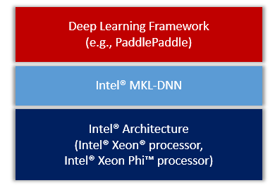

# Intel® MKL-DNN on PaddlePaddle: Design Doc

我们计划将Intel深度神经网络数学库(**MKL-DNN**\[[1](#references)\])集成到PaddlePaddle，充分展现英特尔平台的优势，有效提升PaddlePaddle在英特尔架构上的性能。

我们短期内的基本目标是：

- 完成常用layer的MKL-DNN实现。
- 完成常见深度神经网络VGG，GoogLeNet 和 ResNet的MKL-DNN实现。


## Contents

- [Overview](#overview)
- [Actions](#actions)
 	- [CMake](#cmake)
	- [Layers](#layers)
	- [Activations](#activations)
	- [Unit Tests](#unit-tests)
	- [Protobuf Messages](#protobuf-messages)
	- [Python API](#python-api)
	- [Demos](#demos)
	- [Benchmarking](#benchmarking)
	- [Others](#others)
- [Design Concerns](#design-concerns)

## Overview

我们会把MKL-DNN作为第三方库集成进PaddlePaddle，整体框架图
<div align="center">
<br/>
Figure 1. PaddlePaddle on IA.
</div>

## Actions
我们把集成方案大致分为了如下几个方面。

### CMake
我们会在`CMakeLists.txt`中会添加`WITH_MKLDNN`的选项，当设置这个值为`ON`的时候会启用编译MKL-DNN功能。同时会自动开启OpenMP用于提高MKL-DNN的性能。

同时，我们会引入`WITH_MKLML`选项，用于选择是否使用MKL-DNN自带的MKLML安装包。这个安装包可以独立于MKL-DNN使用，但是建议在开启MKL-DNN的同时也打开MKLML的开关，这样才能发挥最好的性能。

所以，我们会在`cmake/external`目录新建`mkldnn.cmake`和`mklml.cmake`文件，它们会在编译PaddlePaddle的时候下载对应的软件包，并放到PaddlePaddle的third party目录中。

**备注**：当`WITH_MKLML=ON`的时候，会优先使用这个包作为PaddlePaddle的CBLAS和LAPACK库，所以会稍微改动`cmake/cblas.cmake`中的逻辑。

### Layers
所有MKL-DNN相关的C++ layers，都会按照PaddlePaddle的目录结构存放在
`paddle/gserver/layers`中，并且文件名都会一以*Mkldnn*开头。

所有MKL-DNN的layers都会继承于一个叫做`MkldnnLayer`的父类，该父类继承于PaddlePaddle的基类`Layer`。

### Activations
由于在PaddlePaddle中，激活函数是独立于layer概念的，所以会在`paddle/gserver/activations`目录下添加一个`MkldnnActivation.h`文件定义一些用于MKL-DNN的接口，实现方法还是会在`ActivationFunction.cpp`文件。

### Unit Tests
会在`paddle/gserver/test`目录下添加`test_Mkldnn.cpp`和`MkldnnTester.*`用于MKL-DNN的测试。

Activation的测试，计划在PaddlePaddle原有的测试文件上直接添加新的测试type。

### Protobuf Messages
根据具体layer的需求可能会在`proto/ModelConfig.proto`里面添加必要的选项。

### Python API
目前只考虑**v1 API**。

计划在`python/paddle/trainer/config_parser.py`里面添加`use_mkldnn`这个选择，方便用户选择使用MKL-DNN的layers。

具体实现方式比如：

```python
use_mkldnn = bool(int(g_command_config_args.get("use_mkldnn", 0)))
if use_mkldnn
    self.layer_type = mkldnn_*
```

所有MKL-DNN的layer type会以*mkldnn_*开头，以示区分。 

并且可能在`python/paddle/trainer_config_helper`目录下的`activations.py `和`layers.py`里面添加必要的MKL-DNN的接口。

### Demos

会在`v1_api_demo`目录下添加一个`mkldnn`的文件夹，里面放入一些用于MKL-DNN测试的demo脚本。

### Benchmarking
会考虑添加部分逻辑在`benchmark/paddle/image/run.sh`，添加使用MKL-DNN的测试。

### Others
1. 如果在使用MKL-DNN的情况下，会把CPU的Buffer对齐为64。
2. 深入PaddlePaddle，寻找有没有其他可以优化的可能，进一步优化。比如可能会用OpenMP改进SGD的更新性能。

## Design Concerns

为了更好的符合PaddlePaddle的代码风格\[[2](#references)\]，同时又尽可能少的牺牲MKL-DNN的性能\[[3](#references)\]。

我们总结出一些特别需要注意的点：

1. 使用**deviceId_**。为了尽可能少的在父类Layer中添加变量或者函数，我们决定使用已有的`deviceId_`变量来区分layer的属性，定义`-2`为`MkldnnLayer`特有的设备ID。
2. 重写父类Layer的**init**函数，修改`deviceId_`为`-2`，代表这个layer是用于跑在MKL-DNN的环境下。
3. 创建`MkldnnMatrix`，用于管理MKL-DNN会用到的相关memory函数、接口以及会用的到格式信息。
4. 创建`MkldnnBase`，定义一些除了layer和memory相关的类和函数。包括MKL-DNN会用到`MkldnnStream`和`CpuEngine`，和未来可能还会用到`FPGAEngine`等。
5. 在**Argument**里添加两个`MkldnnMatrixPtr`，取名为`mkldnnValue`和`mkldnnGrad`，用于存放`MkldnnLayer`会用到的memory buffer。 并且添加函数cvt(会修改为一个更加合适的函数名)，用于处理"CPU device"和"MKL-DNN device"之间memory的相互转化。
6. 在父类`Layer`中的`getOutput`函数中添加一段逻辑，用于判断`deviceId`，并针对device在MKL-DNN和CPU之间不统一的情况，做一个前期转换。 也就是调用`Argument`的cvt函数把output统一到需要的device上。
7. 在原来的`FLAGS`中添加一个`use_mkldnn`的flag，用于选择是否使用MKL-DNN的相关功能。
8. 关于MKLDNN参数的保存。由于MKLDNN参数的格式与PaddlePaddle原有的格式存在不一样的情况，所以需要在保存参数时同时保存该格式信息。目前准备扩展[Header](https://github.com/PaddlePaddle/Paddle/blob/develop/paddle/parameter/Parameter.h#L247)里面的`int32_t version`。这个值不管是在v1还是在v2里面，一直保存的是0，所以可以充分利用这个信息，定义一个枚举处理所有MKLDNN的参数格式，从而`MKLDNNLayer`就可以从输入的参数中获取需要的格式信息。

## References

1. [Intel Math Kernel Library for Deep Neural Networks (Intel MKL-DNN)](https://github.com/01org/mkl-dnn "Intel MKL-DNN")
2. [原来的方案](https://github.com/PaddlePaddle/Paddle/pull/3096)会引入**nextLayer**的信息。但是在PaddlePaddle中，无论是重构前的layer还是重构后的op，都不会想要知道next layer/op的信息。
3. MKL-DNN的高性能格式与PaddlePaddle原有的`NCHW`不同(PaddlePaddle中的CUDNN部分使用的也是`NCHW`，所以不存在这个问题)，所以需要引入一个转换方法，并且只需要在必要的时候转换这种格式，才能更好的发挥MKL-DNN的性能。

