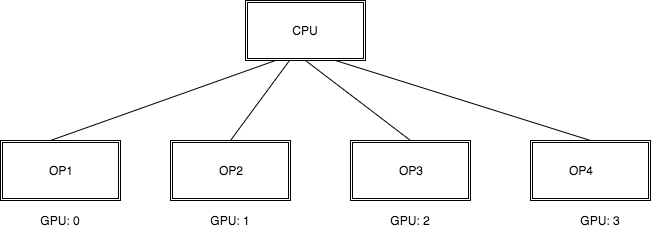

# Multi-device training in PaddlePaddle

## Why Multi-device
On a typical device or system, there are multiple computing devices. In PaddlePaddle, the supported device types as of now, are CPU and GPU (we will be adding FPGA in the future too).

If a PaddlePaddle operation has both CPU and GPU implementations, we decide which kernel to execute based on the device type.  
Training deep learning models can be resource intensive. Even with a very powerful GPU, some models can take really long to train. This is obvious with deep learning models, especially recurrent models where the execution of each step depends on the execution and output of previous step.

We also need to support multi-device during inference. When using FPGA for inference, we might want to use the CPU for some operator computation, GPU for some and FPGA for the others, since FPGA does not support all operators. In this setup, we also need multi-device support to facilitate the above scenario.

If we could come up with a way to optimize the usage of multiple heterogeneous devices that are available, we can achieve significant speedups during training and inference.

There are two ways we could achieve this:
1. Data Parallelism
2. Model Parallelism

### Data Parallelism
Data parallelism works by partitioning the training data over all the devices and hence distributes the workload over multiple devices. Each device has a copy of the complete model and only has access to 1/d of the total training data (if there are d devices in total). The updates from each device (gradients, parameter updates etc.) are communicated across all the devices once the device has an update.

### Model Parallelism
Model parallelism on the other hand, works by keeping a part of the model on each available device. This is useful when the model is too large to keep on one device or when there are parts of the model that can be executed independently ( in parallel). In this setup, each device will train a part of the model and pass on its updates to the next device.

Here, we want to explore the model parallelism setup, where different parts of the same model reside on different devices and communicate to each other by sending updates.

### Components of Model Parallelism
Let us look at a very simple example of model parallelism in the figure below:
 

Here we have four GPUs, (say GPU: 0, GPU: 1, GPU: 2 and GPU: 3) and each GPU is executing a separate operator viz. Op1, Op2, Op3 and Op4. All the operators together are a part of the same model.

### Copy operator
Now to pass on the updates from GPU: 0 to GPU: 1, we need to somehow copy the updates made by GPU: 0 and move them to GPU: 1 . This can be done in two ways:
1. Copy updates from GPU: 0 to CPU. Then copy updates from CPU to GPU: 1. This is shown as follows:
 

2. Copy updates directly from GPU: 0 to GPU: 1, shown as follows:
 

The first approach above requires two memcpy operations, one from GPU to CPU and another one from CPU to GPU. The second approach however requires just one memcpy operation (one GPU to another).

We have some low level implementations of CUDA memcpy [here](https://github.com/PaddlePaddle/Paddle/blob/develop/paddle/memory/memcpy.h) and the next step would be to write C++ operators to expose these functions.

### Python API
To enable users to use the setup we talked about above, we need to set up a Python API that the users can use. We specifically need two components here:
1. The Python API: This is the interface that the users of PaddlePaddle will use to set up model/data parallelism.
2. ProgramDesc: Behind the scenes we need a module that can convert the python API to a ProgramDesc (which is a collection of repeated OpDescs). The ProgramDesc then will be sent to the Executor, which creates the Ops and eventually runs the Ops.

We need to design the above two components as well as propose how the Python API will be parsed into ProgramDesc.
These components will be addressed in the following design documents, one for each component.
