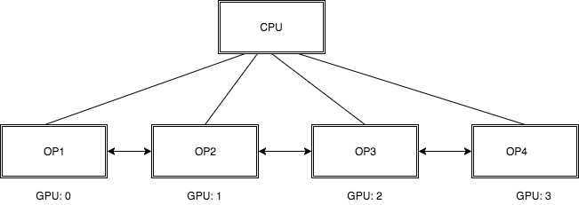

# Understanding Multi-device training in TensorFlow

In the TensorFlow framework, when a system supports multiple computing devices, we can leverage the multi-device training setup. In TensorFlow, the supported device types are CPU and GPU and they are represented as strings.
The CPU of the machine is represented as : "/cpu:0"
The GPU of the machine (if the machine has one) is represented as : "/gpu:0"
The subsequent GPUs of the machine ( if the machine has any) are represented as : "/gpu:1", "/gpu:2", "/gpu:3" and so on.

If a TensorFlow operation has both CPU and GPU implementations, and the computing device has a GPU, the GPU devices will be given priority.

## Logging Device placement

To understand which operation is being executed on which device, we can create the session with the `log_device_placement`  option set to True. For example when creating the session, do the following:

sess = tf.Session(config=tf.ConfigProto(log_device_placement=True))

Now when we do `print(sess.run(c))` where c is the operation we are trying to execute (matmul etc.). We can explicitly see the logs, and can see the name of input and which device it resides on, along with names of operations and the device on which it is being executed. The device in the log will be represented in string format as explained in the above section.


## Manual device placement

TensorFlow also allows us to perform manual device placement, which means that if we want to explicitly make a choice as to which operation should run on which device, we can do so. We have to use `with tf.device` to create a device context and al the operations within the context will have the same device assignment.

For example, if we want to perform matrix multiplication, we can do the following:

```python
with tf.device('/cpu:0'): # keep these on cpu
  a = tf.constant([1.0, 2.0, 3.0, 4.0], shape=[2, 2], name='a')
  b = tf.constant([1.0, 2.0, 3.0, 4.0], shape=[2, 2], name='b')
c = tf.matmul(a, b)

# Create a session with log_device_placement set to True.
sess = tf.Session(config=tf.ConfigProto(log_device_placement=True))
```
Now if we do `print(sess.run(c))`, we can see the device for `a` and `b` will be the CPU, and since we did not explicitly specify the device for MatMul, it will by default keep it on a GPU if available (as per TensorFlow's policy).

## GPU memory growth

TensorFlow maps most of the GPU memory visible to the current process to ensure that GPU memory resources are used more efficiently and that memory fragmentation is reduced.

There are two additional things that might be required:
1. Allocate only a subset of the memory and not the entire available memory.
2. Grow the memory usage as needed.
Both of the above options can be achieved in TensorFlow using different configurations.

The first requirement can be satisfied by using the `per_process_gpu_memory_fraction` option, which determines the fraction of the total memory that each GPU should be allocated. For example, you can tell TensorFlow to only allocate 20% of the total memory of each GPU in ConfigProto as follows:

```python
config = tf.ConfigProto()
config.gpu_options.per_process_gpu_memory_fraction = 0.4
session = tf.Session(config=config, ...)
```

The second requirement can be satisfied by using the `allow_growth` option. This allocates the GPU memory based on runtime allocations. When starting, it allocates very small memory, and as the Sessions get executed and if GPU memory is needed, we extend the GPU memory needed by the TensorFlow process. To turn this option on we set the option in the ConfigProto by:

```python
config = tf.ConfigProto()
config.gpu_options.allow_growth = True
session = tf.Session(config=config, ...)
```

This method is useful because the users can now manually control the amount of GPU memory that should be available to the TensorFlow process.

## How to use a single GPU when multiple GPUs are available

If our computation system has multiple GPUs, the GPU with the lowest ID is selected by default by TensorFlow. If we want to run the operation on a specific GPU, we can do so using `with tf.device()` explicitly as explained in the section above. The user has to make sure that the device mentioned exists on the system, otherwise TensorFlow throws an `InvalidArgumentError`.

To avoid the above error, we can choose to allow TensorFlow to choose an existing device to run the operation in case the specified device doesn't exist (this is like the `Try` `Catch` way of handling errors). To perform this, we can set `allow_soft_placement` option to True in the configuration when creating the session as follows:

```python
sess = tf.Session(config=tf.ConfigProto(
      allow_soft_placement=True, log_device_placement=True))
```

## Using multiple GPUs on computing devices

To run a model on multiple GPUs, we can construct the model in a multi-tower fashion where each tower is assigned to a different GPU as shown in the figure below:
<br/>

Let us follow the following example to see how this would look like in code:

```python
c = []
for d in ['/gpu:2', '/gpu:3']:
  # Choose gpu:2 and gpu:3 for execution
  with tf.device(d):
    a = tf.constant([1.0, 2.0, 3.0, 4.0], shape=[2, 2])
    b = tf.constant([1.0, 2.0, 3.0, 4.0], shape=[2, 2])
    c.append(tf.matmul(a, b))
with tf.device('/cpu:0'):
  sum = tf.add_n(c)

sess = tf.Session(config=tf.ConfigProto(log_device_placement=True))

print(sess.run(sum))
```
Here we are running the same operation(MatMul) on two different GPUs : '/gpu:2' and '/gpu:3', and on the CPU ('/cpu:0') the operation `tf.add_n` which adds all input tensors element-wise. This operation would collect the output of MatMulfrom the GPUs and aggregate them on the CPU.

The [tutorial](https://www.TensorFlow.org/tutorials/deep_cnn) on CIFAR10 is a good example demonstrating how to do training with multiple GPUs on TensorFlow.
