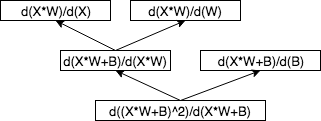
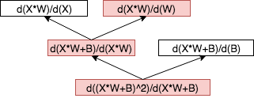
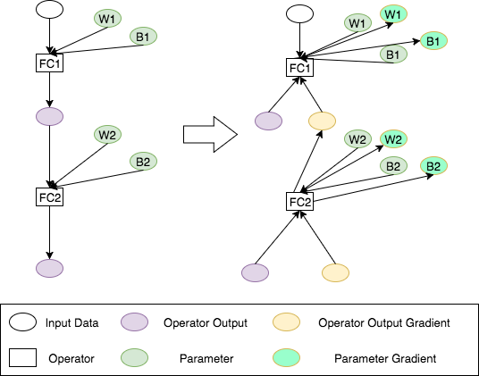

# Backward Overview
There are two stages for calculating neural network gradient while training, forward, and backward by back propagation method. Every operator calculates their input gradients by its output gradients reversely in the backward stage.

This note will describe following topics:

* What is the backpropagation algorithm in math?
* What is the inputs and outputs to compute the gradient of one operator. What is the first gradient and why?
* What is the difference between calculating the gradient on the same computation graph and explicit generating the backward computation graph? What are the advantages and disadvantages of them?
* What is the difference between training and backward?


## What is the backpropagation algorithm in math?

The [backpropagation algorithm](https://en.wikipedia.org/wiki/Backpropagation) is the fundamental algorithm to calculate gradients of neural network parameters. Please reference [UFLDL](http://deeplearning.stanford.edu/wiki/index.php/UFLDL_Tutorial) and [Wikipedia](https://en.wikipedia.org/wiki/Backpropagation) for the details of that algorithm. Here is a quick revisit of the backpropagation algorithm. If you are familiar with backpropagation algorithm, you can skip this section.

Backpropagation algorithm is very straightforward to understand if you are familiar with [`Chain rule`](https://en.wikipedia.org/wiki/Chain_rule) which for computing the derivative of the composition of two or more functions.

The equation of `Chain rule` is

```text
F'(x)=f'(g(x))g'(x).
```

The backpropagation algorithm is just apply `Chain rule` iteratively. 

For example, let our toy neural network are


The `d F(x)/ d W` and `d F(x)/ d B` are follow the equation


If we let `Z=X*W+B`, `d(Z^2) / d(z)` is used by both `d F(X) / d(W)` and `d F(X) / d(B)`. It will be calculated first and shared by `W'` and `B'`.  To calculate `d(Z^2)/d(z)` then calculate `d(z)/d(B)` is just the backpropagation.

The compuatation graph of that equation is



If we want to calculate the gradient of W, just following the red path below



Combine that red path we will get the exact equation of `dF(x)/d(W)` above.

## What's the input and output of gradient operator?

As we discussed in the previous section, the back-propagation algorithm is to apply `Chain rule` iteratively. For the forward operators, such as `matmul`, `rowwise_add`, `sigmoid`, what is the inputs and outputs of gradient operators?

Think about a toy neural network

```
Y = sigmoid(rowwise_add(matmul(X, W), b))
```
To compute `d(Y)/d(W)`, we just apply chain rule step by step. We can get the gradient of `matmul(X, W)`. If we let `X, W` as the input of `matmul` and the result of `matmul(X, W)` as output, then it means we can get the output gradient of `matmul(X, W)`. The backward operator uses the output gradients of forwarding operator to calculate its input gradients.

For calculating the derivative of some operator, such as `matmul`, not only output gradients are used but also the forward inputs and outputs of that operator are needed.

So for the gradient operator, there are three kinds of inputs and one kind of outputs. They are

| Description | abbreviation | Input or output to compute gradient |
| --- | --- | --- |
| Input of forward operator | I | Input |
| Output of forward operator | O | Input |
| Output gradient of forward operator | OG | Input |
| Input gradient of forward operator | IG | Output |

The data flow of the backward method is shown as blew.


## Two ways to implement back-propagation

There are mainly two ways to implement back-propagation: performing back-propagation on the same graph or explicitly representing a backwards path to calculate the required gradients.


### Perform back-propagation on the same graph

If we want to perform back-propagation on the same computational graph, each node of that computational graph must contains `forward` and `backward` method. It doesn't matter whether the node is operator or layer. If we assume the basic computational object is operator, then the interface of the operator should be

```cpp
class Operator {
public:
  virtual void Forward(...) = 0;
  virtual void Backward(...) = 0;
};
```

When forwarding that neural network, the `forward` method will be inovked one by one. When backwarding that neural network, the `backward` method will be invoked reversely. But for backward method, the I, O, and OG are passed as arguments. 

For example, there are two operators in the computational graph, `FC1` and `FC2`. The forward and backward data flow graph is shown as below.



### explicitly representing a backward graph
