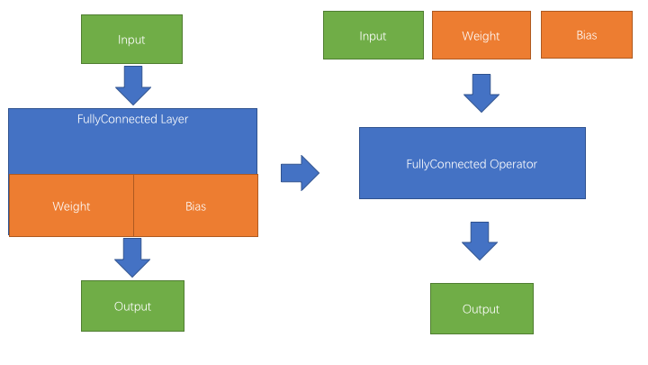

# Operator Overview

重构后Paddle最基础的计算单元是Operator。
一个Operator包含神经网络的一系列计算过程，也是用户使用Paddle配置神经网络的最底层用户接口。

这篇笔记不想试图解释当前Paddle重构的Operator为何如此设计，也不想探讨具体的实现手法。这篇笔记准备介绍Operator与Layer的区别与迷思，解释为什么需要Operator和Operator是什么。

Paddle重构前基于的Layer与Operator的区别很多，他们包括:

* Operator不维护参数等内部状态，而是将其作为输入输出。
* Operator不区分输入是否是可学习的参数，还是数据。

同时，关于Operator本身有很多似是而非迷思，这篇笔记也试图澄清:

* Operator并不是细粒度的Layer。
* 使用Operator并不增加内存占用。
* Operator并不一定只有Run，也可以有Forward/Backward。

## Operator不维护参数等内部状态

诚如Caffe2在[Operator Overview](https://caffe2.ai/docs/operators.html)中简短说明的一样，Layer与Operator总体最根本的区别就是是否维护内部状态。

以Layer为基础的神经网络框架，`Weight`与`Bias`等都是Layer的数据成员。甚至在Paddle的实现中，连层的输入输出都是层的数据成员(参考代码[[1]](https://github.com/PaddlePaddle/Paddle/blob/f27fd9dc28389d98fe10098b6de1084b324e1dff/paddle/gserver/layers/Layer.h#L77), [[2]](https://github.com/PaddlePaddle/Paddle/blob/f27fd9dc28389d98fe10098b6de1084b324e1dff/paddle/gserver/layers/Layer.h#L71))。这样实现是最符合直觉的，但深度学习系统经过多年的实践和发展，这种实现也显示出了诸多问题。

* 每个Layer持有自己的参数作为成员变量，这让内存/显存优化变得困难。
	* 最基础的问题是如何支持两个Layer共享同一个权重。这就要求layer存储参数的时候，必然是一个shared_ptr(参考代码[[1]](https://github.com/PaddlePaddle/Paddle/blob/develop/paddle/gserver/layers/Layer.h#L71),[[2]](https://github.com/PaddlePaddle/Paddle/blob/develop/paddle/parameter/Parameter.h#L58))，但是`shared_ptr`增加了代码的复杂度，并不鼓励使用。参数中还要有一个字段记录权重(参考代码[[1]](https://github.com/PaddlePaddle/Paddle/blob/develop/paddle/parameter/Parameter.h#L351), [[2]](https://github.com/PaddlePaddle/Paddle/blob/develop/paddle/parameter/Parameter.h#L352))共享的次数，这样才能知晓何时某一个参数梯度完全累加完毕。
	* 随着神经网络变得越来越深，内存优化变得越来越重要。比如在训练一个mini-batch的过程中，提前释放后序不需要的内存，或者将计算代价小的内存直接丢弃(参考[算法](https://mxnet.incubator.apache.org/architecture/note_memory.html))，以求可以在有限的GPU显存中训练更大的模型。如果Layer使用成员变量持有显存或者内存的话，这种优化实现将十分困难。
* 每个Layer持有一些数据作为成员变量，会让拓扑结构和内存耦合紧密。
	* 譬如对于RNN来说，每一个时间步的拓扑结构，也就是Op描述本身不会变化。但是每一个时间步运行的序列内存偏移会变化。譬如，我们将RNN假象成编程语言中的for循环(实际上稍有不同。TODO(yuyang18): 添加一个markdown说明for循环与RNN的关系)。循环的数组是`A`。那么，循环中的Op在第一个时间步操作的是`A[0]`，第二个时间步操作的是`A[1]`。使用Operator将内存与计算二者解耦合，在实现诸如RNN的复杂Op时会更加简单。
	* 如果Op中维护了一些状态数据。那么便不能通过切换内存偏移来实现RNN特别是嵌套的RNN了。因为既然Op内部有一些状态，简单的切换内存偏移也并不能让子网络在新的内存偏移上正确计算。

## Operator不区分参数与数据

无论是通常可训练的参数还是通常不需要训练的数据信息，在Operator看来都是输入或输出。而在Layer中，参数是被Layer创建和持有的，也只有参数是可以训练的。这会带来两个问题:

首先，参数不一定可训练，数据也不一定不可训练。区分数据和参数并不符合神经网络的实际使用情况。

* 很多情况下我们会使用一个神经网络进行预训练，再将预训练好的参数给另一个神经网络进行训练。这时，预训练好的参数可以固定住让它不在更新。所以参数不一定可训练。
* 在[A Neural Algorithm of Artistic Style](https://arxiv.org/abs/1508.06576)这篇论文中，训练的对象不是神经网络的参数而是数据。这里使用随机数据当做画布，使用预训练好的卷积模型。将画风图片的隐藏层与内容图片的隐藏层输出作为输出目标。通过更新数据来实现作画。

其次，如果区分参数与数据，通常会引发很多重复实现的代码。

* 譬如实现乘法Op，可能面临数种情况。例如，乘法操作左侧是输入数据，右侧是可学习的参数。或者乘法操作的右侧是输入数据，而左侧是参数。或者乘法操作的两个输入都是数据。
* 这个问题在Paddle中有所体现。譬如 [DotMulProjection](https://github.com/PaddlePaddle/Paddle/blob/develop/paddle/gserver/layers/DotMulProjection.cpp)与[DotMulOperator](https://github.com/PaddlePaddle/Paddle/blob/develop/paddle/gserver/layers/DotMulOperator.cpp).

故Operator不区分输入是参数还是数据可以减少冗余的实现，也可以让优化逻辑更清晰，但是也引入了一个新的问题:

* 因为Operator并不知道哪个输入/输出是参数。所以，输出计算梯度的时候，很可能由于某一个输出并不需要训练，也就并不需要梯度。所以Operator，特别是可能位于Backward阶段的Operator需要处理某些输入或输出可能为空的情况。
* 举一个实际的例子。对于FullyConnectedOp，如果这个Op的输入是用户给出的训练数据。那这个输入的梯度是不需要计算的。所以这个位置的输出可能是空。而对于中间层的FullyConnectedOp来说，FC的输入梯度就必须要计算了。所以正确的FullyConnectedOp实现，需要去注意这些输入或者输出可能是空的情况。

## Operator并不是细粒度的Layer

正如之前笔记中所给出的例子，全连接(FullyConnected)的实现，既可以实现成Op，也可以实现成Layer。计算粒度并不是Operator与Layer的区别，是否持有参数等可变的状态才是Operator与Layer的区别。

譬如在重构前的Paddle，虽然是基于Layer的框架，但是也可以直接配置矩阵乘法，矩阵点乘。这种计算粒度已经是大部分神经网络框架支持的最细粒度了。

同理，既然计算粒度并不是Operator与Layer的区别，那么Operator也并不一定比Layer计算的慢。因为如果计算粒度足够大，可以把若干个GPU Kernel进行合并，进而提高Operator的速度。(TODO(yuyang18): 具体问题会在后续的GPU的特性笔记中阐释，之后在这里加一个连接)。

但这里也需要说明的是，书写更细粒度Operator，通过组合一些细粒度的Operator来实现一个完整的Layer，确实也是Operator设计的一个动机。使用细粒度Operator组合Layer可以极大的减少开发一个神经网络框架的工作量。

Operator开发和维护的工作量与框架计算效率之间的权衡影响了Operator的计算粒度，不同的框架使用不同的思路解决这一问题。这个讨论会在GPU Kernel Fusion的相关话题中讨论(TODO)。不过一个简单直接的想法是:

1. 所有粗粒度的Operator。例如FullyConnectedOperator或者LSTM Operator都先用细粒度的Operator拼装而成。保证开发效率。
2. 如果一个Operator经常被使用且运行效率是瓶颈，例如`FullyConnected`，可以再将其作为一个Operator实现。

这样既保证了开发效率，也可以为提升运行速度。

## 使用Operator并不增加内存占用

正如之前介绍，Operator将参数等可变状态作为Operator的输入输出来传递，其一大动因就是更好的内存管理。虽然这一话题会在内存显存管理(TODO)中介绍，但也可以先把原因简单的列在这个笔记中。他们是:

* 正如上一个section介绍的，Operator的粒度可大可小。所以如果Operator计算粒度和Layer一样大，自然不会增加内存开销。
* 如果我们使用最细粒度的Operator配置整个网络，只要我们实现了变量的inplace和co-share(一种类似于引用计数的算法)。内存也并不会增加，相反内存有可能变少。
* 最后，如果我们实现了简单输出的重计算(例如扔掉RNN每一个时间步的Activation，在Backward的时候重新计算Activation的结果)，便可以与Paddle之前相比，极大的减少内存占用。

具体算法请参考内存显存管理(TODO)相关笔记。

## Operator并不一定只有Run，也可以有Forward/Backward

在原来Paddle的实现中，Layer含有`forward`和`backward`两个函数。重构后的Operator只含有`Run`函数。但这并不意味着`Operator`必须只有Run函数，而不能实现成`forward`/`backward`两个函数。

这两种实现实际上对应的是两种Backward风格: 1. 在原拓扑结构中反向遍历Op进行Backward; 2. 显示的新建Backward拓扑结构，将Forward与Backward合为一个拓扑结构进行运行。 这两种Backward风格，和Operator与Layer两个实现方式，完全是正交的两个问题。

这一话题会在Backward的实现中具体讨论这两种设计的想要解决的问题。但这里可以举出举例说明这一点。在DyNet中，每一个Operator(在DyNet中叫做Node，意味计算图中的一个节点)都有[`forward`函数](https://github.com/clab/dynet/blob/master/dynet/dynet.h#L581)和[`backward`函数](https://github.com/clab/dynet/blob/master/dynet/dynet.h#L609)。而在Caffe2中，每一个Operator含有的是[`Run`函数](https://github.com/caffe2/caffe2/blob/master/caffe2/core/operator.h#L116)。
