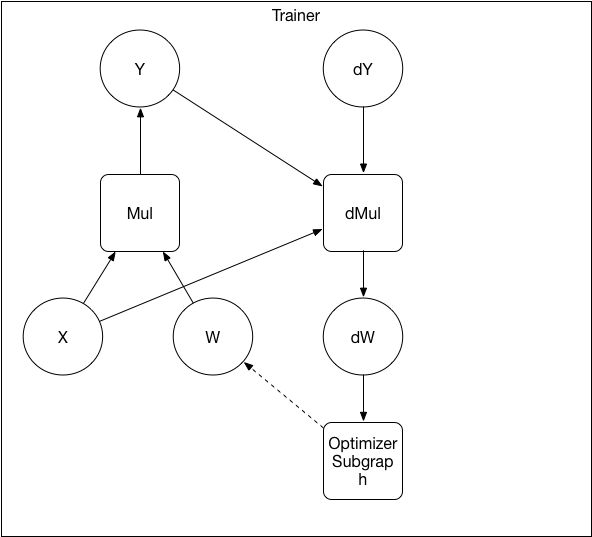
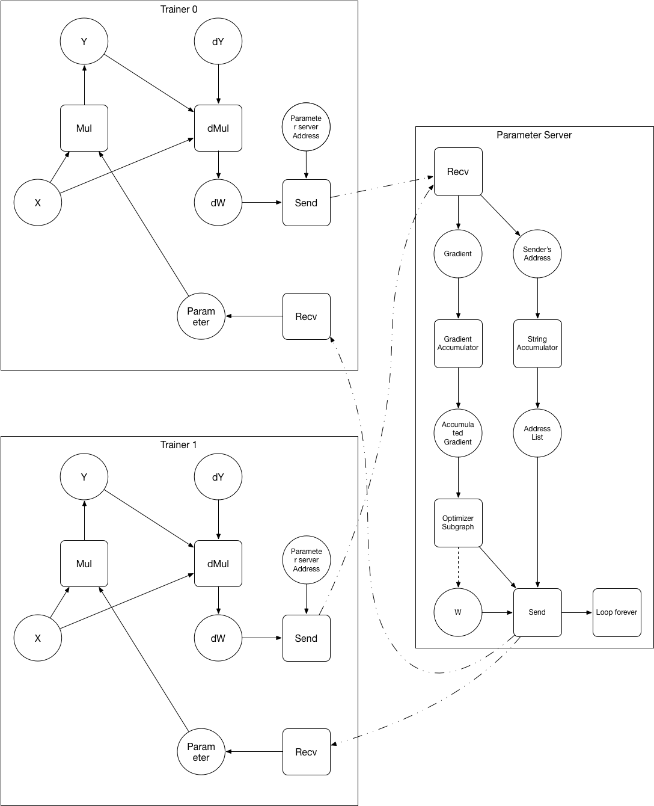

# Design Doc: Operation Graph Based Parameter Server

## Abstract

We propose an approach to implement the parameter server. In this
approach, there is no fundamental difference between the trainer and
the parameter server: they both run subgraphs, but subgraphs of
different purposes.

## Background

The previous implementations of the parameter server does not run a
subgraph. parameter initialization, optimizer computation, network
communication and checkpointing are implemented twice on both the
trainer and the parameter server.

It would be great if we can write code once and use them on both the
trainer and the parameter server: reduces code duplication and
improves extensibility. Given that after the current refactor, we are
representing everything as a computing graph on the
trainer. Representing everything as a computing graph on the parameter
server becomes a natural extension.

## Design

### Graph Converter

The *graph converter* converts the user-defined operation (OP) graph
into subgraphs to be scheduled on different nodes with the following
steps:

1. OP placement: the OPs will be placed on different nodes according
   to heuristic that minimizes estimated total computation
   time. Currently we will use a simple heuristic that puts parameter
   varable on parameter server workers and everything else on trainer
   workers.

1. Add communication OPs to enable the communication between nodes.

We will need these OPs: *Send*, *Recv*, *Enqueue*, *Dequeue*.

Below is an example of converting the user defined graph to the
subgraphs for the trainer and the parameter server:

After converting:

1. The parameter variable W and it's optimizer subgraph are placed on the parameter server.
1. Operators are added to the subgraphs.
   - *Send* sends data to the connected *Recv* operator.  The
	 scheduler on the receive node will only schedule *Recv* operator
	 to run when the *Send* operator has ran (the *Send* OP will mark
	 the *Recv* OP runnable automatically).
   - *Enueue* enqueues the input variable, it can block until space
     become available in the queue.
   - *Dequeue* outputs configurable numbers of tensors from the
     queue. It will block until the queue have the required number of
     tensors.

### Benefits

- Model parallelism become easier to implement: it's an extension to
  the trainer - parameter server approach. we already have the
  communication OPs, but need to extend the graph converter's
  placement functionality.

- User-defined optimizer is easier to add - user can now express it as
  a subgraph.

- No more duplication logic inside the trainer and the parameter
  server mentioned in the background section.

### Challenges

- It might be hard for the graph converter to cut a general graph
  (without any hint for which subgraph is the optimizer). We may need
  to label which subgraph inside the OP graph is the optimizer.

- It's important to balance the parameter shards of on multiple
  parameter server. If a single parameter is very big (some
  word-embedding, fully connected, softmax layer), we need to
  automatically partition the single parameter onto different
  parameter servers when possible (only element-wise optimizer depends
  on the parameter variable).

### Discussion

- In the "Aync SGD" figure, the "W" variable on the parameter server
  could be read and wrote concurrently, what is our locking strategy?
  E.g., each variable have a lock cpp method to be invoked by every
  OP, or, have a lock OP.

- Can the Enqueue OP be implemented under our current tensor design
  (puts the input tensor into the queue tensor)?

- *Dequeue* OP will have variable numbers of output (depends on the
  `min_count` attribute), does our current design support it? (similar
  question for the *Add* OP)

### References:
[1] [TensorFlow: Large-Scale Machine Learning on Heterogeneous Distributed Systems](https://static.googleusercontent.com/media/research.google.com/en//pubs/archive/45166.pdf)
