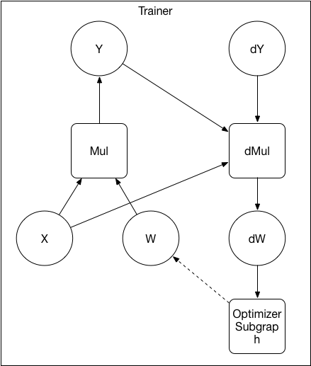
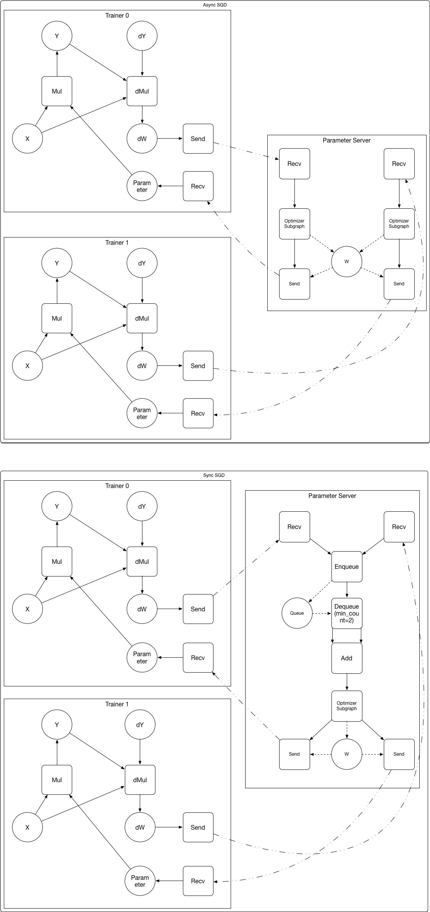

# Design Doc: Operation Graph Based Parameter Server

## Abstract

We propose an approach to implment the parameter server. In this
approach, there is no fundimental difference between the trainer and
the parameter server: they both run sub-graphs, but sub-graphs of
different purposes.

## Background

The previous implementations of the parameter server does not run a
sub-graph. parameter initialization, optimizer computation, network
communication and checkpointing are implemented twice on both the
trainer and the parameter server.

It would be great if we can write code once and use them on both the
trainer and the parameter server: reduces code duplication and
improves extensibility. Given during the current refactor, we are
representing everything as a computing graph on the
trainer. Representing everything as a computing graph on the parameter
server becomes a natural extension.

## Design

### Graph Converter

The *graph converter* converts user-defined operation (OP) graph into
sub-graphs to be scheduled on different nodes.

1. The user-defined OP graph will be cut into sub-graphs of
different purposes (e.g., trainer, parameter server) to run on
different workers.

1. OPs will be added to the subgraphs, so the subgraphs can
communicate with each other. We will need these OPs: *send*, *recv*,
*gradient accumulator*, *string accumulator*, *loop forever*.

Below is an example of converting the user defined graph to the
sub-graphs for the trainer and the parameter server:

After converting:

1. The parameter variable W and it's optimizer subgraph are placed on the parameter server.
1. Operators are added to the sub-graphs.
   - *send* operator sends data and sender's address to the destination.
   - *recv* operator receives data and sender's address from the
     destination. It will block until data has been received.
   - *gradient accumulator* operator accumulates *N* pieces of
     gradients. N=1 in Async-SGD, N>1 in Sync-SGD.
   - *string accumulator* accumulates *N* pieces of strings into a
     list of strings. N=1 in Async-SGD, N>1 in Sync-SGD.
   - *loop forever* runs itself as a target forever.

### Benefits

- Model parallelism become easier to implement: it's an extension to
  the trainer - parameter server approach. we already have the
  communication OPs, but need to extend the graph converter.

- User-defined optimizer is easier to add - user can now express it as
  a subgraph.

- No more duplication logic inside the trainer and the parameter
  server in the background section.

### Challenges

- It might be hard for the graph converter to cut a general graph
  (without any hint for which sub-graph is the optimizer). We may need
  to label which sub-graph inside the OP graph is the optimizer.

- It's important to balance the parameter shards of on multiple
  parameter server. If a single parameter is very big (some
  word-embedding, fully connected, softmax layer), we need to
  automatically partition the single parameter onto different
  parameter servers when possible (only element-wise optimizer depends
  on the parameter variable).
