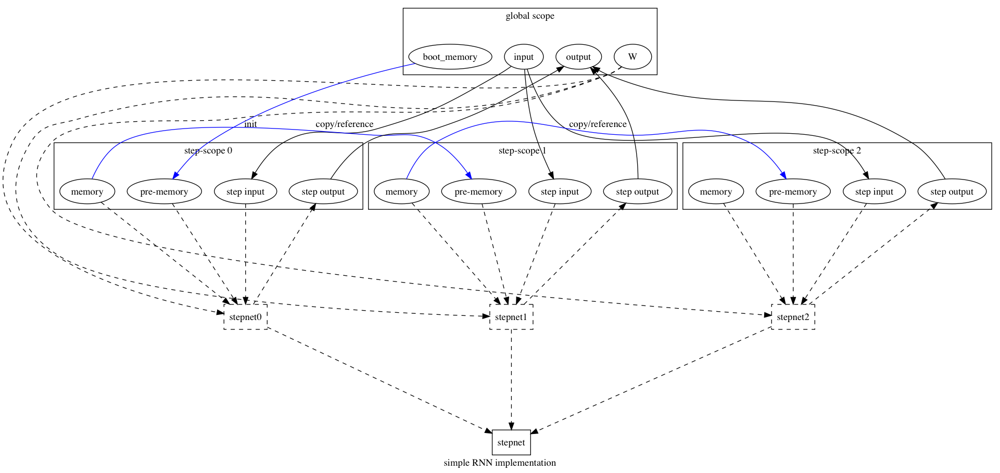
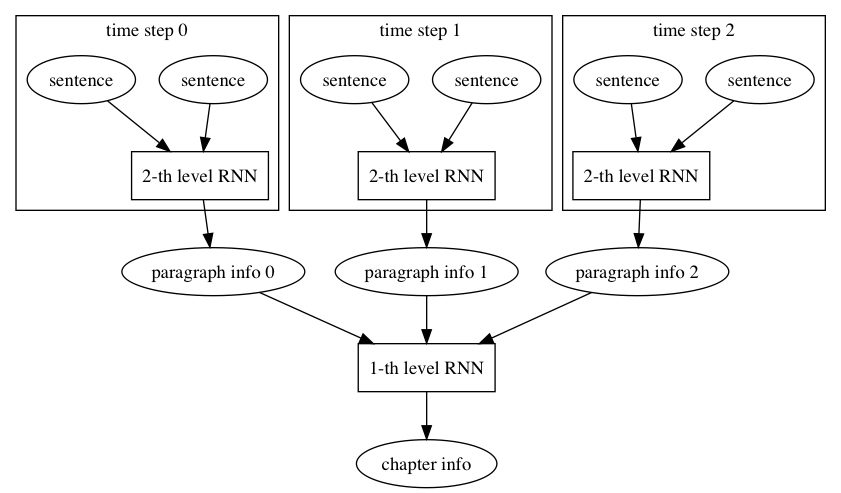
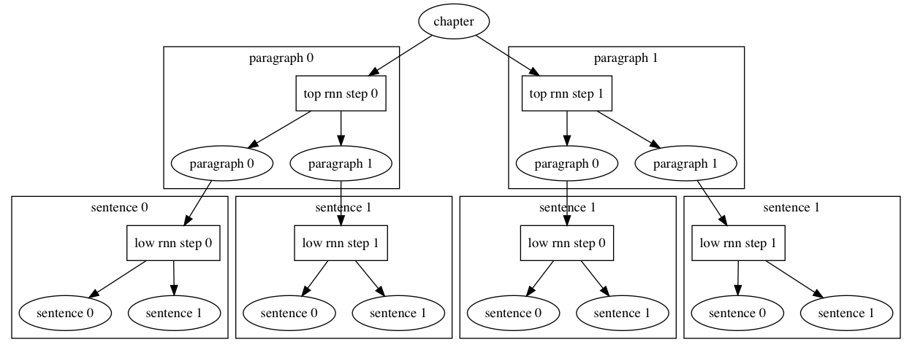

# RNNOp design
This is the design doc of the recurrent neural network operator, 
and this operator requires that input instances in each mini-batch must have the same length. 

## RNN Algorithm Implementation

<p aligh="center">

</p>

The above diagram shows an RNN being unrolled into a full network.

There are several important concepts:

- sep-net, the network to be executed in each step
- memory, a variable storing state in the current step, which is denoted as $h_t$.
- pre-memory, the value of state in the previous time step, it can be denoted as $h_{t-1}$.
- init-memory, the variable to help initialize state in the first time step.

### Step Scope
The step-net could have local variables defined.
In each step of RNN, a scope is created to hold corresponding variables.
Such a scope is known as a *step scope*.

<p aligh="center">
<br/>
Figure 2 the RNN's data flow
</p>

All steps run the same step-net.

Each step runs the following procedure:

1. create the step scope,
2. create local variables in the step scope, and
3. execute the step-net, which would use these variables.

After the execution of all steps, the RNNOp would compose its output from step outputs in those step scopes.

### Memory and Ex-memory
An RNN step often has some status which needs to be passed to the next step.
These status are known as the memory, which is often referred by the step-net as variables.
A step often needs to refer to the memory value changed by the previous step.
We call it *ex-memory*.

Let's use a simply RNN as an example to explain memory and ex-memory.

$$
h_t = U h_{t-1} + W x_t
$$,

where $h_t$ is the memory of step $t$'s, $h_{t-1}$ is the ex-memory, or the memory of step $t-1$.

In the implementation, we can make an ex-memory variable either "refers to" the memory variable of the previous step, 
or copy the value of the previous memory variable to the current ex-memory variable.

### The Python Interface
In Paddle's macro design, 
the concept Block represents a sequence of operators.

We can define an RNN's step-net based on Block as follows

```python
import paddle as pd

X = some_op() # x is some operator's output, and is a LoDTensor
a = some_op()

# declare parameters
W = pd.Variable(shape=[20, 30])
U = pd.Variable(shape=[20, 30])

rnn = pd.create_RNNOp(output_num=1)
with rnn.stepnet():
    x = rnn.add_input(X)
    # declare a memory (rnn's step)
    h = rnn.add_memory(init=a)
    # h.pre_state() means previous memory of rnn
    new_state = pd.add_two( pd.matmul(W, x) + pd.matmul(U, h.pre_state()))
    # update current memory
    h.update(new_state)
    # indicate that h variables in all step scopes should be merged
    rnn.set_output(0, h)
    
out = rnn()
```

in above example, some Python interfaces declared:
- `rnn.add_input` indicates the variables that need to be segmented for RNN time steps and step-net's inputs.
- `rnn.add_memory` declares a memory of RNN (state).
- `rnn.set_output` mark the variables that need to be concated across all the time steps.

### Integrate with LoDTensor to implement multiple levels of RNN
We are interested in how to apply varied levels of RNN using RNNOp, 
for example, use a 2-level RNN to learn the information from a Chapter,
a single chapter contains several paragraphs, 
and each paragraph contains several sentences.

Feed the paragraph data to the lower level RNNOps, one sentence in each step time, 
collect their outputs and feed to the top level RNNOp, one paragraph in each step time,
finally, the top level RNN outputs the information of a chapter.

<p aligh="center">

</p>

```python
import paddle as pd

W = pd.Variable(shape=[20, 30])
U = pd.Variable(shape=[20, 30])

W0 = pd.Variable(shape=[20, 30])
U0 = pd.Variable(shape=[20, 30])

# a is output of some op
a = some_op()

# chapter_data is a set of 128-dim word vectors
# the first level of LoD is sentence
# the second level of LoD is chapter
chapter_data = pd.Variable(shape=[None, 128], type=pd.lod_tensor, level=2)

def lower_level_rnn(paragraph):
    '''
    x: the input
    '''
    rnn = pd.create_RNNOp(output_num=1)
    with rnn.stepnet():
        sentence = rnn.segment_input(paragraph, level=0)
        h = rnn.add_memory(shape=[20, 30])
        h.update(
            pd.matmul(W, sentence) + pd.matmul(U, h.pre_state()))
        # get the last state as sentence's info
        rnn.set_output(0, h)
    return rnn

top_level_rnn = pd.create_RNNOp(output_num=1)
with top_level_rnn.stepnet():
    paragraph_data = rnn.segment_input(chapter_data, level=1)
    low_rnn = lower_level_rnn(paragraph_data)
    paragraph_out = low_rnn()

    h = rnn.add_memory(init=a)
    h.update(
        pd.matmul(W0, paragraph_data) + pd.matmul(U0, h.pre_state()))
    top_level_rnn.set_output(0, h)

chapter_out = top_level_rnn()
```

in above example, the `lower_level_rnn` will be embedded in the step-net of `top_level_rnn` as a RNNOp operator, 
with a LoD Tensor, the top rnn will segment the original chapter data into paragraph records, 
and the lower rnn will segment paragraph records into sentence records.

<p align="center">

</p>

After data are segmented, run `lower-level-rnn` first, then the `up-level-rnn`, 
finally the `up-level-rnn` will output the hidden state learned from the whole chapter data.
