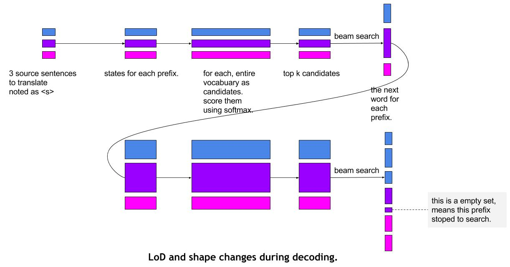

# Design: Sequence Decoder Generating LoDTensors
In tasks such as machine translation and image to text, 
a [sequence decoder](https://github.com/PaddlePaddle/book/blob/develop/08.machine_translation/README.md) is necessary to generate sequences.

This documentation describes how to implement the sequence decoder as an operator.

## Beam Search based Decoder
The [beam search algorithm](https://en.wikipedia.org/wiki/Beam_search) is necessary when generating sequences, 
it is a heuristic search algorithm that explores the paths by expanding the most promising node in a limited set.

In the old version of PaddlePaddle, a C++ class `RecurrentGradientMachine` implements the general sequence decoder based on beam search, 
due to the complexity, the implementation relays on a lot of special data structures, 
quite trivial and hard to be customized by users.

There are a lot of heuristic tricks in the sequence generation tasks, 
so the flexibility of sequence decoder is very important to users.

During PaddlePaddle's refactoring work,
some new concept is proposed such as [LoDTensor](https://github.com/PaddlePaddle/Paddle/blob/develop/paddle/framework/lod_tensor.md) and [TensorArray](https://github.com/PaddlePaddle/Paddle/blob/develop/doc/design/tensor_array.md) that can better support sequence usage,
and they can help to make the implementation of beam search based sequence decoder **more transparent and modular** .

For example, the RNN sates, candidates IDs and probabilities of beam search can be represented as `LoDTensors`;
the selected candidate's IDs in each time step can be stored in a `TensorArray`, and `Packed` to the sentences translated.

## Changing LoD's absolute offset to relative offsets
The current `LoDTensor` is designed to store levels of variable-length sequences,
it stores several arrays of integers each represents a level.

The integers in each level represents the begin and end (not inclusive) offset of a sequence **in the underlying tensor**, 
let's call this format the **absolute-offset LoD** for clear.

The relative-offset LoD can fast retrieve any sequence but fails to represent empty sequences, for example, a two-level LoD is as follows
```python
[[0, 3, 9]
 [0, 2, 3, 3, 3, 9]]
```
The first level tells that there are two sequences:
- the first's offset is `[0, 3)`
- the second's offset is `[3, 9)`

while on the second level, there are several empty sequences that both begin and end at `3`.
It is impossible to tell how many empty second-level sequences exist in the first-level sequences.

There are many scenarios that relay on empty sequence representation,
such as machine translation or image to text, one instance has no translations or the empty candidate set for a prefix.

So let's introduce another format of LoD, 
it stores **the offsets of the lower level sequences** and is called **relative-offset** LoD.

For example, to represent the same sequences of the above data

```python
[[0, 3, 6]
 [0, 2, 3, 3, 3, 9]]
```

the first level represents that there are two sequences, 
their offsets in the second-level LoD is `[0, 3)` and `[3, 5)`.

The second level is the same with the relative offset example because the lower level is a tensor.
It is easy to find out the second sequence in the first-level LoD has two empty sequences.

The following demos are based on relative-offset LoD.

## Usage in a simple machine translation model
Let's start from a simple machine translation model that is simplified from [machine translation chapter](https://github.com/PaddlePaddle/book/tree/develop/08.machine_translation) to draw a simple blueprint of what a sequence decoder can do and how to use it.

The model has an encoder that learns the semantic vector from a sequence,
and a decoder which uses the sequence decoder to generate new sentences.

**Encoder**
```python
import paddle as pd

dict_size = 8000
source_dict_size = dict_size
target_dict_size = dict_size
word_vector_dim = 128
encoder_dim = 128
decoder_dim = 128
beam_size = 5
max_length = 120

# encoder
src_word_id = pd.data(
    name='source_language_word',
    type=pd.data.integer_value_sequence(source_dict_dim))
src_embedding = pd.embedding(size=source_dict_size, size=word_vector_dim)

src_word_vec = pd.lookup(src_embedding, src_word_id)

encoder_out_seq = pd.gru(input=src_word_vec, size=encoder_dim)

encoder_ctx = pd.last_seq(encoder_out_seq)
# encoder_ctx_proj is the learned semantic vector
encoder_ctx_proj = pd.fc(
    encoder_ctx, size=decoder_dim, act=pd.activation.Tanh(), bias=None)
```

**Decoder**

```python
def generate():
    decoder = pd.while_loop()
    with decoder.step():
        decoder_mem = decoder.memory(init=encoder_ctx)  # mark the memory
        generated_ids = decoder.memory() # TODO init to batch_size <s>s
        generated_scores = decoder.memory() # TODO init to batch_size 1s or 0s

        target_word = pd.lookup(trg_embedding, gendrated_ids)
        # expand encoder_ctx's batch to fit target_word's lod
        # for example
        # decoder_mem.lod is
        # [[0 1 3],
        #  [0 1 3 6]]
        # its tensor content is [a1 a2 a3 a4 a5]
        # which means there are 2 sentences to translate
        #   - the first sentence has 1 translation prefixes, the offsets are [0, 1)
        #   - the second sentence has 2 translation prefixes, the offsets are [1, 3) and [3, 6)
        # the target_word.lod is 
        # [[0, 1, 6]
        #  [0, 2, 4, 7, 9 12]]
        # which means 2 sentences to translate, each has 1 and 5 prefixes
        # the first prefix has 2 candidates
        # the following has 2, 3, 2, 3 candidates
        # the encoder_ctx_expanded's content will be
        # [a1 a1 a2 a2 a3 a3 a3 a4 a4 a5 a5 a5]
        encoder_ctx_expanded = pd.lod_expand(encoder_ctx, target_word)
        decoder_input = pd.fc(
            act=pd.activation.Linear(),
            input=[target_word, encoder_ctx],
            size=3 * decoder_dim)
        gru_out, cur_mem = pd.gru_step(
            decoder_input, mem=decoder_mem, size=decoder_dim)
        scores = pd.fc(
            gru_out,
            size=trg_dic_size,
            bias=None,
            act=pd.activation.Softmax())
        # K is an config
        topk_scores, topk_ids = pd.top_k(scores, K)
        topk_generated_scores = pd.add_scalar(topk_scores, generated_scores)

        selected_ids, selected_generation_scores = decoder.beam_search(
            topk_ids, topk_generated_scores)

        # update the states
        decoder_mem.update(cur_mem)  # tells how to update state
        generated_ids.update(selected_ids)
        generated_scores.update(selected_generation_scores)

        decoder.output(selected_ids)
        decoder.output(selected_generation_scores)

translation_ids, translation_scores = decoder()
```
The `decoder.beam_search` is a operator that given the candidates and the scores of translations including the candidates,
return the result of the beam search algorithm.

In this way, users can customize anything on the inputs or outputs of beam search, for example, two ways to prune some translation prefixes

1. meke the correspondind elements in `topk_generated_scores` zero or some small values, beam_search will discard this candidate.
2. remove some specific candidate in `selected_ids`
3. get the final `translation_ids`, remove the translation sequence in it.

The implementation of sequence decoder can reuse the C++ class [RNNAlgorithm](https://github.com/Superjom/Paddle/blob/68cac3c0f8451fe62a4cdf156747d6dc0ee000b3/paddle/operators/dynamic_recurrent_op.h#L30),
so the python syntax is quite similar to a [RNN](https://github.com/Superjom/Paddle/blob/68cac3c0f8451fe62a4cdf156747d6dc0ee000b3/doc/design/block.md#blocks-with-for-and-rnnop).

Both of them are two-level `LoDTensors`

- the first level represents `batch_size` of (source) sentences;
- the second level represents the candidate ID sets for translation prefix.

for example, 3 source sentences to translate, and has 2, 3, 1 candidates.

Unlike an RNN, in sequence decoder, the previous state and the current state have different LoD and shape,
a `lod_expand` operator is used to expand the LoD of the previous state to fit the current state.

For example, the previous state

* LoD is `[0, 1, 3][0, 2, 5, 6]`
* content of tensor is `a1 a2 b1 b2 b3 c1`

the current state stored in `encoder_ctx_expanded`

* LoD is `[0, 2, 7][0 3 5 8 9 11 11]`
* the content is 
  - a1 a1 a1 (a1 has 3 candidates, so the state should be copied 3 times for each candidates)
  - a2 a2
  - b1 b1 b1
  - b2
  - b3 b3
  - None (c1 has 0 candidates, so c1 is dropped)

Benefit from the relative offset LoD, empty candidate set can be represented naturally.

the status in each time step can be stored in `TensorArray`, and `Pack`ed to a final LoDTensor, the corresponding syntax is 

```python
decoder.output(selected_ids)
decoder.output(selected_generation_scores)
```

the `selected_ids` is the candidate ids for the prefixes, 
it will be `Packed` by `TensorArray` to a two-level `LoDTensor`,
the first level represents the source sequences,
the second level represents generated sequences.

Pack the `selected_scores` will get a `LoDTensor` that stores scores of each candidate of translations.

Pack the `selected_generation_scores` will get a `LoDTensor`, and each tail is the probability of the translation.

## LoD and shape changes during decoding
<p align="center">
  
</p>

According the image above, the only phrase to change LoD is beam search.

## Beam search design
The beam search algorthm will be implemented as one method of the sequence decoder, it has 3 inputs

1. `topk_ids`, top K candidate ids for each prefix.
2. `topk_scores`, the corresponding scores for `topk_ids`
3. `generated_scores`, the score of the prefixes.

All of the are LoDTensors, so that the sequence affilication is clear.
Beam search will keep a beam for each prefix and select a smaller candidate set for each prefix.

It will return three variables

1. `selected_ids`, the final candidate beam search function selected for the next step.
2. `selected_scores`, the scores for the candidates.
3. `generated_scores`, the updated scores for each prefixes (with the new candidates appended).

## Introducing the LoD-based `Pack` and `Unpack` methods in `TensorArray`
The `selected_ids`, `selected_scores` and `generated_scores` are LoDTensors,
and they exist in each time step,
so it is natural to store them in arrays.

Currently, PaddlePaddle has a module called `TensorArray` which can store an array of tensors,
the results of beam search are better to store in a `TensorArray`.

The `Pack` and `UnPack` in `TensorArray` are used to package tensors in the array to a `LoDTensor` or split the `LoDTensor` to an array of tensors. 
It needs some extensions to support pack or unpack an array of `LoDTensors`.
