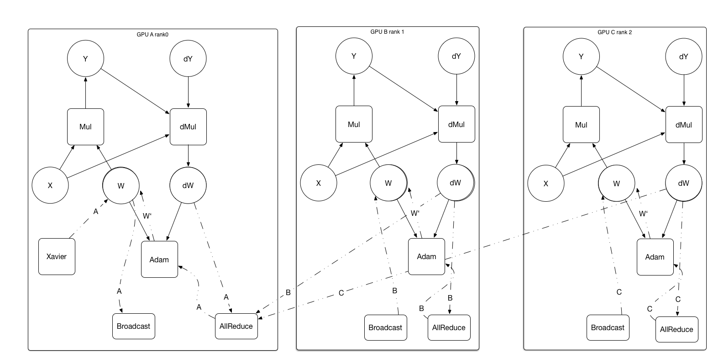

# Design Doc: NCCL support in Paddle Fluid

## Abstract

This Design Doc refers to the NCCL feature in  paddle.  We propose an approach to support NCCL library both on a single machine and multiple machines. We wrapper the NCCL primitives `Broadcast`, `Allreduce`, `Reduce` as operators to utilize Multi-GPU powers in one script.

## Motivation

[NCCL](https://developer.nvidia.com/nccl) is a NVIDIA library support Multi-GPU communicating and optimized for NVIDIA GPUs, it provides routines such as all-gather, all-reduce, broadcast, reduce, reduce-scatter, that can achieve high bandwidth over PCIe and NVLink high-speed interconnect. With NCCL library, we can easily accelerate the training in parallel. 

- Pros
1. easily plug-in with [NCCL2](https://developer.nvidia.com/nccl) library.
1. high performance in NVIDIA GPUs.
1. MPI like primitives, which have low learning cost for users.

- Cons
1. Only design for NVIDIA GPUs, not a general multi-device solution.
1. Although NCCL1 is opensourced under BSD license, but NCCL2 is not opensourced anymore.

At the beginning of training, the framework needs to distribute the same parameters to every GPU, and merge the gradients at any time user interests.

As a result, during training, we need the operations of peer to peer copy between different GPUs, aggregating gradients/parameters from GPUs, and broadcasting parameters to GPUs. Every GPU only need to run the operator with correct place information.

Besides, it needs interfaces to synchronize model update with each different GPU Cards. 

## Implementation

As mentioned above, we wrap the NCCL routines as several kinds of operators. Need to note that NCCL need to create Communicator between gpu at the beginning, so there is a NCCLInit operator created.

### Transpiler

To be compatible with [parameter server design doc](https://github.com/PaddlePaddle/Paddle/blob/develop/doc/design/ops/dist_train.md), the transpiler compiles the user defined operation graph into sub-graphs to be executed on different devices.

1. The user-defined model will be a single device program

2. Broadcast/Reduce operators between GPUs will be inserted into the program, even for the multi-node, may insert the `Send`, `Recv` operator.

   *Broadcast, AllReduce in a single machine. And Broadcast, AllReduce, [Send, Recv](https://github.com/PaddlePaddle/Paddle/blob/develop/doc/design/ops/dist_train.md#graph-converter) in multiple machines*

   

After compiling, the graph as shows

Operators are added to the sub-graphs. Every GPU assigned a role of `rank0`, `rank1` etc. 

- **Broadcast**. Broadcast operator distribute initialized parameter to all the GPUs from the GPU who owns it. e.g. from`rank0` GPU.
- **AllReduce**. AllReduce operator synchronizes parameters/gradients between GPUs. AllReduce implemented in the Ring-Based  communicating method, avoid of the bottle neck in a single GPU.

Need to notice that AllReduce operator force GPUs synchronized at that point. The whole training process in asynchronous or synchronous mode depends on the AllReduce point in the graph.

As it shown in the picture, when each GPU compute the gradient of `W`, followed with a `AllReduce` operator, accumulate the `dW` to full batch of data, then run the optimize process individually and apply the gradient to its `W`.

- **AllReduce**
  Need to note that our AllReduce operator is a ring-base AllReduce implementation. If we use the NCCL2 AllReduce primitive, every GPU optimized full batch of data, wasted (n-1) GPU compute resources. In addition, NCCL2 built-in AllReduce will only utilize the communicating resource during synchronization, then update the gradient will be a subsequent phase. In fact, we can amortize the update gradient time cost into the communicating phase. The process is
1. Every parameter has its root card. That card will responsible for aggregating the gradients from GPUs.
2. The whole model's parameter will be hashed to different root card, ensure the load balance between GPUs.
3. Logically neighberhood card will start send parameter to the next one. After one round, the parameter main card will aggregate the full gradients.
4. Then the root card will optimize the parameter.
5. This parameter card will send its optimized result to its neighberhood, then the neighberhood will send parameter to its next one.
6. Finish the sychronization round.

The total time cost will be 2 * (n-1) * per-parameter-send-time, we reach the goal of amortize the upgrade time into communicating phase.
