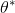

# Averaging Parameter Updates in PaddlePaddle

## Why Averaging
In large scale machine learning, it could take us a large number of iterations over the training data to achieve optimal values of parameters of our model. The size of training data could be very large for large scale training hence it is desirable if we can obtain the optimal parameters by going through the data in as few passes as we can.
Polyak and Juditsky (1992) showed that asymptotically the test performance of simple average of parameters obtained by Stochastic Gradient Descent (SGD) is as good as that of parameters which minimize the empirical cost.

Hence, to accelerate the speed of SGD, Averaged Stochastic Gradient Descent (ASGD) was proposed in Polyak and Juditsky (1992). For ASGD, the running average of parameters obtained by SGD, is used as the estimator for   . The averaging is done as follows:

 

We propose averaging for any optimizer along the same lines of ASGD mentioned above.

### How to perform Parameter Averaging in PaddlePaddle

Parameter Averaging in PaddlePaddle works in the following way during training :
1. It will take in an instance of a normal optimizer as an input, e.g. RMSPropOptimizer
2. The optimizer itself is responsible for updating the parameters.
3. The ParameterAverageOptimizer maintains a separate copy of the parameters for itself:
    1. In concept, the values of this copy are the average of the values of the parameters in the most recent N batches.
    2. However, saving all the N instances of the parameters in memory is not feasible.
    3. Therefore, an approximation algorithm is used.

Hence, overall we have have two copies of the parameters: one for the optimizer itself, and one for the ParameterAverageOptimizer. The former should be used in back propagation, while the latter should be used during testing and should be saved.

During the testing/ saving the model phase, we perform the following steps:
1. Perform the delayed operations.
2. Save current values of the parameters to a temporary variable.
3. Replace the values of the parameters with the averaged values.
4. Perform testing and/or save the parameters.
5. Restore the values of the parameters once done.

### How to do implement Averaging of Parameter Updates in PaddlePaddle

We can add the ParameterAverageOptimizer op to the graph through Python API. Using this approach, we manually add this op to the graph and direct the output of the optimizer op to this op during training.

	**Advantages**:
    - Allows for greater flexibility to the users of Paddle. Using this approach, the users can plug different optimizers into ParameterAverageOptimizer by passing in the optimizer to the op.
    - Makes it easy for the users to customize and extend the framework.

	**Disadvantages**:
    - Implementation requires re-writing the averaging methodology in Python.  

### Low-Level implementation

In the new design, we propose to create a new operation for averaging parameter updates (ParameterAverageOptimizer). For now, we can add an op that takes in the following as input:
- the optimizer
- the window_size to keep the updates

The ParameterAverageOptimizer op can be like any other operator with its own CPU/GPU implementation either using Eigen or separate CPU and GPU kernels. As the initial implementation, we can implement the kernel using Eigen following the abstraction pattern implemented for [Operators](https://github.com/PaddlePaddle/Paddle/blob/develop/paddle/operators/rmsprop_op.h).

The idea of building an op for averaging is in sync with the refactored Paddle philosophy of using operators to represent any computation unit. The way the op will be added to the computation graph will be decided by the [layer functions](https://github.com/PaddlePaddle/Paddle/blob/develop/doc/design/python_api.md#layer-function) in Python API.

### Python API implementation for ParameterAverageOptimizer

Based on Polyak and Juditsky (1992), we can generalize the averaging of updates to any optimizer. The input to the op would be the following:
- Any optimizer (RMSProp , AdaGrad etc.)
- A window size. The op keeps accumulating updated parameter values over a window of N batches and takes an average. Move the averaged value to a buffer when window is full to avoid loss of precision.

Using the ParameterAverageOptimizer op, any user can add the operation to their computation graphs. However, this will require a lot of lines of code and we should design Python APIs that support averaging. As per the PaddlePaddle [Python API design](https://github.com/PaddlePaddle/Paddle/blob/develop/doc/design/python_api.md), the layer functions are responsible for creating operators, operator parameters and variables. Since parameter averaging will be an operator, it makes sense to create it in the layer functions.

#### Creation of the ParameterAverageOptimizer operator
There are two ways for creating the ParameterAverageOptimizer op:
1. We create the op immediately while building the computation graph.
2. We add the op in a lazy manner, just before the backward pass, similar to the way the optimization ops are added.

The proposal is to add the op immediately while building the computation graph.

#### High-level API

In PaddlePaddle Python API, users will primarily rely on [layer functions](https://github.com/PaddlePaddle/Paddle/blob/develop/doc/design/python_api.md#layer-function) to create neural network layers. Hence, we also need to provide parameter average functionality in layer functions.
