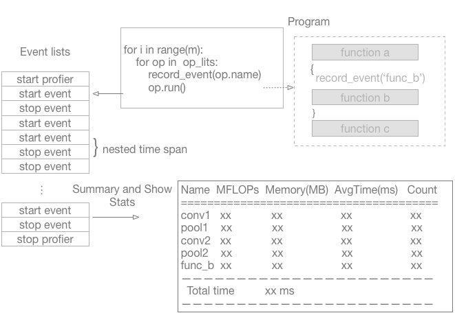

## Introduction

There are many performance analysis tools for [different programming languages and different software framework](https://en.wikipedia.org/wiki/List_of_performance_analysis_tools). For most popular deep learning framework, they used several programming languages and adapt to heterogeneous platforms. Similar to most of the deep learning framework, the PaddlePaddle also used C++, CUDA and Python as the basic programming languages to adapt to run on CPU and GPU device.  The [`nvprof` tools](http://docs.nvidia.com/cuda/profiler-users-guide/index.html#nvprof-overview) is usually used to analyse the CUDA program.  We have [a document](https://github.com/PaddlePaddle/Paddle/blob/develop/doc/howto/optimization/cpu_profiling.md) to profile CPU and Python program by [yep](https://pypi.python.org/pypi/yep) and [Google's perftools](https://github.com/google/pprof) to profile the only CPU and Python program. But for [PaddlePaddle fluid](https://github.com/PaddlePaddle/Paddle/blob/develop/doc/design/fluid.md), the operator is the basic computing unit. The developers usually wants to collect the time of each operator and locate bottlenecks.  The `nvprof` usually collect the timeline of CUDA-related activities on both CPU and GPU, including kernel execution, memory transfers, memory set and CUDA API calls and events or metrics for CUDA kernels. And the `yep` and `Google's perftools` can't collect the timeline for CUDA program. All these tools can't collect time in the operator level. So we design this profiling tools.

## Architecture

The work flow for most task is as follows. Each operator will run many times in the all iterations. So the profiler must collect the total time of each operator during the iteration. For more, sometimes, the developers want to collect more detailed time span inside the operator or record time span for elsewhere, this requires that the profiler must support to record the nested time span. And in order to speed training, all the deep learning framework supports parallel computing, including multi-threads on CPU and multi-GPUs. So the profiler must enable to collect the timeline for each thread. In addition, the profiler also occupies certain resources. It must can be easily to enable or disable by the developers. At last, the profiler should show a human-readable report.  

```python
for i in xrange(M):  # M is  the iteration number
  for op in operator_lists: # The `operator_lists` is the all operators in the network graph.
    op.run();
```

In a summary, the proflier should have follow features:

- record time span in loop.
- support nested time span.
- support multi-threads/multi-GPUs.
- support to enable and disable the profiler.

But how to record the time for the mixed C++ and CUDA program?  There many C++ interfaces to get the current calendar time in host program. But for GPU, the CUDA kernels may be executed concurrently if they are in different streams (http://docs.nvidia.com/cuda/cuda-c-programming-guide/index.html#streams) and the CUDA kernels is asynchronous with the host program if there is no the synchronous aftern the CUDA kernels. The CUDA provides [event](http://docs.nvidia.com/cuda/cuda-c-programming-guide/index.html#events) to monitor the device's perform accurate timing. Inspired by PyTorch and CUDA event, we also design and apply the events to record the timeline.  Then summary and show statistics based on these events.  

The overall flow is shown as following figure.

<br/>

### Event

In above work flow, a pair of events are needed before and aftern the piece of code to collect time. So the event has a flag to mark it is starting event or ending event. There three kinds of event:

```c++
enum EventKind { kMark,
  kPushRange,
  kPopRange};
```
- kMark: only a mark.
- kPushRange: mark the starting event for time range. 
- kPopRange: mark the ending event for the time range.

For the CPU code, the events only need to record the current time. For the CUDA code, the [event management functions of CUDA](http://docs.nvidia.com/cuda/cuda-runtime-api/group__CUDART__EVENT.html#group__CUDART__EVENT) are used.  For many pieces of code, a event lists are used to record each piece.
```c++
class Event {
 public:
  // The DeviceContext is used to get current  CUDA stream.
  Event(EventKind kind, std::string name, uint32_t thread_id,
        const platform::DeviceContext* dev_ctx = nullptr);
  double CpuElapsedUs(const Event& e) const;
  double CudaElapsedUs(const Event& e) const;

 private:
  EventKind kind_;
  std::string name_;
  uint32_t thread_id_;
  int64_t cpu_ns_;
#ifdef PADDLE_WITH_CUDA
  cudaEvent_t event_ = nullptr;
  int device_ = -1;
#endif
};

struct EventList {
  std::forward_list<std::vector<Event>> event_blocks;
};
```

As mentioned above, there is no need to record the timeline when disabling the profiler. So there is a global state to enable or distable the profiler. 

```c++
enum ProfilerState {
  kDisabled, 
  kCPU,
  kCUDA
};
ProfilerState kState;
```
- kDisabled:  the disabled state.
- kCPU: profiling for CPU code.
- kCUDA: profiling for GPU code.

A pair of starting and ending events are pushed to event lists in constructor and destructor of `RecordEvent`. So the timeline is recorded for the code in the lifecycle of an object of `RecordEvent`.

```c++
struct RecordEvent {
  explicit RecordEvent(const std::string name,
                       platform::DeviceContext* dev_ctx = nullptr) {
    if (kState == ProfilerState::kDisabled) return;
    // push the starting event to the event lists.
  }
  ~RecordEvent() {
    if (kState == ProfilerState::kDisabled) return;
    // push the ending event to the event lists.
  }
};
```
