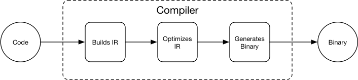
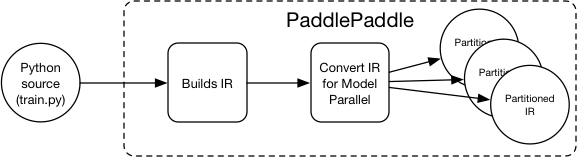
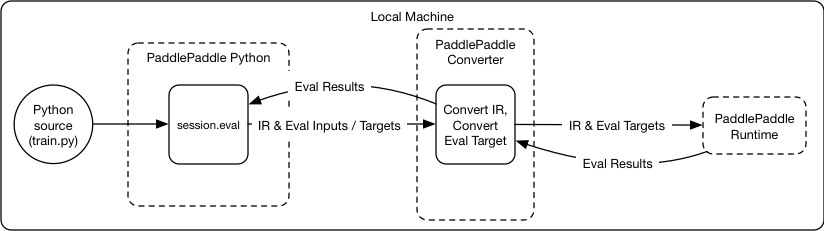

# Design Doc: Distributed Training Architecture

## Abstract

PaddlePaddle v0.10.0 uses the "trainer-parameter server"
architecture. We run multiple replicated instances of trainers (runs
the same code written by the user) and parameter servers for
distributed training. This architecture served us well, but has some
limitations:

1. Need to write special code to handle tasks which should only be run
  by a single trainer. E.g., initializing model and saving model.

2. Model parallelism is hard: need to write if-else branches conditioned
  on the trainer ID to partition model onto each trainer, and manually
  write the inter-model-shard communication code.

3. The user can not directly specify the parameter update rule: need
   to modify the parameter server C++ code and compile a new
   binary. This adds complication for researchers: A lot of extra
   effort is required. Besides, the training job submission program
   may not allow running arbitrary binaries.

This design doc discusses PaddlePaddle's new distributed training
architecture that addresses the above limitations.

## Analysis

We will assume the user writes the trainer program by Python, the same
analysis holds if the trainer program is written in C++.

### Limitation 1

If we look at the Python code that the user writes, there are two
kinds of functionalities:

- The training logic such as load / save model and print log.
- The neural network definition such as the definition of the data
  layer, the fully connected layer, the cost function and the
  optimizer.

When we training with PaddlePaddle v0.10.0 distributedly, multiple
replicated Python instances are running on different nodes: both the
training logic and the neural network computation is replicated.

The tasks that should only run once all belong to the training logic,
if we only replicate the neural network computation, but do **not**
replicate the training logic, the limitation could be solved.

### Limitation 2

Model parallelism means running a single model on multiple nodes by
partitioning the model onto different nodes and managing the
inter-model-shard communications.

PaddlePaddle should be able to modify the nerual network computation
definition to support model parallelism automatically. However, the
computation is only specified in Python code, and PaddlePaddle can not
modify Python code.

Just like compiler uses a intermediate representation (IR) so that
programmer does not need to manually optimize their code in most of
the cases - the compiler will optimize the IR:



We can have our own IR too: PaddlePaddle can support model parallel by
converting the IR so the user no longer need to manually do it in
Python:



The IR for PaddlePaddle after refactor is called `Block`, it specifies
the computation dependency graph and the variables used in the
computation.

### Limitation 3

The user can not directly specify the parameter update rule for the
parameter server because the parameter server does not use the same
computation definition as the trainer. Instead, the update rule is
baked in the parameter server. The user can not specify the update
rule in the same way of specifying the trainer computation.

This could be fixed by making the parameter server run the same
computation definition as the trainer. For a detailed explanation,
please
see
[Design Doc: Operation Graph Based Parameter Server](./dist_train.md)

## Distributed Training Architecture

The new distributed training architecture can address the above
limitations. Below is the illustration:


The architecture includes major components: *PaddlePaddle Python*,
*PaddlePaddle converter* and *PaddlePaddle runtime*:

### PaddlePaddle Python

PaddlePaddle Python is the Python library that user's Python trainer
invoke to build the neural network topology, start training, etc.

```Python
paddle.init()
input = paddle.op.recordIO("/home/data/mnist.recordio") # file stored on the cluster
img, label = input[0], input[1]
hidden = paddle.layer.fc(input=img, size=200, act=paddle.activation.Tanh())
prediction = paddle.layer.fc(input=img, size=10, act=paddle.activation.Softmax())
cost = paddle.layer.classification_cost(input=prediction, label=label)
optimizer = paddle.optimizer.SGD(cost, learning_rate=0.01)
session = paddle.session.NewRemote(num_trainer=3, num_ps=2, GPU_per_trainer=1)
for i in range(1000):
	_, cost_val = session.eval(targets=[cost, optimizer])
	print cost_val
```

The code above is a typical Python trainer code, the neural network
topology is built using helper functions such as
`paddle.layer.fc`. The training is done by calling `session.eval`
iteratively.

#### session.eval

As shown in the graph, `session.eval` sends the IR and the evaluation
inputs/targets to the PaddlePaddle cluster for evaluation. The
targets can be any variable in the computation graph. When the target
is the `optimizer` variable, the neural network will be optimized
once. When the target is the `cost` variable, `session.eval` returns
the cost value.

The Python `session` is a wrapper of the C++ `Session` class. For more
information about `Session`, please
see [Design Doc: Session](./session.md).

### PaddlePaddle Converter

PaddlePaddle converter automatically converts the IR in the request
(IR and evaluation inputs/targets) from PaddlePaddle Python to new
partitioned IRs and dispatch the new IRs and evaluation inputs/targets
to different PaddlePaddle runtimes. Below are the steps:

1. Add `feed` OP that feeds the eval inputs, and `fetch` OP that
   fetches the eval targets to the IR.

1. Extract a new computation (sub)graph with `feed` and `fetch` OP as
   the boundary. The runtime does not need to run the OP that is not
   dependent by the `fetch` OP.

1. Optimizes the computation graph.

1. Place the OPs in the graph onto different devices on different
   PaddlePaddle runtime according to a placement algorithm and device
   constraint specified by the user.

1. Partition the graph according to runtime boundaries and add `send` /
   `recv` OP pair on the runtime boundaries.

1. Dispatch the partitioned graph to different PaddlePaddle runtimes.

1. PaddlePaddle runtimes with the `fetch` OP reports evaluation
   results back to the converter, the convert reports the evaluation
   results back to the PaddlePaddle Python.
   
The output IRs will be cached to optimize the conversion latency.


#### Placement Algorithm

Our first implementation will only support "trainer-parameter server"
placement: the parameters, initializers, and optimizers are placed on
the PaddlePaddle runtimes with the parameter server role. And
everything else will be placed on the PaddlePaddle runtimes with the
trainer role. This has the same functionality of our
"trainer-parameter server" architecture of PaddlePaddle v0.10.0, but
is more general and flexible.

In the future, we will implement the general placement algorithm,
which makes placements according to the input IR, and a model of
device computation time and device communication time. Model
parallelism requires the general placement algorithm.


### PaddlePaddle Runtime

The PaddlePaddle runtime owns multiple devices (e.g., CPUs, GPUs) and
runs the IR. The runtime does not need to do OP placement since it's
already done by the converter.


### Local Training Architecture

The local training architecture will be the same as the distributed
training architecture, the differences are everything runs locally,
and there is just one PaddlePaddle runtime:




### Training Data

In PaddlePaddle v0.10.0, training data is typically read
with [data reader](../reader/README.md) from Python. This approach is
no longer efficient when training distributedly since the Python
process no longer runs on the same node with the trainer processes,
the Python reader will need to read from the distributed filesystem
(assuming it has the access) and send to the trainers, doubling the
network traffic.

When doing distributed training, the user can still use Python data
reader: the training data are sent with `session.eval`. However should
be used for debugging purpose only. The users are encouraged to use
the read data OPs.


## References:

[1] [TensorFlow: Large-Scale Machine Learning on Heterogeneous Distributed Systems](https://static.googleusercontent.com/media/research.google.com/en//pubs/archive/45166.pdf)

[2] [TensorFlow: A System for Large-Scale Machine Learning](https://www.usenix.org/system/files/conference/osdi16/osdi16-abadi.pdf)
