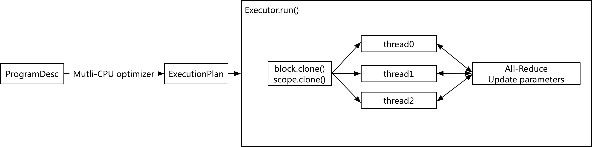

# Design Doc: How to Execute the ProgramDesc on Multiple Device

A sequence of optimizers will convert a ProgramDesc to ExecutionPlan, which allow
the PaddlePaddle program running on multi devices such CPU, GPU or FPGA,
or multi nodes.

The interface of ExecutionPlan is as followed:

```cpp
enum ExecutionType {
    SINGLE_THREAD = 0,
    MULTIPLE_CPU = 1,
    MULTIPLE_GPU = 2,
    MULTIPLE_NODE = 3
};

class ExecutionPlan {
  ExecutionType type_;
  vector<ProgramDescBind*> trainers_;
  vector<ProgramDescBind*> pservers_;
};
```

## Running with Multi-CPU



1. Use Multi-CPU Optimizer to convert the ProgramDesc to ExecutionPlan

    For the data parallelism, we need to pass the attribution `start` and `end`
    index for the mini-batch, and this will be calculated in the optimizer step.
1. `multiCPUExecutor` execute the ExecutionPlan which the type is Multi CPU

    the `MultiCPUExecutor` will call `block.clone()` and `scope.clone()` to make
    a list of blocks and scopes, the size equals the thread number, and then execute
    the graph in each thread.
1. Collect the gradients and update the parameters

    After all the threads finished the split mini-batch, the `MultiCPUExecutor` would
    collect all gradients with `sum/mean/...`, execute the optimizer and then deliver
    the result of parameters in each thread.
    Like [nccl](https://developer.nvidia.com/nccl) on GPU, we can implement the same
    the logic to speed up the memory copy.

## Running with Multi-GPU

TODO
