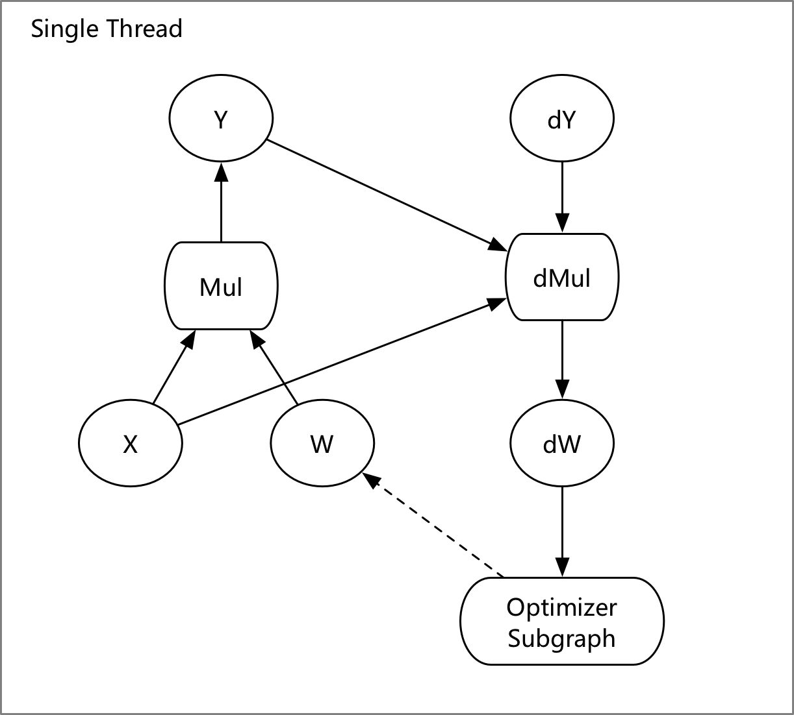
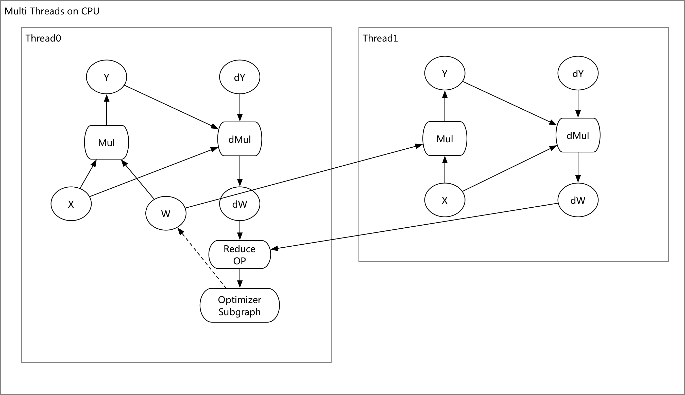

# Design Doc: How to Execute the ProgramDesc on Multiple Device

A sequence of optimizers will convert a ProgramDesc to ExecutionPlan, which allow
the PaddlePaddle program running on multi devices such CPU, GPU or FPGA,
or multi nodes.

## Running with Multi-CPU

### Graph Convert

The Multi CPU Optimizer will converts the user-define graph into the ExecutionPlan

After converting:

1. For the data parallelism, the `Feed` Op will feed the mini-batch
    according with the thread index, such as set the different
    `start/end` index for the Op in each thread.
1. The **Thread0** is the master thread, and it will collect the
    gradients, execute the optimizer and update the parameter
    variable W.
1. We will add a `Reduce` Op, it will collect the gradients with
    `sum/mean/...` method, and before it execute the collector,
    the `Reduce` Op should wait for all the threads finish their
    mini-batch, it's a Sync SGD.

## Running with Multi-GPU

TODO
