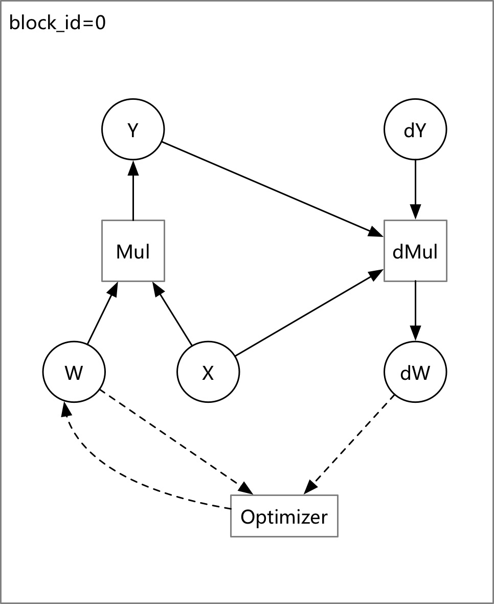
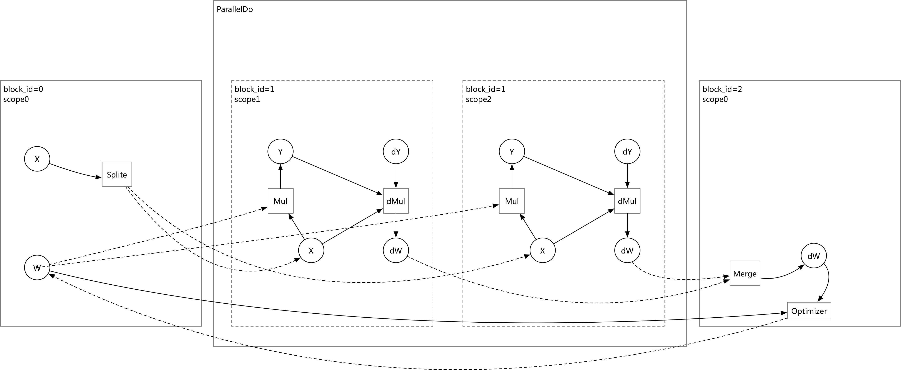

# Design Doc: Execute the Program with Multi Thread

## Abstract

This Design Doc propose an approach to make the user-defined Op graph
running on multi threads, we will use an auto transpiler to convert the user-defined
Op graph to a multi-thread Op graph, and run `ParallelDo` Op to run the
multi-thread graph with multi-threads.

## Graph Converter


After converted:



## Implement

- `Multi-Thread Transpiler`  will convert the graph to a multi-threads graph
    which would be executed with multi-threads.
- `BlockingCounter` will `Init/Decrement` a condition variable, and Blocking `Wait`
    for the condition variable become `0`:
    ```cpp
    BlockingCounter bc(thread_count);
    for (int i = 0; i < thread_count; ++i) {
        thread_pool->Schedule([&bc] {bc.DecrementCount(); })
    }
    bc.Wait();
    ```
- `ParallelDo` Operator
  - Initialize a thread pool which is a Singleton Mode.
  - Use a list of block id as the input, and create multi Executor to run 
    these Block which specified with block id with multi-threads.
  - Initialize a `BlockingCounter` instance and wait until all threads are done.
- `Split` Operator will split the Input Tensor into N slices.
- `Merge` Operator will merge all the gradients from the block list and then
    run the Optimizer Op to optimize `W`.