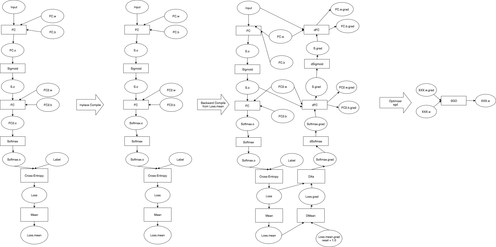
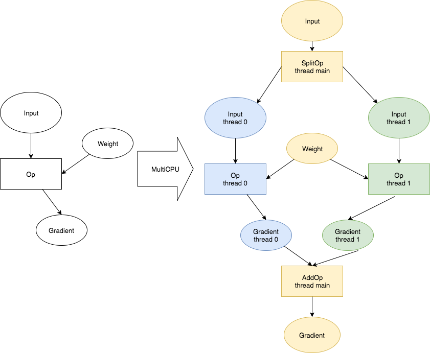

## Graph

```cpp
struct Graph {
  Vec<Op> ops_;
  
  Map<string, TensorAttr> tensors_;
};
```

Graph由Op简单组成，是一个Op的数组。不过一个Graph还可以加上`tensors_`字段，来表示这个图中所有的tensors_。这个字段从`ops_`中得到的，只是方便用户去访问这个图中所有的信息。

## Graph Compiler

```
using GraphCompilerFN = std::function<void(Graph* graph, const AttributeMap& attrs)>;
```

Graph Compiler是一组函数，他们会使用一些参数，对图进行修改，将修改结果写会原图中。

在样例中，用户只配置了神经网络的单线程前向部分，这部分计算图如下:



在该图中，进行了三次编译，他们是:

1. Inplace Compiler: 当某一个Op的输入和输出size一致，且输入Tensor只被这个Op所依赖，就可以简化计算图，将输入输出合并成一个TensorAttr
2. Backward Compiler: 从Loss.mean开始反向传播。先将`Loss.mean.grad`梯度默认设置成`1.0`。然后反向遍历这个图，将梯度的Op插入到图中。如果某一个TensorAttr不需要Gradient，则不产生这个TensorAttr的Gradient。
3. Optimizer Compiler: 找出所有参数的梯度和参数值，将两者之间添加上SGD op，讲输出结果保存会参数TensorAttr。

另外，还有一类编译操作是将图从单线程转变为多线程，即

1. 将图的输入进行切分。每个线程分配同样大小的输入数据。
2. 将每一个Op设置不同的设备，分别产生不同的输出。
3. 将梯度跨设备聚合插入到图中。



MultiGPU的实现同理，也是一种Compiler
