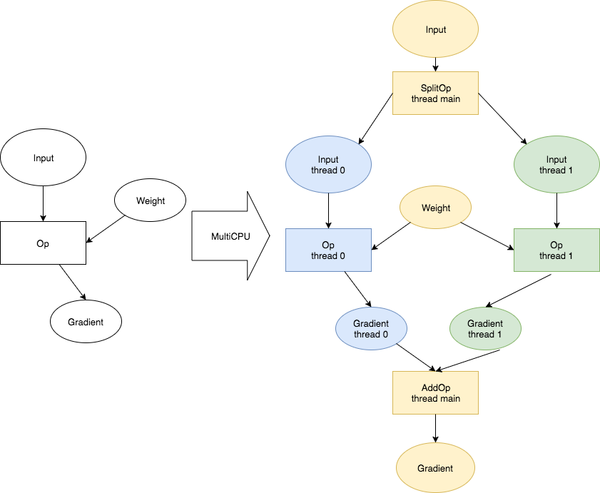

# Paddle 计算重构设计文档

整体设计如下图所示:


主要的概念包括:

* Workspace: 全部的神经网络层的参数和输入，均由一个全局对象所管理。内存/显存的申请，释放，resize都使用该对象管理。
	* 内存申请后的类型是`TensorBuffer`，该类型是一个`void*`指针，size
* Tensor是计算Kernel函数的参数格式，他包括`TensorBuffer`和`TensorAttr`。其中，`TensorAttr`中包括了Tensor的`Shape`，是否需要Gradient，设备信息等。
* Op是神经网络中的所有操作，他们包括:
	* 元信息，即属于某一个操作类型的信息。包括不同设备的Kernel函数，Shape推导函数，梯度Op推导函数。
	* 配置信息，即某一个FC Layer的输入有是哪些TensorAttr，输出是哪些TensorAttr。
* Graph是表示一个神经网络的全部计算，主要由op的数组表示。其中，为了方便获取tensor的信息，还添加了一个`map<string, TensorAttr>`的字段方便快速获得tensor
* Graph Compilers是一组函数，每一个函数都修改了`Graph`。用户定义完神经网络的配置之后，由Graph Compiler将用户定义的，只有单线程前向操作的图，扩展成多线程，多显卡带反向操作的图。这些扩展工作，都有compiler完成。
* Engine。执行器，用来执行一个图。

## 设想中的用户使用方法

```cpp
Workspace w;
Graph graph;
auto input = graph.createTensor("input", {1000, 784}, float);
auto hidden0 = graph.fullyConnected("hidden0", input, 200);
auto hidden0Sigmoid = graph.fullyConnected("hidden0_sigmoid", fc);
auto hidden1 = graph.fullyConnected("hidden1", input, 10);
auto prediction = graph.softmax("prediction", hidden1);

auto label = graph.createTensor("label", {1000, 10}, int);

auto crossEntropy = graph.crossEntropy("xe_loss", prediction, label);
auto loss = graph.mean("mean_loss", crossEntropy);

graph.backward(loss);
graph.optimize("sgd", 1e-4);
graph.multiCpu(4);
Engine engine(w, graph, cpuNum = 4);
for (;;) {
  w[input] = [...];
  w[label] = [...];
  engine.run();
  engine.clearGradient();
}
```

## Workspace

```cpp
class TensorBuffer {
public:
   virtual void* get() = 0;
   virtual size_t size() const = 0;
};
struct Workspace {
  Map<string, TensorBufferPtr> allBuffers_;
}
```
所有的参数全部存放到一个WorkSpace中。申请、释放、resize `TensorBuffer`交由这个全局的WorkSpace完成。这个WorkSpace的好处是:

1. 可以在不同的拓扑结构中，共享一段内存。(share 同一个`Workspace`即可)
2. 可以实现check point机制。即将所有的buffer序列化后即完成了checkpoint。`Workspace.checkpoint()`

## Tensor, TensorAttr, TensorBuffer
```cpp
enum TensorType {kFLOAT32, kINT32};

struct TensorAttr {
  std::string name_;
  TensorType type_;
  bool needGrad_ {false};
  SmallVector<size_t, 4> dims_;
  int device{-1};
};

struct Tensor {
  TensorAttrPtr attr_;
  TensorBufferPtr buffer_;
};
```

TensorAttr是记录在计算图中，对某一个Op输入输出参数的描述。包括输入输出的名字，数据类型，形状，设备等等。

* name_ 在一个计算图中，每一个Tensor都有唯一的名字。
* type_ Paddle的Tensor类型按照数据类型分类，只包括float, double, int等类型。
* needGrad_ 这个Tensor是否需要在backward的时候计算梯度。
* dims_ 这个Tensor的维度信息。使用SmallVector是为了避免alloc小内存带来的开销。
* device_ 设备信息，默认是-1，即CPU。0即GPU-0。

TensorBuffer和Tensor并没有记录在计算图中，因为内存/显存具体值是多少，不是计算图描述中应有的属性。`Tensor`会被Op实现时的Kernel函数调用。

## Op

```cpp
using AttributeMap = Map<std::string, boost::any>;
enum DeviceType {
  kDEVICE_CPU = 0,
  kDEVICE_GPU,
  kNUM_DEVICES
};
using ShapeInfererFN = std::function<void(const Vec<TensorAttrPtr>& inputs, 
                                          const Vec<TensorAttrPtr>& outputs,
                                          const AttributeMap& attrs)>;
using GetGraidentFN = std::function<Vec<Op>(
    const Vec<TensorAttrPtr>& I,
    const Vec<TensorAttrPtr>& O,
    const Vec<TensorAttrPtr>& OG,
    const Vec<TensorAttrPtr>& IG,
    const AttributeMap& attrs,
)>;

using KernelFN = std::function<void(const Vec<Tensor>& inputs, 
                                    const Vec<Tensor>& outputs,
                                    const AttributeMap& attrs)>;

struct OpMeta {
  std::string type_;
  ShapeInfererFN shape_;
  GetGradientFN grad_;
  KernelFN kernels_[kNUM_DEVICES];
};

struct Op {
  std::string type_;
  Vec<TensorAttrPtr> inputs_;
  Vec<TensorAttrPtr> outputs_;
  AttributeMap attrs_;
};
```

`Op`是每一个操作的具体配置，而`OpMeta`是每一类操作的元信息，他们之间通过共同的`type_`来相互对应。用户配置Op的时候，将对应的Op创建，添加进Graph中即可。

每一个Op具有一些可配置的属性，这些可配置的属性是`AttributeMap`类型，即`Map<std::string, boost::any>`类型。该类型可以方便用户对一个Op配置float，string，int等不同类型的属性。

`OpMeta`类型即为每一个Op的元信息，里面包括了

* shape. 不同shape的输入，经过这个Op后会产生输出的shape。在这个函数中，可以通过throw exception报错。
* grad. 某一个Op对应的梯度Op是哪些。grad可以为空。为空表示这个Op不支持反向传播。
* kernels。 不同设备上如何计算该Op。

简单的实现一个Op为:

```
static void FCShape(const Vec<TensorAttrPtr>& inputs, 
                    const Vec<TensorAttrPtr>& outputs,
                    const AttributeMap& attrs) {
  outputs[0]->dims = {inputs[0]->dims[0], inputs[1]->dims[1]};                    
}

static void FCImpl(const Vec<Tensor>& inputs, 
                   const Vec<Tensor>& outputs,
                   const AttributeMap& attrs) {
  ...                   
}

static void Vec<Op> FCGrad(
    const Vec<TensorAttrPtr>& I,
    const Vec<TensorAttrPtr>& O,
    const Vec<TensorAttrPtr>& OG,
    const Vec<TensorAttrPtr>& IG,
    const AttributeMap& attrs,
) {
  Op op;
  op.type = "fc_grad";
  op.inputs = {I[0], I[1], OG[0]};
  op.outputs = {IG[1], IG[0], IG[2]};
  return {op};
}

static InitFunction init([]{
  OpMeta meta;
  meta.type_ = "fc";
  meta.shape_ = FCShape;
  meta.kernels[CPU] = FCImpl;
  meta.grad_ = FCGrad;
  OpMeta::addMeta(meta);
});
```

## Graph

```cpp
struct Graph {
  Vec<Op> ops_;
  
  Map<string, TensorAttr> tensors_;
};
```

Graph由Op简单组成，是一个Op的数组。不过一个Graph还可以加上`tensors_`字段，来表示这个图中所有的tensors_。这个字段从`ops_`中得到的，只是方便用户去访问这个图中所有的信息。

## Graph Compiler

```
using GraphCompilerFN = std::function<void(Graph* graph, const AttributeMap& attrs)>;
```

Graph Compiler是一组函数，他们会使用一些参数，对图进行修改，将修改结果写会原图中。

在样例中，用户只配置了神经网络的单线程前向部分，这部分计算图如下:


在该图中，进行了三次编译，他们是:

1. Inplace Compiler: 当某一个Op的输入和输出size一致，且输入Tensor只被这个Op所依赖，就可以简化计算图，将输入输出合并成一个TensorAttr
2. Backward Compiler: 从Loss.mean开始反向传播。先将`Loss.mean.grad`梯度默认设置成`1.0`。然后反向遍历这个图，将梯度的Op插入到图中。如果某一个TensorAttr不需要Gradient，则不产生这个TensorAttr的Gradient。
3. Optimizer Compiler: 找出所有参数的梯度和参数值，将两者之间添加上SGD op，讲输出结果保存会参数TensorAttr。

另外，还有一类编译操作是将图从单线程转变为多线程，即

1. 将图的输入进行切分。每个线程分配同样大小的输入数据。
2. 将每一个Op设置不同的设备，分别产生不同的输出。
3. 将梯度跨设备聚合插入到图中。



MultiGPU的实现同理，也是一种Compiler

## Engine

Engine输入的Op加定已经添加好如何进行多设备同步的相关Op了。那么Engine的实现比较简单:

1. 如果有N个计算设备，则有N+1个线程
1. 每一个设备一个计算线程，如果某一个Op的输入输出数据不在一个设备上，那么使用另一个控制线程执行这个Op。
1. 每个线程顺序执行内部的Op，直到所有线程运行结束，一次`Engine.run`结束

即如上图所示，蓝色，绿色和黄色三者分别在三个不同线程执行。


# 一些使用场景的具体设计方式

## 循环神经网络 RNN

由于该设计的所有配置类型全是C++对象，操作速度快。并且内存管理(`TensorBuffer`)和计算图`Graph`完全分离，所以对于RNN可以完全按照动态图来进行设计。具体的使用方法有两类:

1. 对于成熟的RNN层，例如`LSTMemory`，和`FC`Op的配置方式一致。
2. 对于任意RNN层，即Paddle目前的`RecurrentLayerGroup`，使用方式为:

```cpp
Workspace w;  // workspace is global, so parameter is shared between each batch.
for (each_data in dataset) {
	Graph g;
	...
	auto seqPos = g.createTensor("sequence_pos", {1000}, int);
	auto input = g.createTensor("input", {8912, 100}, float);
	
	each_data.fill_into(seqPos, input);  // get user data.
	
	rnn_step = g.rnnView(input, seqPos);
	TensorAttrPtr lastTimeStep = nullptr;
	while (rnn_step.hasNext()) {
	  auto rnn_in = rnn_step.next();
	  auto tmp = g.fc(rnn_in);
	  if (lastTimeStep != nullptr) {
	    tmp = g.fc(lastTimeStep)
	  }
	  lastTimeStep = tmp;
	}
	auto prediction = g.softmax(lastTimeStep);  // create graph dynamically during each batch.
	
	Engine engine(&w, prediction);
	engine.run();
}
```

## 动态神经网络 DyNet

同RNN

## Op单元测试

使用[Gradient Check](http://ufldl.stanford.edu/wiki/index.php/Gradient_checking_and_advanced_optimization)进行单元测试。在单测的时候，多次的进行forward，用数值模拟出gradient的预测数值，再使用backward计算出gradient的实际值。对比二者的差别，小于某一阈值即可完成Op的单测。
