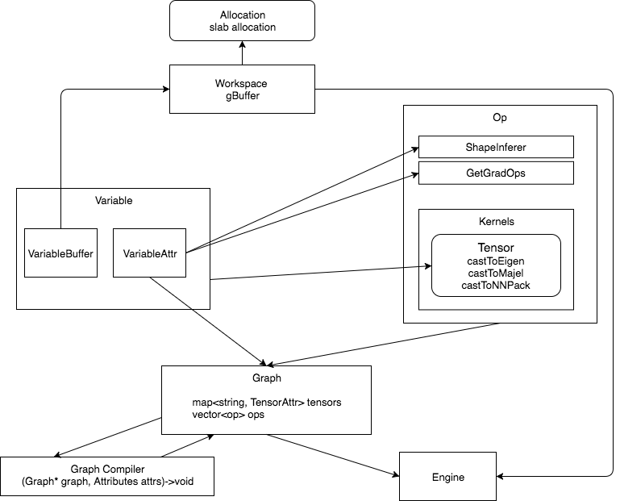

# Paddle 计算重构设计文档

整体设计如下图所示:



主要的概念包括:

* 内存管理与维护模块:
	* 内存管理模块对外的接口为Workspace。有Workspace分配神经网络中的所有内存。内存表示为VariableBuffer类型。内存的类型参考[Memory Management](./memory.md)

* Variable是每一个Op [Kernel](https://en.wikipedia.org/wiki/Compute_kernel)的参数。他包括内存管理器`VariableBuffer`和描述参数属性的`VariableAttr`。Variable只是Op Kernel函数的参数。除了Kernel外的其他部分，只使用`VariableAttr`作为其他函数的参数。
	* `VariableAttr`中包含了参数的`Shape`，是否需要`Gradient`, 设备信息等。
	* 更详细信息参考[Variable And Op](./variable_and_op.md)

* Op是神经网络中的所有操作，他们包括元信息和配置信息。
	* 元信息表示『某一类Op』所固有的信息，配置信息表示『某一个Op』所具有的实际信息。
		* 譬如 所有的FC op的计算[Kernel](https://en.wikipedia.org/wiki/Compute_kernel)都一样。所以计算[Kernel]就是一个元信息。而某个具体配置中，FC Op前面接了两个输入，"input"和"w"，这就是具体的配置信息。
		* 二者相当于类型与值的关系。
	* 元信息，即属于某一个操作类型的信息。包括不同设备的Kernel函数，Shape推导函数，梯度Op推导函数。
	* 配置信息，即某一个FC Layer的输入有是哪些TensorAttr，输出是哪些TensorAttr。
	* 更详细信息参考[Variable And Op](./variable_and_op.md)

* `Kernels` 是神经网络中代码量最大的模块。更详细的信息参考[Kernels](./kernels.md)

* 神经网络的都可以表示成一个[有向无环图](https://en.wikipedia.org/wiki/Directed_acyclic_graph)，这个DAG使用Graph存储。Graph中存储了所有的计算的Op，每一个Op都记录了它的输入和输出。
	* 在存储中，是用一个Op的数组记录这个DAG。这个Op需要是有序的。需要是DAG的[拓扑排序](https://en.wikipedia.org/wiki/Topological_sorting)后的某一个结果。
	* Graph组建中还包括Graph Compilers。它是一组函数，每一个函数都修改了`Graph`。用户定义完神经网络的配置之后，由Graph Compiler将用户定义的，只有单线程前向操作的图，扩展成多线程，多显卡带反向操作的图。这些扩展工作，都有compiler完成。
	* 详细信息参考[Graph](./graph.md)
* Engine。执行器，用来执行一个图。详细信息参考[engine](./engine.md)。

## 详细信息

* 内存相关[Memory Management](./memory.md)
* 变量和Op[Variable And Op](./variable_and_op.md)
* 计算图 [Graph](./graph.md)
* Kernels[Kernels](./kernels.md)
* 计算引擎[Engine](./engine.md)


# 设想中的用户使用方法

## 通常情况

```cpp
Workspace w;
Graph graph;
// each op will return a TensorAttrPtr.
auto input = graph.createTensor("input", {1000, 784}, float);
auto hidden0 = graph.fullyConnected("hidden0", input, 200);
auto hidden0Sigmoid = graph.fullyConnected("hidden0_sigmoid", fc);
auto hidden1 = graph.fullyConnected("hidden1", input, 10);
auto prediction = graph.softmax("prediction", hidden1);
auto label = graph.createTensor("label", {1000, 10}, int);

auto crossEntropy = graph.crossEntropy("xe_loss", prediction, label);
auto loss = graph.mean("mean_loss", crossEntropy);

graph.backward(loss);
graph.optimize("sgd", 1e-4);
graph.multiCpu(4);
Engine engine(w, graph, cpuNum = 4);
for (;;) {
  input = graph.createOrResizeTensor("input", {1000, 784}, float);
  label = graph.createOrResizeTensor("label", {1000, 10}, int);
  w[input] = [...];
  w[label] = [...];
  engine.run();
  engine.clearGradient();
}
```

## 循环神经网络 RNN

由于该设计的所有配置类型全是C++对象，操作速度快。并且内存管理(`TensorBuffer`)和计算图`Graph`完全分离，所以对于RNN可以完全按照动态图来进行设计。具体的使用方法有两类:

1. 对于成熟的RNN层，例如`LSTMemory`，和`FC`Op的配置方式一致。
2. 对于任意RNN层，即Paddle目前的`RecurrentLayerGroup`，使用方式为:

```cpp
Workspace w;  // workspace is global, so parameter is shared between each batch.
for (each_data in dataset) {
	Graph g;
	...
	auto seqPos = g.createTensor("sequence_pos", {1000}, int);
	auto input = g.createTensor("input", {8912, 100}, float);
	
	each_data.fill_into(seqPos, input);  // get user data.
	
	rnn_step = g.rnnView(input, seqPos);
	TensorAttrPtr lastTimeStep = nullptr;
	while (rnn_step.hasNext()) {
	  auto rnn_in = rnn_step.next();
	  auto tmp = g.fc(rnn_in);
	  if (lastTimeStep != nullptr) {
	    tmp = g.fc(lastTimeStep)
	  }
	  lastTimeStep = tmp;
	}
	auto prediction = g.softmax(lastTimeStep);  // create graph dynamically during each batch.
	
	Engine engine(&w, prediction);
	engine.run();
}
```

## 动态神经网络 DyNet

同RNN

## Op单元测试

使用[Gradient Check](http://ufldl.stanford.edu/wiki/index.php/Gradient_checking_and_advanced_optimization)进行单元测试。在单测的时候，多次的进行forward，用数值模拟出gradient的预测数值，再使用backward计算出gradient的实际值。对比二者的差别，小于某一阈值即可完成Op的单测。
