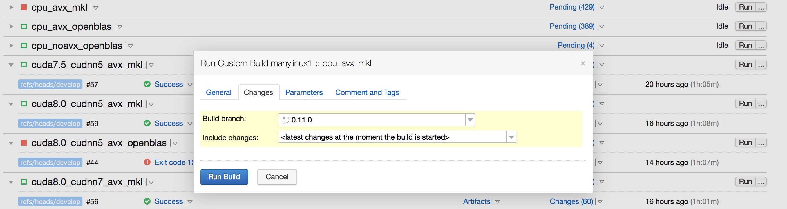

# PaddlePaddle发行规范

PaddlePaddle使用git-flow branching model做分支管理，使用[Semantic Versioning](http://semver.org/)标准表示PaddlePaddle版本号。

PaddlePaddle每次发新的版本，遵循以下流程:

1. 从`develop`分支派生出新的分支，分支名为`release/版本号`。例如，`release/0.10.0`
1. 将新分支的版本打上tag，tag为`版本号rc.Patch号`。第一个tag为`0.10.0rc1`，第二个为`0.10.0rc2`，依次类推。
1. 对这个版本的提交，做如下几个操作:
  * 使用Regression Test List作为检查列表，测试本次release的正确性。
	  * 如果失败，记录下所有失败的例子，在这个`release/版本号`分支中，修复所有bug后，Patch号加一，到第二步
	* 修改`python/setup.py.in`中的版本信息,并将`istaged`字段设为`True`。
	* 编译这个版本的python wheel包，并发布到pypi。
		* 由于pypi.python.org目前遵循[严格的命名规范PEP 513](https://www.python.org/dev/peps/pep-0513)，在使用twine上传之前，需要重命名wheel包中platform相关的后缀，比如将`linux_x86_64`修改成`manylinux1_x86_64`。
		* pypi上的package名称为paddlepaddle和paddlepaddle_gpu，如果要上传GPU版本的包，需要修改build/python/setup.py中，name: "paddlepaddle_gpu"并重新打包wheel包：`python setup.py bdist_wheel`。
		* 上传方法：
			```
			cd build/python
			pip install twine
			twine upload dist/[package to upload]
			```
		* 编译这个版本的Docker发行镜像，发布到dockerhub。如果失败，修复Docker编译镜像问题，Patch号加一，返回第二步
1. 第三步完成后，将`release/版本号`分支合入master分支，并删除`release/版本号`分支。将master分支的合入commit打上tag，tag为`版本号`。同时再将`master`分支合入`develop`分支。最后删除`release/版本号`分支。
1. 协同完成Release Note的书写


需要注意的是:

* `release/版本号`分支一旦建立，一般不允许再从`develop`分支合入`release/版本号`。这样保证`release/版本号`分支功能的封闭，方便测试人员测试PaddlePaddle的行为。
* 在`release/版本号`分支存在的时候，如果有bugfix的行为，需要将bugfix的分支同时merge到`master`, `develop`和`release/版本号`这三个分支。

## 发布wheel包到pypi

使用[PaddlePaddle CI](https://paddleci.ngrok.io/project.html?projectId=Manylinux1&tab=projectOverview)
完成自动化二进制编译，参考下图，选择需要发布的版本（通常包含一个CPU版本和一个GPU版本），点击"run"右侧的"..."按钮，可以
弹出下面的选择框，在第二个tab (Changes)里选择需要发布的分支，这里选择0.11.0，然后点击"Run Build"按钮。等待编译完成后
可以在此页面的"Artifacts"下拉框中找到生成的3个二进制文件，分别对应CAPI，`cp27m`和`cp27mu`的版本。然后按照上述的方法
使用`twine`工具上传即可。



* 注：CI环境使用 https://github.com/PaddlePaddle/buildtools 这里的DockerImage作为编译环境以支持更多的Linux
  发型版，如果需要手动编译，也可以使用这些镜像。这些镜像也可以从 https://hub.docker.com/r/paddlepaddle/paddle_manylinux_devel/tags/ 下载得到。
* pypi不支持覆盖上传，所以一个版本号的wheel包发布之后，不可以更改。下一个wheel包需要更新版本号才可以上传。

## 发布Docker镜像

上述PaddlePaddle CI编译wheel完成后会自动将Docker镜像push到DockerHub，所以，发布Docker镜像只需要对自动push的镜像打上
版本号对应的tag即可：

1. 进入 https://hub.docker.com/r/paddlepaddle/paddle/tags/ 查看latest tag的更新时间是否在上述编译wheel包完成后是否最新。
1. 执行 `docker pull paddlepaddle/paddle:[latest tag]`，latest tag可以是latest或latest-gpu等。
1. 执行 `docker tag paddlepaddle/paddle:[latest tag] paddlepaddle/paddle:[version]`
1. 执行 `docker push paddlepaddle/paddle:[version]`

## PaddlePaddle 分支规范

PaddlePaddle开发过程使用[git-flow](http://nvie.com/posts/a-successful-git-branching-model/)分支规范，并适应github的特性做了一些区别。

* PaddlePaddle的主版本库遵循[git-flow](http://nvie.com/posts/a-successful-git-branching-model/)分支规范。其中:
	* `master`分支为稳定(stable branch)版本分支。每一个`master`分支的版本都是经过单元测试和回归测试的版本。
	* `develop`分支为开发(develop branch)版本分支。每一个`develop`分支的版本都经过单元测试，但并没有经过回归测试。
	* `release/版本号`分支为每一次Release时建立的临时分支。在这个阶段的代码正在经历回归测试。

* 其他用户的fork版本库并不需要严格遵守[git-flow](http://nvie.com/posts/a-successful-git-branching-model/)分支规范，但所有fork的版本库的所有分支都相当于特性分支。
	* 建议，开发者fork的版本库使用`develop`分支同步主版本库的`develop`分支
	* 建议，开发者fork的版本库中，再基于`develop`版本fork出自己的功能分支。
	* 当功能分支开发完毕后，向PaddlePaddle的主版本库提交`Pull Reuqest`，进而进行代码评审。
		* 在评审过程中，开发者修改自己的代码，可以继续在自己的功能分支提交代码。 

* BugFix分支也是在开发者自己的fork版本库维护，与功能分支不同的是，BugFix分支需要分别给主版本库的`master`、`develop`与可能有的`release/版本号`分支，同时提起`Pull Request`。

## PaddlePaddle回归测试列表

本列表说明PaddlePaddle发版之前需要测试的功能点。

### PaddlePaddle Book中所有章节

PaddlePaddle每次发版本首先要保证PaddlePaddle Book中所有章节功能的正确性。功能的正确性包括验证PaddlePaddle目前的`paddle_trainer`训练和纯使用`Python`训练模型正确性。

| | 新手入门章节 | 识别数字 | 图像分类 | 词向量 | 情感分析 | 语意角色标注 | 机器翻译 | 个性化推荐 |
| --- | --- | --- | --- | --- | --- | --- | --- | --- |
| API.V2 + Docker + GPU  |  |  |  |  |  |  |  |  |
| API.V2 + Docker + CPU  |  |  |  |  |  |  |  |  |
| `paddle_trainer` + Docker + GPU |  |  |  |  |  |  |  |  |
| `paddle_trainer` + Docker + CPU |  |  |  |  |  |  |  |  |
| API.V2 + Ubuntu + GPU |  |  |  |  |  |  |  |  |
| API.V2 + Ubuntu + CPU |  |  |  |  |  |  |  |  |
| `paddle_trainer` + Ubuntu + GPU |  |  |  |  |  |  |  |  |
| `paddle_trainer` + Ubuntu + CPU |  |  |  |  |  |  |  |  |
